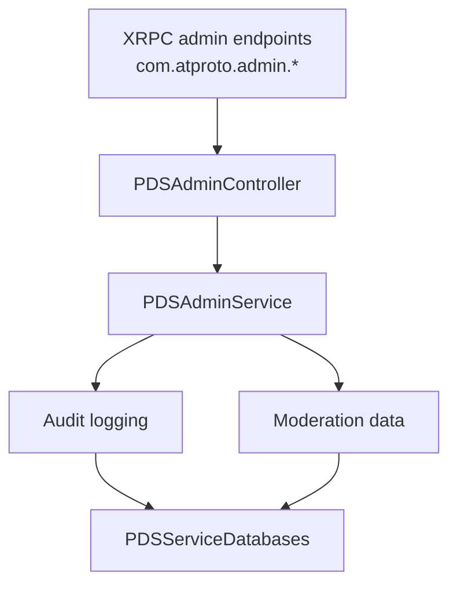

# Admin Service

## Overview

The `PDSAdminService` (delegated by `PDSAdminController`) provides administrative operations for PDS management including account moderation, takedowns, labeling, and system administration. It handles privileged operations that require admin authentication.

### Why This Service Matters

Moderation is essential for maintaining healthy online communities. The Admin Service enables:

- **Content Moderation**: Remove harmful content while preserving legitimate speech
- **Account Management**: Suspend or delete accounts that violate terms of service
- **Labeling System**: Apply warnings and filters without complete removal
- **Audit Trail**: Track all moderation actions for accountability and appeals
- **Compliance**: Meet legal requirements for content removal and user safety

Understanding the Admin Service is crucial for implementing responsible moderation policies and maintaining a safe, compliant PDS.

## When to Use This Service

### Use Admin Service When:

- **Moderating content**: Responding to reports of harmful or illegal content
- **Managing accounts**: Suspending or deleting accounts for policy violations
- **Applying labels**: Adding warnings or filters to content
- **Investigating issues**: Reviewing moderation status and history
- **Implementing admin endpoints**: Backing `com.atproto.admin.*` XRPC methods

### Don't Use Admin Service For:

- **User-initiated actions**: Use appropriate services for user operations (delete own post, etc.)
- **Automated filtering**: Implement separate content filtering systems
- **Authentication**: Use `PDSAccountService` for login and token management
- **Regular operations**: Admin Service is for privileged operations only

## Responsibilities

- Account suspension and deletion
- Record takedowns
- Label management
- Moderation actions
- Admin audit logging
- System configuration
- User management

## Architecture



## Key Operations

### Account Suspension

Temporarily disables an account while preserving data:

```objc
- (BOOL)suspendAccount:(NSString *)did 
              reason:(NSString *)reason 
             error:(NSError **)error;
```

**Effects:**
- Account cannot login
- Records are hidden from search
- Blobs are inaccessible
- Data is preserved for restoration

**Example:**
```objc
NSError *error = nil;
BOOL success = [adminService suspendAccount:@"did:plc:user123"
                                     reason:@"Violation of terms of service"
                                      error:&error];
```

### Account Deletion

Permanently removes an account and all associated data:

```objc
- (BOOL)deleteAccount:(NSString *)did 
             reason:(NSString *)reason 
            error:(NSError **)error;
```

**Effects:**
- Account is permanently deleted
- All records are removed
- All blobs are deleted
- Data cannot be recovered

**Example:**
```objc
NSError *error = nil;
BOOL success = [adminService deleteAccount:@"did:plc:user123"
                                    reason:@"User requested deletion"
                                     error:&error];
```

### Record Takedown

Removes a specific record from the repository:

```objc
- (BOOL)takedownRecord:(NSString *)uri 
              reason:(NSString *)reason 
             error:(NSError **)error;
```

**Parameters:**
- `uri`: AT URI of record to remove
- `reason`: Takedown reason
- `error`: Error pointer

**Example:**
```objc
NSError *error = nil;
BOOL success = [adminService takedownRecord:@"at://did:plc:user123/app.bsky.feed.post/abc123"
                                     reason:@"Illegal content"
                                      error:&error];
```

### Label Management

Adds labels to accounts or records for moderation:

```objc
- (BOOL)addLabel:(NSString *)label 
        toTarget:(NSString *)target 
         reason:(NSString *)reason 
        error:(NSError **)error;

- (BOOL)removeLabel:(NSString *)label 
          fromTarget:(NSString *)target 
             error:(NSError **)error;
```

**Common Labels:**
- `!no-unauthenticated`: Hide from unauthenticated users
- `!no-unknown`: Hide from unknown users
- `!warn`: Show warning before viewing
- `!impersonation`: Impersonation warning
- `!spam`: Spam label

**Example:**
```objc
NSError *error = nil;

// Add warning label
BOOL success = [adminService addLabel:@"!warn"
                             toTarget:@"did:plc:user123"
                               reason:@"Potentially sensitive content"
                                error:&error];

// Remove label
success = [adminService removeLabel:@"!warn"
                         fromTarget:@"did:plc:user123"
                              error:&error];
```

### Get Moderation Status

Retrieves moderation information for an account or record:

```objc
- (nullable NSDictionary *)getModerationForTarget:(NSString *)target 
                                            error:(NSError **)error;
```

**Returns:** Dictionary with:
- `labels`: Array of applied labels
- `suspended`: Boolean suspension status
- `reason`: Moderation reason
- `actionedAt`: Timestamp of last action

**Example:**
```objc
NSError *error = nil;
NSDictionary *moderation = [adminService getModerationForTarget:@"did:plc:user123"
                                                          error:&error];

if (moderation) {
    NSArray *labels = moderation[@"labels"];
    BOOL suspended = [moderation[@"suspended"] boolValue];
}
```

## Audit Logging

All admin actions are logged with:

- Admin DID who performed action
- Action type (suspend, delete, label, etc.)
- Target (account or record)
- Reason provided
- Timestamp
- Result (success/failure)

**Example log entry:**
```

{
  "admin": "did:plc:admin123",
  "action": "suspend",
  "target": "did:plc:user123",
  "reason": "Violation of terms of service",
  "timestamp": "2025-01-15T10:30:00Z",
  "result": "success"
}
```

## Moderation Workflow

### Typical Moderation Process

```

1. Report received
   ↓
2. Admin reviews content
   ↓
3. Admin applies label (if warning needed)
   ↓
4. If severe: takedown record or suspend account
   ↓
5. Log action in audit trail
   ↓
6. Notify user (if applicable)
   ↓
7. Monitor for appeals
```

## Error Handling

Common error scenarios:

| Error | Cause | Handling |
|-------|-------|----------|
| Not found | Target doesn't exist | Return 404 |
| Unauthorized | Not admin | Return 403 |
| Invalid label | Unknown label | Return 400 |
| Already suspended | Account already suspended | Return 409 |
| Invalid reason | Reason too short/long | Return 400 |

## Common Pitfalls and Troubleshooting

### Pitfall 1: Insufficient Moderation Documentation

**Problem**: Moderation actions are reversed on appeal due to lack of documentation.

**Why it happens**: Not recording sufficient context for moderation decisions.

**Solution**: Document all moderation actions thoroughly:
```objc
- (BOOL)suspendAccountWithDocumentation:(NSString *)did
                                 reason:(NSString *)reason
                               reporter:(NSString *)reporterDid
                                context:(NSDictionary *)context
                                  error:(NSError **)error {
    // Create detailed moderation record
    NSDictionary *moderationRecord = @{
        @"action": @"suspend",
        @"target": did,
        @"reason": reason,
        @"reporter": reporterDid,
        @"context": context,  // URLs, screenshots, related reports
        @"admin": self.currentAdminDid,
        @"timestamp": @([[NSDate date] timeIntervalSince1970]),
        @"appealDeadline": @([[NSDate dateWithTimeIntervalSinceNow:30*24*3600] timeIntervalSince1970])
    };
    
    // Store in moderation database
    [self.moderationDB storeModerationAction:moderationRecord error:error];
    
    // Perform suspension
    return [adminService suspendAccount:did reason:reason error:error];
}
```

### Pitfall 2: Inconsistent Label Application

**Problem**: Similar content receives different labels, confusing users.

**Why it happens**: No clear guidelines for label application.

**Solution**: Implement label decision tree:
```objc
- (NSString *)determineLabelForContent:(NSDictionary *)content {
    // Check for illegal content
    if ([self containsIllegalContent:content]) {
        return @"!takedown";  // Immediate removal
    }
    
    // Check for graphic violence
    if ([self containsGraphicViolence:content]) {
        return @"!warn";  // Warning before viewing
    }
    
    // Check for adult content
    if ([self containsAdultContent:content]) {
        return @"!no-unauthenticated";  // Hide from logged-out users
    }
    
    // Check for spam patterns
    if ([self appearsToBeSpam:content]) {
        return @"!spam";  // Spam label
    }
    
    return nil;  // No label needed
}
```

### Pitfall 3: Permanent Actions Without Warning

**Problem**: Accounts deleted immediately without opportunity to appeal.

**Why it happens**: Not following escalation procedures.

**Solution**: Implement graduated response:
```objc
- (void)handleViolation:(NSString *)did severity:(NSString *)severity {
    // Check violation history
    NSArray *priorViolations = [self.moderationDB violationsForDid:did];
    
    if ([severity isEqualToString:@"minor"]) {
        if (priorViolations.count == 0) {
            // First offense: warning only
            [self sendWarning:did];
        } else if (priorViolations.count < 3) {
            // Repeat offense: temporary suspension
            [self temporarySuspension:did days:7];
        } else {
            // Persistent violations: permanent suspension
            [adminService suspendAccount:did reason:@"Repeated violations" error:nil];
        }
    } else if ([severity isEqualToString:@"major"]) {
        // Major violation: immediate suspension with appeal option
        [adminService suspendAccount:did reason:@"Major violation" error:nil];
        [self setAppealDeadline:did days:30];
    } else if ([severity isEqualToString:@"critical"]) {
        // Critical violation: immediate deletion (illegal content)
        [adminService deleteAccount:did reason:@"Illegal content" error:nil];
    }
}
```

### Pitfall 4: No Audit Trail

**Problem**: Cannot track who performed moderation actions or why.

**Why it happens**: Not logging admin operations.

**Solution**: Comprehensive audit logging:
```objc
- (BOOL)performAdminAction:(NSString *)action
                    target:(NSString *)target
                    reason:(NSString *)reason
                     error:(NSError **)error {
    // Log before action
    NSDictionary *auditLog = @{
        @"timestamp": @([[NSDate date] timeIntervalSince1970]),
        @"admin": self.currentAdminDid,
        @"action": action,
        @"target": target,
        @"reason": reason,
        @"ipAddress": self.currentRequestIP,
        @"userAgent": self.currentRequestUserAgent
    };
    
    [self.auditLogger logAction:auditLog];
    
    // Perform action
    BOOL success = [self executeAction:action target:target error:error];
    
    // Log result
    [self.auditLogger logResult:@{
        @"success": @(success),
        @"error": error ? error.localizedDescription : [NSNull null]
    }];
    
    return success;
}
```

### Troubleshooting Guide

#### Issue: Labels not appearing on content

**Symptoms**: Labels applied but not visible to users.

**Possible causes**:
1. Label not propagated to relays
2. Client not respecting labels
3. Label format incorrect

**Diagnosis**:
```objc
// Verify label was stored
NSDictionary *moderation = [adminService getModerationForTarget:target error:nil];
NSArray *labels = moderation[@"labels"];
PDS_LOG_DEBUG(@"Stored labels: %@", labels);

// Check label format
for (NSString *label in labels) {
    if (![label hasPrefix:@"!"]) {
        PDS_LOG_WARN(@"Invalid label format: %@", label);
    }
}

// Verify label in firehose
[self checkFirehoseForLabel:target label:label];
```

#### Issue: Suspended account still accessible

**Symptoms**: Suspended account can still login and post.

**Possible causes**:
1. Suspension not applied to all services
2. Cached authentication tokens
3. Suspension flag not checked

**Diagnosis**:
```objc
// Verify suspension status
PDSDatabaseAccount *account = [accountRepository accountForDid:did error:nil];
PDS_LOG_DEBUG(@"Account status: %@", account.status);
PDS_LOG_DEBUG(@"Suspended: %d", account.suspended);

// Check if authentication checks suspension
- (BOOL)authenticateUser:(NSString *)did error:(NSError **)error {
    PDSDatabaseAccount *account = [self getAccount:did];
    
    if (account.suspended) {
        if (error) {
            *error = [ATProtoError errorWithCode:ATProtoErrorCodeAccountSuspended
                                         message:@"Account is suspended"];
        }
        return NO;
    }
    
    return YES;
}
```

## Best Practices

1. **Moderation Actions**
   - Always provide clear, specific reason for actions
   - Use appropriate labels before takedown when possible
   - Document all actions with context and evidence
   - Follow due process and escalation procedures
   - Allow appeals with reasonable deadlines

2. **Account Suspension**
   - Suspend before delete to allow appeals (except for illegal content)
   - Preserve data for investigation and potential restoration
   - Notify user of suspension with reason and appeal process
   - Set appeal deadline (typically 30 days)
   - Review appeals promptly and fairly

3. **Audit Trail**
   - Log all admin actions with timestamp, admin identity, and reason
   - Include admin identity (DID) in all logs
   - Timestamp all actions for chronological tracking
   - Retain logs for compliance (typically 1-7 years)
   - Implement log integrity protection (append-only, signed)

4. **Escalation**
   - Have clear escalation procedures for serious violations
   - Require multiple admins for serious actions (deletion, permanent ban)
   - Review high-impact decisions with senior staff
   - Document reasoning for all escalated actions
   - Implement cooling-off period for contentious decisions

5. **Transparency**
   - Publish moderation guidelines and policies
   - Provide transparency reports (aggregate statistics)
   - Explain decisions clearly to affected users
   - Allow appeals with clear process
   - Be consistent in policy application

## Common Patterns

### Handling a Reported Post

```objc
// 1. Get moderation status
NSError *error = nil;
NSDictionary *moderation = [adminService getModerationForTarget:reportedUri
                                                          error:&error];

// 2. Review content (admin UI)
// ...

// 3. Apply label if warning needed
[adminService addLabel:@"!warn"
             toTarget:reportedUri
               reason:@"Potentially sensitive content"
                error:&error];

// 4. If severe, takedown
[adminService takedownRecord:reportedUri
                      reason:@"Illegal content"
                       error:&error];
```

### Suspending a Problematic Account

```objc
// 1. Get account moderation status
NSError *error = nil;
NSDictionary *moderation = [adminService getModerationForTarget:userDid
                                                          error:&error];

// 2. Review account history
// ...

// 3. Suspend account
BOOL success = [adminService suspendAccount:userDid
                                     reason:@"Multiple violations of terms"
                                      error:&error];

// 4. Notify user
[self notifyUserOfSuspension:userDid reason:@"Multiple violations"];

// 5. Set appeal deadline
[self setAppealDeadline:userDid days:30];
```

### Bulk Moderation Action

```objc
// Apply label to multiple accounts
NSArray *violatingAccounts = @[
    @"did:plc:user1",
    @"did:plc:user2",
    @"did:plc:user3"
];

for (NSString *did in violatingAccounts) {
    NSError *error = nil;
    [adminService addLabel:@"!spam"
                 toTarget:did
                   reason:@"Spam network detected"
                    error:&error];
}
```

## Implementation Map

Start here when you change administrative or moderation behavior:

- `Garazyk/Sources/Services/Core/PDSAdminService.h`
- `Garazyk/Sources/Services/Core/PDSAdminService.m`
- `Garazyk/Sources/Admin/PDSAdminController.m`
- `Garazyk/Sources/Admin/PDSAdminHandler.m`
- `Garazyk/Sources/Network/XrpcAdminMethods.m`

## See Also

- [Services Overview](services-overview) - How Admin Service fits into the service layer
- [PDSApplication](pds-application) - Application-level integration
- [Authentication](../06-authentication/jwt-tokens) - Admin authentication and authorization
- [Security Best Practices](../06-authentication/security-best-practices) - Security considerations for admin operations
- [Logging Strategy](../11-reference/logging-strategy) - Audit logging implementation

## Related

- [Documentation Map](../11-reference/documentation-map.md)
- [Contributor Guide](../index.md)
- [Repository Documentation Index](../repo-index/index.md)

