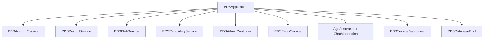

# PDS Application Facade

`PDSApplication` is the composition root and primary interface for the PDS. It manages service lifecycles, infrastructure initialization, and subsystem coordination.

## Service Composition

`PDSApplication` coordinates the following subsystems:
- **Core Services**: `PDSAccountService`, `PDSRecordService`, `PDSBlobService`, `PDSRepositoryService`.
- **Controllers and Proxies**: `PDSAdminController`, `PDSRelayService`.
- **Infrastructure**: `PDSServiceDatabases`, `PDSDatabasePool`, `JWTMinter`.



## Boot Sequence

The `initWithConfiguration:` method initializes the server:
1. **Infrastructure**: Establishes shared database connections (`PDSServiceDatabases`) and actor pools (`PDSDatabasePool`).
2. **Identity**: Configures the `JWTMinter` and loads server signing keys via `PDSKeyManager`.
3. **Services**: Instantiates domain services with their required dependencies.
4. **Validation**: Loads AT Protocol lexicons for request validation.

## Lifecycle Management

### Startup
The HTTP server is activated via `[app.httpServer startWithCompletion:]`. This enables the request pipeline and firehose streams.

### Shutdown
The shutdown process ensures data integrity:
1. Stopping the `HttpServer` to reject new connections.
2. Stopping the `PDSRelayService` and firehose broadcasters.
3. Closing active database connections in both service and actor pools.

## Service Access

Handlers access domain logic through `PDSApplication` properties:

```objc
// Account creation
[app.accountService createAccountWithEmail:email 
                                   handle:handle
                                 password:pwd
                               completion:completion];

// Record mutation
[app.recordService createRecord:record
                    collection:collection
                           did:userDID
                    completion:completion];
```

## Monitoring

### Health Checks
`isHealthy:` verifies the status of critical components, including database connectivity and HTTP server runtime state.

### Metrics
`PDSApplication` captures request metrics (latency, success rates, and error distributions) exposed via the `/api/pds/metrics` endpoint.

## Related
- [Services Overview](./account-service)
- [Account Service](./account-service)
- [Record Service](./record-service)
- [Blob Service](./blob-service)
- [Repository Service](./repository-service)
- [HTTP Server](../04-network-layer/http-server)
- [Configuration Reference](../11-reference/config-reference)
- [Runtime Flow Walkthrough](./runtime-flow-walkthrough)

