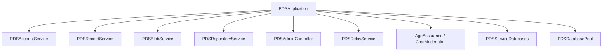

# PDSApplication Facade

## Overview

`PDSApplication` is the primary facade for the PDS. It:
- Composes all services
- Manages server lifecycle
- Provides a unified interface to the entire system
- Handles initialization and configuration

## Architecture

### Service Composition



### Initialization Flow

The actual initialization in PDSApplication.m follows this pattern (lines 1-150):

```objc
// In PDSApplication.m
- (instancetype)initWithConfiguration:(nullable PDSConfiguration *)configuration {
    self = [super init];
    if (self) {
        _configuration = configuration ?: [PDSConfiguration sharedConfiguration];
        _dataDirectory = _configuration.dataDirectory ?: [PDSConfiguration defaultDataDirectory];
        _httpPort = _configuration.serverPort > 0 ? _configuration.serverPort : 2583;
        _running = NO;

        // Catch unhandled ObjC exceptions before they silently crash
        NSSetUncaughtExceptionHandler(&PDSApplicationUncaughtExceptionHandler);

        // Configure logging from configuration
        [self configureLogging];
        
        // Configure rate limiter
        [self configureRateLimiter];
        
        PDS_LOG_INFO_C(PDSLogComponentCore, @"PDSApplication initializing with data directory: %@", _dataDirectory);
        
        // Initialize infrastructure (databases, JWT minter)
        [self initializeInfrastructure];
        
        // Initialize services
        [self initializeServices];
        
        // Load lexicons
        [self loadLexicons];
    }
    return self;
}
```

**Key initialization steps (from PDSApplication.m lines 150-250):**

1. **Database initialization:**
```objc
_serviceDatabases = [[PDSServiceDatabases alloc] initWithDirectory:_dataDirectory
                                                     serviceMaxSize:serviceMaxSize
                                                   didCacheMaxSize:didCacheSize
                                                 sequencerMaxSize:sequencerSize];

_userDatabasePool = [[PDSDatabasePool alloc] initWithDbDirectory:_dataDirectory maxSize:userMaxSize];
```

2. **JWT Minter setup:**
```objc
_jwtMinter = [[JWTMinter alloc] init];
_jwtMinter.issuer = [_configuration canonicalIssuerWithPortHint:_httpPort];
_jwtMinter.signingAlgorithm = @"ES256K";

// Load or create signing key
id<PDSKeyManager> keyManager = [PDSKeyManagerFactory createKeyManagerWithDatabase:[_serviceDatabases serviceDatabaseWithError:nil]];
id<PDSKeyPair> activeKey = [keyManager getActiveKeyPair:&serverKeyError];
if (activeKey) {
    _jwtMinter.keyManager = keyManager;
}
```

3. **Service initialization:**
```objc
_accountService = [[PDSAccountService alloc] initWithDatabasePool:_userDatabasePool];
_recordService = [[PDSRecordService alloc] initWithDatabasePool:_userDatabasePool];
_blobService = [[PDSBlobService alloc] initWithDatabasePool:_userDatabasePool storage:blobStorage];
_repositoryService = [[PDSRepositoryService alloc] initWithDatabasePool:_userDatabasePool];
```

## Service Access

### Getting Services

```objc
// Access services through PDSApplication
PDSApplication *app = ...;

// Account operations
[app.accountService createAccountWithEmail:@"user@example.com" 
                                   handle:@"user.example.com"
                                 password:@"password"
                               completion:^(NSString *did, NSError *error) {
    // Handle result
}];

// Record operations
[app.recordService createRecord:@{@"text": @"Hello"}
                    collection:@"app.bsky.feed.post"
                           did:userDID
                    completion:^(NSString *uri, NSError *error) {
    // Handle result
}];

// Blob operations
[app.blobService uploadBlob:imageData
                 completion:^(NSString *blobCID, NSError *error) {
    // Handle result
}];
```

## Lifecycle Management

### Starting the Server

```objc
// In main.m or CLI dispatcher
PDSApplication *app = [[PDSApplication alloc] 
    initWithConfiguration:config error:&error];

if (!app) {
    NSLog(@"Failed to initialize PDS: %@", error);
    exit(1);
}

// Start HTTP server
[app.httpServer startWithCompletion:^(NSError *error) {
    if (error) {
        NSLog(@"Failed to start server: %@", error);
        exit(1);
    }
    
    NSLog(@"PDS started on port %ld", (long)app.configuration.server.port);
}];

// Keep server running
[[NSRunLoop mainRunLoop] run];
```

### Stopping the Server

```objc
// Graceful shutdown
[app.httpServer stopWithCompletion:^(NSError *error) {
    if (error) {
        NSLog(@"Error stopping server: %@", error);
    }
    
    // Close databases
    [app.serviceDatabases close];
    [app.databasePool close];
    
    NSLog(@"PDS stopped");
    exit(0);
}];
```

## Configuration

### Configuration File

```json
{
  "server": {
    "host": "0.0.0.0",
    "port": 2583,
    "data_dir": "./pds-data",
    "issuer": "https://pds.example.com"
  },
  "plc": {
    "url": "https://plc.directory"
  },
  "session": {
    "invite_code_required": true
  },
  "logging": {
    "level": "info",
    "format": "text"
  }
}
```

### Loading Configuration

```objc
// In PDSConfiguration.m
+ (instancetype)loadFromFile:(NSString *)path error:(NSError **)error {
    NSData *data = [NSData dataWithContentsOfFile:path];
    if (!data) {
        *error = [NSError errorWithDomain:@"Config" code:1 
            userInfo:@{NSLocalizedDescriptionKey: @"File not found"}];
        return nil;
    }
    
    NSDictionary *json = [NSJSONSerialization JSONObjectWithData:data 
                                                          options:0 
                                                            error:error];
    if (!json) return nil;
    
    PDSConfiguration *config = [[PDSConfiguration alloc] init];
    config.serverHost = json[@"server"][@"host"] ?: @"0.0.0.0";
    config.serverPort = [json[@"server"][@"port"] integerValue] ?: 2583;
    config.issuer = json[@"server"][@"issuer"];
    config.databasePath = json[@"database"][@"path"];
    config.plcURL = json[@"plc"][@"url"];
    config.inviteCodeRequired = [json[@"session"][@"invite_code_required"] boolValue];
    
    return config;
}
```

## Error Handling

### Standardized Errors

```objc
// In XrpcErrorHelper.m
+ (NSDictionary *)errorResponseForError:(NSError *)error {
    NSString *errorCode = @"InternalServerError";
    NSString *message = error.localizedDescription;
    
    if ([error.domain isEqualToString:@"XRPC"]) {
        switch (error.code) {
            case 1:
                errorCode = @"InvalidRequest";
                break;
            case 2:
                errorCode = @"Unauthorized";
                break;
            case 3:
                errorCode = @"Forbidden";
                break;
            case 4:
                errorCode = @"NotFound";
                break;
            case 5:
                errorCode = @"Conflict";
                break;
        }
    }
    
    return @{
        @"error": errorCode,
        @"message": message
    };
}
```

## Logging

### Structured Logging

```objc
// In PDSApplication.m
- (void)logMessage:(NSString *)message 
             level:(NSString *)level 
           context:(NSDictionary *)context {
    if (self.configuration.debug.verbose) {
        NSMutableString *log = [NSMutableString stringWithFormat:@"[%@] %@", level, message];
        
        if (context) {
            [log appendFormat:@" %@", context];
        }
        
        NSLog(@"%@", log);
    }
}

// Usage
[app logMessage:@"Record created" 
          level:@"INFO" 
        context:@{@"did": userDID, @"collection": @"app.bsky.feed.post"}];
```

## Monitoring and Metrics

### Request Metrics

```objc
// In PDSApplication.m
- (void)recordRequestMetric:(NSString *)method 
                   duration:(NSTimeInterval)duration 
                    success:(BOOL)success {
    @synchronized(self.metrics) {
        NSMutableDictionary *methodMetrics = self.metrics[method];
        if (!methodMetrics) {
            methodMetrics = [NSMutableDictionary dictionary];
            self.metrics[method] = methodMetrics;
        }
        
        methodMetrics[@"count"] = @([methodMetrics[@"count"] integerValue] + 1);
        methodMetrics[@"totalDuration"] = @([methodMetrics[@"totalDuration"] doubleValue] + duration);
        
        if (!success) {
            methodMetrics[@"errors"] = @([methodMetrics[@"errors"] integerValue] + 1);
        }
    }
}

// Get metrics
- (NSDictionary *)getMetrics {
    @synchronized(self.metrics) {
        return [self.metrics copy];
    }
}
```

## Health Checks

### Server Health

```objc
// In PDSApplication.m
- (BOOL)isHealthy:(NSError **)error {
    // Check database connectivity
    if (![self.serviceDatabases isConnected]) {
        *error = [NSError errorWithDomain:@"Health" code:1 
            userInfo:@{NSLocalizedDescriptionKey: @"Database not connected"}];
        return NO;
    }
    
    // Check HTTP server
    if (![self.httpServer isRunning]) {
        *error = [NSError errorWithDomain:@"Health" code:2 
            userInfo:@{NSLocalizedDescriptionKey: @"HTTP server not running"}];
        return NO;
    }
    
    return YES;
}
```

## Best Practices

### When to Use PDSApplication

**Use PDSApplication When:**
- Starting the PDS server
- Accessing any service (Account, Record, Blob, etc.)
- Managing application lifecycle (startup, shutdown)
- Configuring the PDS
- Implementing XRPC endpoints

**Don't Use PDSApplication For:**
- Direct database access (use services instead)
- Business logic (implement in services)
- Request handling (use XRPC handlers)

### Common Pitfalls and Troubleshooting

#### Pitfall 1: Multiple PDSApplication Instances

**Problem**: Creating multiple `PDSApplication` instances causes resource conflicts.

**Why it happens**: Not understanding that PDSApplication should be a singleton.

**Solution**: Use a single shared instance:
```objc
// Bad: Multiple instances
PDSApplication *app1 = [[PDSApplication alloc] initWithConfiguration:config error:nil];
PDSApplication *app2 = [[PDSApplication alloc] initWithConfiguration:config error:nil];

// Good: Single shared instance
static PDSApplication *sharedApp = nil;
+ (instancetype)sharedApplication {
    static dispatch_once_t onceToken;
    dispatch_once(&onceToken, ^{
        sharedApp = [[PDSApplication alloc] initWithConfiguration:nil error:nil];
    });
    return sharedApp;
}
```

#### Pitfall 2: Configuration Not Loaded

**Problem**: Application starts with default configuration instead of custom settings.

**Why it happens**: Configuration file not found or not loaded before initialization.

**Solution**: Verify configuration loading:
```objc
// Load configuration explicitly
NSError *error = nil;
PDSConfiguration *config = [PDSConfiguration loadFromFile:@"config.json" error:&error];

if (!config) {
    NSLog(@"Failed to load configuration: %@", error);
    exit(1);
}

// Verify critical settings
if (!config.issuer) {
    NSLog(@"ERROR: issuer not configured");
    exit(1);
}

// Initialize with loaded config
PDSApplication *app = [[PDSApplication alloc] initWithConfiguration:config error:&error];
```

#### Pitfall 3: Services Not Initialized

**Problem**: Accessing services returns nil or crashes.

**Why it happens**: Trying to use services before application initialization completes.

**Solution**: Wait for initialization to complete:
```objc
NSError *error = nil;
PDSApplication *app = [[PDSApplication alloc] initWithConfiguration:config error:&error];

if (!app) {
    NSLog(@"Application initialization failed: %@", error);
    exit(1);
}

// Verify services are initialized
if (!app.accountService || !app.recordService) {
    NSLog(@"ERROR: Services not initialized");
    exit(1);
}

// Now safe to use services
[app.accountService createAccountForEmail:/* ... */];
```

#### Pitfall 4: Graceful Shutdown Not Implemented

**Problem**: Application terminates abruptly, leaving databases in inconsistent state.

**Why it happens**: Not implementing proper shutdown sequence.

**Solution**: Implement graceful shutdown:
```objc
- (void)gracefulShutdown {
    PDS_LOG_INFO(@"Starting graceful shutdown...");
    
    // 1. Stop accepting new requests
    [self.httpServer stopAcceptingConnections];
    
    // 2. Wait for in-flight requests to complete (with timeout)
    dispatch_semaphore_t semaphore = dispatch_semaphore_create(0);
    [self.httpServer waitForRequestsToComplete:^{
        dispatch_semaphore_signal(semaphore);
    }];
    
    dispatch_time_t timeout = dispatch_time(DISPATCH_TIME_NOW, 30 * NSEC_PER_SEC);
    if (dispatch_semaphore_wait(semaphore, timeout) != 0) {
        PDS_LOG_WARN(@"Timeout waiting for requests to complete");
    }
    
    // 3. Stop relay service
    [self.relayService stop];
    
    // 4. Close databases
    [self.serviceDatabases close];
    [self.databasePool close];
    
    PDS_LOG_INFO(@"Graceful shutdown complete");
}

// Register signal handlers
signal(SIGTERM, handleShutdownSignal);
signal(SIGINT, handleShutdownSignal);

void handleShutdownSignal(int signal) {
    PDSApplication *app = [PDSApplication sharedApplication];
    [app gracefulShutdown];
    exit(0);
}
```

#### Troubleshooting Guide

**Issue: "Failed to initialize PDS" error**

**Symptoms**: Application fails to start with initialization error.

**Possible causes**:
1. Database directory not writable
2. Port already in use
3. Invalid configuration
4. Missing signing key

**Diagnosis**:
```objc
// Check database directory
NSString *dataDir = config.dataDirectory;
BOOL isWritable = [[NSFileManager defaultManager] isWritableFileAtPath:dataDir];
PDS_LOG_DEBUG(@"Data directory writable: %d", isWritable);

// Check port availability
int sock = socket(AF_INET, SOCK_STREAM, 0);
struct sockaddr_in addr;
addr.sin_family = AF_INET;
addr.sin_port = htons(config.serverPort);
addr.sin_addr.s_addr = INADDR_ANY;

if (bind(sock, (struct sockaddr *)&addr, sizeof(addr)) < 0) {
    PDS_LOG_ERROR(@"Port %d already in use", config.serverPort);
}
close(sock);

// Check signing key
id<PDSKeyPair> key = [keyManager getActiveKeyPair:&error];
if (!key) {
    PDS_LOG_ERROR(@"No signing key available: %@", error);
}
```

**Issue: Services returning errors intermittently**

**Symptoms**: Service operations fail randomly with database errors.

**Possible causes**:
1. Database connection pool exhausted
2. Deadlocks
3. Disk space issues

**Diagnosis**:
```objc
// Monitor connection pool
PDS_LOG_DEBUG(@"Pool utilization: %lu/%lu",
              self.databasePool.activeConnections,
              self.databasePool.maxConnections);

// Check for deadlocks
PRAGMA deadlock_timeout = 5000;  // 5 second timeout

// Monitor disk space
NSError *error = nil;
NSDictionary *attrs = [[NSFileManager defaultManager] 
                       attributesOfFileSystemForPath:dataDir error:&error];
NSNumber *freeSpace = attrs[NSFileSystemFreeSize];
PDS_LOG_DEBUG(@"Free disk space: %@ bytes", freeSpace);
```

### Configuration Best Practices

1. **Use Environment Variables for Secrets**
   ```objc
   // Don't hardcode secrets in config.json
   config.jwtSecret = getenv("PDS_JWT_SECRET");
   config.databasePassword = getenv("PDS_DB_PASSWORD");
   ```text

2. **Validate Configuration on Startup**
   ```objc
   - (BOOL)validateConfiguration:(PDSConfiguration *)config error:(NSError **)error {
       if (!config.issuer) {
           *error = [NSError errorWithDomain:@"Config" code:1
                                    userInfo:@{NSLocalizedDescriptionKey: @"issuer required"}];
           return NO;
       }
       
       if (config.serverPort < 1 || config.serverPort > 65535) {
           *error = [NSError errorWithDomain:@"Config" code:2
                                    userInfo:@{NSLocalizedDescriptionKey: @"invalid port"}];
           return NO;
       }
       
       return YES;
   }
   ```text

3. **Use Secure Defaults**
   ```objc
   // Secure defaults in PDSConfiguration
   config.inviteCodeRequired = YES;  // Require invite codes by default
   config.rateLimitEnabled = YES;    // Enable rate limiting
   config.debugMode = NO;            // Disable debug mode in production
   ```text

4. **Document Configuration Options**
   ```objc
   // config.json with comments (use JSON5 or strip comments before parsing)
   {
     "server": {
       "host": "0.0.0.0",           // Bind address
       "port": 2583,                // HTTP port
       "issuer": "https://pds.example.com"  // Public URL
     },
     "session": {
       "invite_code_required": true  // Require invite codes for signup
     }
   }
   ```text

5. **Support Configuration Reloading**
   ```objc
   - (void)reloadConfiguration {
       NSError *error = nil;
       PDSConfiguration *newConfig = [PDSConfiguration loadFromFile:@"config.json" error:&error];
       
       if (newConfig) {
           // Apply non-disruptive changes
           self.configuration.rateLimitEnabled = newConfig.rateLimitEnabled;
           self.configuration.debugMode = newConfig.debugMode;
           
           PDS_LOG_INFO(@"Configuration reloaded");
       } else {
           PDS_LOG_ERROR(@"Failed to reload configuration: %@", error);
       }
   }
   ```text

### Performance Optimization

1. **Connection Pooling**
   ```objc
   // Configure appropriate pool sizes
   config.databasePoolSize = 20;  // Based on expected concurrency
   config.maxConcurrentRequests = 100;
   ```text

2. **Caching**
   ```objc
   // Cache frequently accessed data
   @property (nonatomic, strong) NSCache *accountCache;
   @property (nonatomic, strong) NSCache *didDocumentCache;
   
   - (PDSDatabaseAccount *)getCachedAccount:(NSString *)did {
       PDSDatabaseAccount *cached = [self.accountCache objectForKey:did];
       if (cached) return cached;
       
       PDSDatabaseAccount *account = [self.accountService getAccountForDid:did error:nil];
       if (account) {
           [self.accountCache setObject:account forKey:did];
       }
       return account;
   }
   ```text

3. **Async Operations**
   ```objc
   // Use background queues for I/O
   dispatch_async(dispatch_get_global_queue(DISPATCH_QUEUE_PRIORITY_DEFAULT, 0), ^{
       NSError *error = nil;
       NSData *carData = [self.repositoryService getRepoContents:did since:nil error:&error];
       
       dispatch_async(dispatch_get_main_queue(), ^{
           [self sendResponse:carData];
       });
   });
   ```text

4. **Resource Limits**
   ```objc
   // Set appropriate limits
   config.maxBlobSize = 5 * 1024 * 1024;  // 5 MB
   config.maxRecordsPerRequest = 100;
   config.requestTimeout = 30;  // seconds
   ```text

### Security Best Practices

1. **Validate All Inputs**
   ```objc
   - (BOOL)validateDID:(NSString *)did error:(NSError **)error {
       if (![did hasPrefix:@"did:"]) {
           *error = [NSError errorWithDomain:@"Validation" code:1
                                    userInfo:@{NSLocalizedDescriptionKey: @"Invalid DID format"}];
           return NO;
       }
       return YES;
   }
   ```text

2. **Rate Limiting**
   ```objc
   // Implement rate limiting per IP/DID
   - (BOOL)checkRateLimit:(NSString *)identifier {
       NSInteger requestCount = [self.rateLimiter getRequestCount:identifier];
       if (requestCount > 100) {  // 100 requests per minute
           return NO;
       }
       [self.rateLimiter incrementRequestCount:identifier];
       return YES;
   }
   ```text

3. **Audit Logging**
   ```objc
   // Log security-relevant events
   - (void)logSecurityEvent:(NSString *)event details:(NSDictionary *)details {
       PDS_LOG_SECURITY(@"[Security] %@: %@", event, details);
       [self.auditLogger logEvent:event details:details];
   }
   ```text

4. **Secrets Management**
   ```objc
   // Never log secrets
   - (void)logConfiguration:(PDSConfiguration *)config {
       NSDictionary *safeConfig = @{
           @"serverPort": @(config.serverPort),
           @"issuer": config.issuer,
           @"jwtSecret": @"[REDACTED]",  // Never log secrets
           @"databasePassword": @"[REDACTED]"
       };
       PDS_LOG_INFO(@"Configuration: %@", safeConfig);
   }
   ```text

## Common Patterns

### Pattern 1: Starting the PDS

```objc
int main(int argc, const char *argv[]) {
    @autoreleasepool {
        // 1. Load configuration
        NSError *error = nil;
        PDSConfiguration *config = [PDSConfiguration loadFromFile:@"config.json" error:&error];
        
        if (!config) {
            NSLog(@"Failed to load configuration: %@", error);
            return 1;
        }
        
        // 2. Initialize application
        PDSApplication *app = [[PDSApplication alloc] initWithConfiguration:config error:&error];
        
        if (!app) {
            NSLog(@"Failed to initialize PDS: %@", error);
            return 1;
        }
        
        // 3. Start HTTP server
        [app.httpServer startWithCompletion:^(NSError *startError) {
            if (startError) {
                NSLog(@"Failed to start server: %@", startError);
                exit(1);
            }
            
            NSLog(@"PDS started on port %ld", (long)config.serverPort);
        }];
        
        // 4. Run event loop
        [[NSRunLoop mainRunLoop] run];
    }
    
    return 0;
}
```

### Pattern 2: Implementing an XRPC Endpoint

```objc
// In XrpcRepoMethods.m
- (void)handleCreateRecord:(NSDictionary *)params
                completion:(void (^)(NSDictionary *response, NSError *error))completion {
    
    // 1. Extract parameters
    NSString *did = params[@"repo"];
    NSString *collection = params[@"collection"];
    NSDictionary *record = params[@"record"];
    
    // 2. Validate authorization
    NSString *actorDid = [self getAuthenticatedDID];
    if (![actorDid isEqualToString:did]) {
        completion(nil, [ATProtoError errorWithCode:ATProtoErrorCodeUnauthorized
                                             message:@"Cannot modify another user's repository"]);
        return;
    }
    
    // 3. Call service through PDSApplication
    PDSApplication *app = [PDSApplication sharedApplication];
    NSError *error = nil;
    
    TID *tid = [TID tid];
    BOOL success = [app.recordService putRecord:collection
                                            rkey:tid.stringValue
                                           value:record
                                          forDid:did
                                        actorDid:actorDid
                                  validationMode:PDSValidationModeOptimistic
                                           error:&error];
    
    // 4. Return response
    if (success) {
        completion(@{
            @"uri": [NSString stringWithFormat:@"at://%@/%@/%@", did, collection, tid.stringValue],
            @"cid": [self computeCIDForRecord:record]
        }, nil);
    } else {
        completion(nil, error);
    }
}
```

### Pattern 3: Health Check Endpoint

```objc
- (NSDictionary *)getHealthStatus {
    PDSApplication *app = [PDSApplication sharedApplication];
    
    // Check all critical components
    BOOL databaseHealthy = [app.serviceDatabases isConnected];
    BOOL poolHealthy = app.databasePool.activeConnections < app.databasePool.maxConnections;
    BOOL serverHealthy = [app.httpServer isRunning];
    
    NSString *status = (databaseHealthy && poolHealthy && serverHealthy) ? @"healthy" : @"unhealthy";
    
    return @{
        @"status": status,
        @"components": @{
            @"database": @{
                @"status": databaseHealthy ? @"healthy" : @"unhealthy"
            },
            @"connectionPool": @{
                @"status": poolHealthy ? @"healthy" : @"unhealthy",
                @"active": @(app.databasePool.activeConnections),
                @"max": @(app.databasePool.maxConnections)
            },
            @"httpServer": @{
                @"status": serverHealthy ? @"healthy" : @"unhealthy"
            }
        },
        @"timestamp": @([[NSDate date] timeIntervalSince1970])
    };
}
```

## See Also

- [Services Overview](services-overview) - Service architecture
- [Account Service](account-service) - Account management
- [Record Service](record-service) - Record operations
- [HTTP Server](../04-network-layer/http-server) - HTTP and XRPC
- [Configuration Reference](../11-reference/config-reference) - Configuration options
- [Security Best Practices](../06-authentication/security-best-practices) - Security guidance

1. **Use PDSApplication for all access** — Don't access services directly
2. **Handle errors properly** — Always check for errors
3. **Log important events** — For debugging and monitoring
4. **Monitor metrics** — Track performance
5. **Graceful shutdown** — Clean up resources
6. **Configuration validation** — Validate on startup

## Next Steps

- **[Services Overview](services-overview)** — Service architecture
- **[Account Service](account-service)** — Account management
- **[Record Service](record-service)** — Record operations
- **[Network Layer](../04-network-layer/http-server)** — HTTP and XRPC\n\n## Related\n\n- [Documentation Map](../11-reference/documentation-map.md)\n- [Contributor Guide](../index.md)\n- [Repository Documentation Index](../repo-index/index.md)\n\n