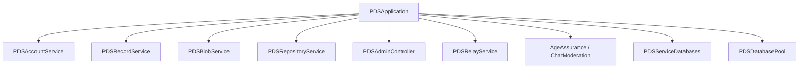

# PDSApplication Facade

`PDSApplication` is the composition root and primary interface for the PDS. It manages service lifecycles, infrastructure initialization, and server coordination.

## Service Composition

`PDSApplication` coordinates the following subsystems:
- **Services**: `PDSAccountService`, `PDSRecordService`, `PDSBlobService`, `PDSRepositoryService`.
- **Controllers**: `PDSAdminController`, `PDSRelayService`.
- **Infrastructure**: `PDSServiceDatabases`, `PDSDatabasePool`, `JWTMinter`.



## Initialization

The `initWithConfiguration:` method executes the boot sequence:
1. **Infrastructure**: Initializes shared databases (`PDSServiceDatabases`) and the actor connection pool (`PDSDatabasePool`).
2. **Identity & Auth**: Configures the `JWTMinter` and loads server signing keys via the `PDSKeyManager`.
3. **Services**: Instantiates domain services with their required infrastructure dependencies.
4. **Lexicons**: Loads and validates ATProto lexicons for request validation.

## Lifecycle Management

### Startup
The HTTP server is started via `[app.httpServer startWithCompletion:]`. This transition enables the request pipeline and firehose streams.

### Shutdown
Graceful shutdown requires:
1. Stopping the `HttpServer` to reject new connections.
2. Stopping the `PDSRelayService` and firehose broadcasters.
3. Closing all active database connections in `PDSServiceDatabases` and `PDSDatabasePool`.

## Service Access

Handlers and external callers access domain logic through `PDSApplication` properties.

```objc
// Account creation
[app.accountService createAccountWithEmail:email 
                                   handle:handle
                                 password:pwd
                               completion:completion];

// Record mutation
[app.recordService createRecord:record
                    collection:collection
                           did:userDID
                    completion:completion];
```

## Health and Monitoring

### Health Checks
`isHealthy:` verifies the operational status of critical components:
- Active database connectivity.
- HTTP server runtime state.

### Metrics
`PDSApplication` captures request metrics (latency, success rates, and error distributions) which are exposed via the `/api/pds/metrics` endpoint for operator inspection.

## Related
- [Services Overview](./services-overview)
- [Account Service](./account-service)
- [Record Service](./record-service)
- [HTTP Server](../04-network-layer/http-server)
- [Configuration Reference](../11-reference/config-reference)

