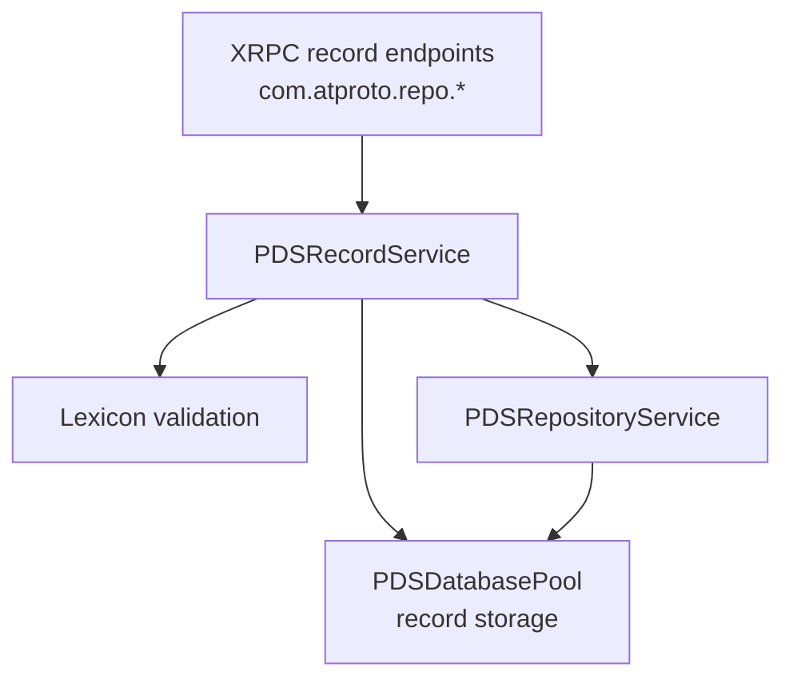

# Record Service

## Overview

The `PDSRecordService` provides CRUD (Create, Read, Update, Delete) operations for ATProto records within repositories. It handles record validation, MST updates, transaction management, and batch operations.

### Why This Service Matters

Records are the fundamental unit of data in ATProto. Every post, like, follow, and profile is stored as a record in a user's repository. The Record Service ensures:

- **Data Integrity**: Records are validated against lexicons before storage
- **Cryptographic Verification**: Each record gets a CID for content-addressed storage
- **Atomic Operations**: Batch writes succeed or fail as a unit
- **Consistency**: MST updates maintain repository integrity

## Responsibilities

- Record creation and updates (put operations)
- Record deletion
- Record retrieval by AT URI
- Record listing with pagination
- Batch write operations with atomic transactions
- Lexicon validation (optional)
- Repository statistics

## Architecture



## Key Methods

### Put Record (Create/Update)

```objc
- (BOOL)putRecord:(NSString *)collection
              rkey:(NSString *)rkey
             value:(NSDictionary *)value
            forDid:(NSString *)did
          actorDid:(NSString *)actorDid
    validationMode:(PDSValidationMode)mode
             error:(NSError **)error;
```

Creates or updates a record in a collection. Validates the record against lexicon if enabled.

**Parameters:**
- `collection`: Collection NSID (e.g., "app.bsky.feed.post")
- `rkey`: Record key within the collection
- `value`: Record value as a dictionary
- `did`: Repository owner DID
- `actorDid`: Authenticated actor's DID (must equal did for self-modification)
- `mode`: Validation mode (Required, Optimistic, or Off)
- `error`: Error pointer for failure details

**Returns:** YES on success, NO on failure

**Implementation pattern (from PDSRecordService.m):**

The service validates authorization, performs lexicon validation, generates a CID, and stores the record:

```objc
- (BOOL)putRecord:(NSString *)collection
               rkey:(NSString *)rkey
              value:(NSDictionary *)value
             forDid:(NSString *)did
           actorDid:(NSString *)actorDid
     validationMode:(PDSValidationMode)mode
              error:(NSError **)error {
```


**Example usage:**
```objc
NSDictionary *post = @{
    @"text": @"Hello, ATProto!",
    @"createdAt": @"2025-01-15T10:30:00Z",
    @"facets": @[]
};

NSError *error = nil;
BOOL success = [recordService putRecord:@"app.bsky.feed.post"
                                  rkey:@"abc123"
                                 value:post
                                forDid:@"did:plc:user123"
                              actorDid:@"did:plc:user123"
                        validationMode:PDSValidationModeOptimistic
                                 error:&error];
```

### Delete Record

```objc
- (BOOL)deleteRecord:(NSString *)collection
                 rkey:(NSString *)rkey
               forDid:(NSString *)did
             actorDid:(NSString *)actorDid
                error:(NSError **)error;
```

Deletes a record from a collection.

**Parameters:**
- `collection`: Collection NSID
- `rkey`: Record key to delete
- `did`: Repository owner DID
- `actorDid`: Authenticated actor's DID
- `error`: Error pointer for failure details

**Returns:** YES on success, NO on failure

**Example:**
```objc
NSError *error = nil;
BOOL deleted = [recordService deleteRecord:@"app.bsky.feed.post"
                                      rkey:@"abc123"
                                    forDid:@"did:plc:user123"
                                  actorDid:@"did:plc:user123"
                                     error:&error];
```

### Get Record

```objc
- (nullable NSDictionary *)getRecord:(NSString *)uri
                              forDid:(NSString *)did
                               error:(NSError **)error;
```

Retrieves a record by AT URI.

**Parameters:**
- `uri`: AT URI (e.g., "at://did:plc:user123/app.bsky.feed.post/abc123")
- `did`: Repository owner DID
- `error`: Error pointer for failure details

**Returns:** Record dictionary or nil if not found

**Implementation pattern (from PDSRecordService.m lines 100-150):**

The service retrieves the record from the database and parses the value:

```objc
- (nullable NSDictionary *)getRecord:(NSString *)uri forDid:(NSString *)did error:(NSError **)error {
    PDSDatabaseRecord *record = [_databasePool getRecord:uri forDid:did error:error];

    if (!record) {
        if (error) {
            *error = [NSError errorWithDomain:@"PDSController" code:1004
                                     userInfo:@{NSLocalizedDescriptionKey: @"Record not found"}];
        }
        return nil;
    }

    NSDictionary *parsedValue = @{};
    if (record.value) {
        if ([record.value respondsToSelector:@selector(dataUsingEncoding:)]) {
            NSData *data = [record.value dataUsingEncoding:NSUTF8StringEncoding];
            if (data) {
                parsedValue = [NSJSONSerialization JSONObjectWithData:data options:0 error:nil] ?: @{};
            }
        } else if ([record.value isKindOfClass:[NSDictionary class]]) {
            parsedValue = (NSDictionary *)record.value;
        }
    }

    return @{
        @"uri": record.uri,
        @"cid": record.cid,
        @"collection": record.collection,
        @"rkey": record.rkey,
        @"value": parsedValue
    };
}
```

**Example usage:**
```objc
NSError *error = nil;
NSDictionary *record = [recordService getRecord:@"at://did:plc:user123/app.bsky.feed.post/abc123"
                                        forDid:@"did:plc:user123"
                                         error:&error];
if (record) {
    NSString *text = record[@"value"][@"text"];
    NSString *cid = record[@"cid"];
}
```

### List Records

```objc
- (nullable NSArray *)listRecords:(NSString *)collection
                          forDid:(NSString *)did
                           limit:(NSUInteger)limit
                          cursor:(nullable NSString *)cursor
                          error:(NSError **)error;
```

Lists records in a collection with pagination.

**Parameters:**
- `collection`: Collection NSID
- `did`: Repository owner DID
- `limit`: Maximum records to return
- `cursor`: Pagination cursor from previous response
- `error`: Error pointer for failure details

**Returns:** Array of records or nil on failure

**Implementation pattern (from PDSRecordService.m lines 150-200):**

The service retrieves records from the database and formats them for the response:

```objc
- (nullable NSArray *)listRecords:(NSString *)collection
                          forDid:(NSString *)did
                           limit:(NSUInteger)limit
                          cursor:(nullable NSString *)cursor
                          error:(NSError **)error {

    PDSActorStore *store = [_databasePool storeForDid:did error:error];
    if (!store) return nil;

    NSArray<PDSDatabaseRecord *> *records = [store listRecordsForDid:did
                                                          collection:collection
                                                               limit:limit
                                                              offset:0
                                                               error:error];

    NSMutableArray *result = [NSMutableArray array];
    for (PDSDatabaseRecord *record in records) {
        NSDictionary *parsedValue = @{};
        if (record.value) {
            if ([record.value respondsToSelector:@selector(dataUsingEncoding:)]) {
                NSData *data = [record.value dataUsingEncoding:NSUTF8StringEncoding];
                if (data) {
                    parsedValue = [NSJSONSerialization JSONObjectWithData:data options:0 error:nil] ?: @{};
                }
            } else if ([record.value isKindOfClass:[NSDictionary class]]) {
                parsedValue = (NSDictionary *)record.value;
            }
        }
        
        [result addObject:@{
            @"uri": record.uri,
            @"cid": record.cid,
            @"collection": record.collection,
            @"rkey": record.rkey,
            @"value": parsedValue
        }];
    }

    return result;
}
```

**Example usage:**
```objc
NSError *error = nil;
NSArray *records = [recordService listRecords:@"app.bsky.feed.post"
                                      forDid:@"did:plc:user123"
                                       limit:50
                                      cursor:nil
                                       error:&error];

// For next page
if (records.count > 0) {
    NSString *nextCursor = records.lastObject[@"cursor"];
    NSArray *nextPage = [recordService listRecords:@"app.bsky.feed.post"
                                           forDid:@"did:plc:user123"
                                            limit:50
                                           cursor:nextCursor
                                            error:&error];
}
```

### Batch Writes

```objc
- (nullable NSDictionary *)applyWrites:(NSArray<NSDictionary *> *)writes
                                 forDid:(NSString *)did
                               actorDid:(NSString *)actorDid
                         validationMode:(PDSValidationMode)mode
                             swapCommit:(nullable NSString *)swapCommit
                                  error:(NSError **)error;
```

Atomically applies multiple write operations in a single transaction.

**Parameters:**
- `writes`: Array of write operations (each with action, collection, rkey, value)
- `did`: Repository owner DID
- `actorDid`: Authenticated actor's DID
- `mode`: Validation mode
- `swapCommit`: Expected current repo root CID (fails if doesn't match)
- `error`: Error pointer for failure details

**Returns:** Result dictionary with commit info or nil on failure

**Example:**
```objc
NSArray *writes = @[
    @{
        @"action": @"create",
        @"collection": @"app.bsky.feed.post",
        @"rkey": @"post1",
        @"value": @{@"text": @"First post"}
    },
    @{
        @"action": @"create",
        @"collection": @"app.bsky.feed.post",
        @"rkey": @"post2",
        @"value": @{@"text": @"Second post"}
    }
];

NSError *error = nil;
NSDictionary *result = [recordService applyWrites:writes
                                            forDid:@"did:plc:user123"
                                          actorDid:@"did:plc:user123"
                                    validationMode:PDSValidationModeOptimistic
                                        swapCommit:nil
                                             error:&error];
```

### Repository Statistics

```objc
- (nullable NSDictionary *)getRepoStatsForDid:(NSString *)did error:(NSError **)error;
```

Gets repository statistics including record and blob counts.

**Parameters:**
- `did`: Repository owner DID
- `error`: Error pointer for failure details

**Returns:** Dictionary with stats or nil on failure

## Validation Modes

The service supports three validation modes:

| Mode | Behavior | Use Case |
|------|----------|----------|
| `PDSValidationModeRequired` | Fail if lexicon unknown or validation fails | Strict validation |
| `PDSValidationModeOptimistic` | Validate if known, allow if unknown | Default mode |
| `PDSValidationModeOff` | Skip validation entirely | Performance-critical |

## Transaction Semantics

Batch writes are atomic:
- All writes succeed or all fail
- If any write fails, preceding writes are rolled back
- Database transaction ensures consistency
- Commit CID is updated only on complete success

## Notifications

The service posts notifications when records change:

```objc
extern NSNotificationName const PDSRecordDidChangeNotification;
```

Notification userInfo contains:
- `did`: Repository DID
- `collection`: Collection NSID
- `rkey`: Record key
- `action`: "create" or "delete"

## When to Use This Service

### Use Record Service When:

- **Creating or updating records**: Any time you need to store data in a user's repository (posts, profiles, follows, etc.)
- **Reading individual records**: Fetching a specific record by its AT URI
- **Listing collections**: Retrieving all records of a specific type (e.g., all posts)
- **Batch operations**: Performing multiple writes atomically (create post + update profile in one transaction)
- **Implementing XRPC endpoints**: The service is designed to back `com.atproto.repo.*` endpoints

### Don't Use Record Service For:

- **Repository-level operations**: Use `PDSRepositoryService` for MST management, commits, and exports
- **Blob storage**: Use `PDSBlobService` for binary data (images, videos)
- **Cross-repository queries**: Record Service operates on single repositories; use indexing for search
- **Real-time updates**: Use the Firehose (`PDSFirehoseService`) for streaming changes

## Common Pitfalls and Troubleshooting

### Pitfall 1: Validation Mode Confusion

**Problem**: Records fail validation unexpectedly, or invalid records are accepted.

**Why it happens**: The three validation modes have different behaviors that aren't always intuitive.

**Understanding validation modes**:
- `PDSValidationModeRequired`: Strict - fails if lexicon unknown or validation fails. Use for critical data.
- `PDSValidationModeOptimistic`: Default - validates if lexicon known, allows unknown types. Best for most cases.
- `PDSValidationModeOff`: No validation - accepts anything. Only for performance-critical paths or testing.

**Solution**:
```objc
// For user-generated content (posts, profiles)
[recordService putRecord:@"app.bsky.feed.post"
                   rkey:rkey
                  value:post
                 forDid:userDid
               actorDid:userDid
         validationMode:PDSValidationModeOptimistic  // Allow future record types
                  error:&error];

// For system-critical records (account settings)
[recordService putRecord:@"app.bsky.actor.profile"
                   rkey:@"self"
                  value:profile
                 forDid:userDid
               actorDid:userDid
         validationMode:PDSValidationModeRequired  // Strict validation
                  error:&error];
```

### Pitfall 2: Timestamp Coherence Violations

**Problem**: Record creation fails with "createdAt timestamp incoherent" error.

**Why it happens**: ATProto requires `createdAt` timestamps to be monotonically increasing within a collection and match the record key (TID) ordering.

**Solution**:
```objc
// Use TID for both rkey and timestamp
TID *tid = [TID tid];
NSString *rkey = tid.stringValue;
NSString *createdAt = [tid toISO8601String];

NSDictionary *post = @{
    @"text": @"Hello world!",
    @"createdAt": createdAt,  // Must match TID timestamp
    @"facets": @[]
};

[recordService putRecord:@"app.bsky.feed.post"
                   rkey:rkey  // TID as rkey
                  value:post
                 forDid:userDid
               actorDid:userDid
         validationMode:PDSValidationModeOptimistic
                  error:&error];
```

### Pitfall 3: Batch Write Failures

**Problem**: Batch writes fail partway through, leaving repository in inconsistent state.

**Why it happens**: Not understanding that batch writes are atomic - all succeed or all fail.

**Solution**: Design batch operations carefully:
```objc
// Good: Related operations that should succeed/fail together
NSArray *writes = @[
    @{
        @"action": @"create",
        @"collection": @"app.bsky.feed.post",
        @"rkey": postRkey,
        @"value": post
    },
    @{
        @"action": @"create",
        @"collection": @"app.bsky.feed.repost",
        @"rkey": repostRkey,
        @"value": repost
    }
];

// If either fails, neither is applied
[recordService applyWrites:writes
                     forDid:userDid
                   actorDid:userDid
             validationMode:PDSValidationModeOptimistic
                 swapCommit:nil
                      error:&error];
```

### Pitfall 4: Pagination Cursor Expiration

**Problem**: Pagination fails with "invalid cursor" after some time.

**Why it happens**: Cursors may be time-limited or invalidated by repository changes.

**Solution**: Handle cursor expiration gracefully:
```objc
- (NSArray *)fetchAllRecords:(NSString *)collection forDid:(NSString *)did {
    NSMutableArray *allRecords = [NSMutableArray array];
    NSString *cursor = nil;
    NSInteger maxPages = 100;  // Prevent infinite loops
    
    for (NSInteger page = 0; page < maxPages; page++) {
        NSError *error = nil;
        NSArray *records = [recordService listRecords:collection
                                              forDid:did
                                               limit:50
                                              cursor:cursor
                                               error:&error];
        
        if (!records) {
            if (error.code == 400 && [error.localizedDescription containsString:@"cursor"]) {
                // Cursor expired, restart from beginning
                PDS_LOG_WARN(@"Cursor expired, restarting pagination");
                cursor = nil;
                continue;
            }
            break;
        }
        
        [allRecords addObjectsFromArray:records];
        
        if (records.count < 50) break;  // Last page
        cursor = records.lastObject[@"cursor"];
    }
    
    return allRecords;
}
```

### Pitfall 5: Authorization Bypass

**Problem**: Users can modify other users' records.

**Why it happens**: Not properly checking that `actorDid` matches `did` for self-modification.

**Solution**: Always verify authorization:
```objc
- (BOOL)checkAuthorizationForDid:(NSString *)did
                        actorDid:(NSString *)actorDid
                           error:(NSError **)error {
    // For self-modification, DIDs must match
    if (![actorDid isEqualToString:did]) {
        if (error) {
            *error = [ATProtoError errorWithCode:ATProtoErrorCodeUnauthorized
                                         message:@"Cannot modify another user's repository"];
        }
        return NO;
    }
    return YES;
}
```

### Troubleshooting Guide

#### Issue: "Record not found" for existing record

**Symptoms**: `getRecord` returns nil even though record exists.

**Possible causes**:
1. Incorrect AT URI format
2. Record in different repository
3. Database corruption

**Diagnosis**:
```objc
// Verify URI format
NSString *uri = @"at://did:plc:user123/app.bsky.feed.post/abc123";
NSArray *components = [uri componentsSeparatedByString:@"/"];
PDS_LOG_DEBUG(@"URI components: %@", components);
// Should be: ["at:", "", "did:plc:user123", "app.bsky.feed.post", "abc123"]

// Check database directly
PDSActorStore *store = [_databasePool storeForDid:did error:nil];
NSArray *allRecords = [store listRecordsForDid:did
                                    collection:collection
                                         limit:1000
                                        offset:0
                                         error:nil];
PDS_LOG_DEBUG(@"Total records in collection: %lu", allRecords.count);
```

#### Issue: Validation fails with cryptic error

**Symptoms**: Record validation fails with unclear error message.

**Possible causes**:
1. Missing required fields
2. Wrong field types
3. Lexicon not loaded

**Diagnosis**:
```objc
// Enable detailed validation logging
ATProtoLexiconValidator *validator = [[ATProtoLexiconValidator alloc]
    initWithRegistry:[ATProtoLexiconRegistry sharedRegistry]];

NSError *validationError = nil;
BOOL valid = [validator validateRecord:value
                            collection:collection
                                  mode:ATProtoValidationModeRequired
                                 error:&validationError];

if (!valid) {
    PDS_LOG_ERROR(@"Validation failed: %@", validationError);
    PDS_LOG_ERROR(@"Record value: %@", value);
    
    // Check if lexicon is loaded
    ATProtoLexicon *lexicon = [[ATProtoLexiconRegistry sharedRegistry]
                               lexiconForNSID:collection];
    PDS_LOG_DEBUG(@"Lexicon loaded: %@", lexicon ? @"YES" : @"NO");
}
```

#### Issue: Batch write fails with no clear error

**Symptoms**: `applyWrites` returns NO but error is vague.

**Possible causes**:
1. One write in batch is invalid
2. swapCommit mismatch
3. Transaction deadlock

**Diagnosis**:
```objc
// Test each write individually
for (NSDictionary *write in writes) {
    NSError *error = nil;
    BOOL success = [recordService putRecord:write[@"collection"]
                                       rkey:write[@"rkey"]
                                      value:write[@"value"]
                                     forDid:did
                                   actorDid:actorDid
                             validationMode:PDSValidationModeOptimistic
                                      error:&error];
    
    if (!success) {
        PDS_LOG_ERROR(@"Write failed: %@", write);
        PDS_LOG_ERROR(@"Error: %@", error);
    }
}
```

## Common Patterns

### Creating a Post

```objc
NSDictionary *post = @{
    @"text": @"Hello world!",
    @"createdAt": @"2025-01-15T10:30:00Z",
    @"facets": @[]
};

NSError *error = nil;
BOOL success = [recordService putRecord:@"app.bsky.feed.post"
                                  rkey:@"abc123"
                                 value:post
                                forDid:userDid
                              actorDid:userDid
                        validationMode:PDSValidationModeOptimistic
                                 error:&error];
```

### Listing Posts with Pagination

```objc
NSMutableArray *allPosts = [NSMutableArray array];
NSString *cursor = nil;

while (YES) {
    NSError *error = nil;
    NSArray *posts = [recordService listRecords:@"app.bsky.feed.post"
                                        forDid:userDid
                                         limit:50
                                        cursor:cursor
                                         error:&error];
    
    if (!posts) break;
    
    [allPosts addObjectsFromArray:posts];
    
    if (posts.count < 50) break; // Last page
    cursor = posts.lastObject[@"cursor"];
}
```

### Batch Update with Swap Commit

```objc
// Get current commit
NSDictionary *commitInfo = [repositoryService getLatestCommitForDid:userDid
                                                               error:&error];
NSString *currentCid = commitInfo[@"cid"];

// Prepare writes
NSArray *writes = @[/* ... */];

// Apply with optimistic concurrency control
NSDictionary *result = [recordService applyWrites:writes
                                            forDid:userDid
                                          actorDid:userDid
                                    validationMode:PDSValidationModeOptimistic
                                        swapCommit:currentCid
                                             error:&error];

if (!result && error.code == 409) {
    // Conflict: repo was modified, retry
}
```

## See Also

- [Repository Service](repository-service) - MST management and repository operations
- [Services Overview](services-overview) - How Record Service fits into the service layer
- [Repository Basics](../07-repository-protocol/repository-basics) - Understanding ATProto repositories
- [Lexicon Validation](../02-core-concepts/atproto-basics) - Record schema validation
- [CBOR Serialization](../07-repository-protocol/cbor-serialization) - How records are encoded
- [MST Trees](../02-core-concepts/mst-trees) - Understanding the underlying data structure

## Related

- [Documentation Map](../11-reference/documentation-map.md)
- [Contributor Guide](../index.md)
- [Repository Documentation Index](../repo-index/index.md)

