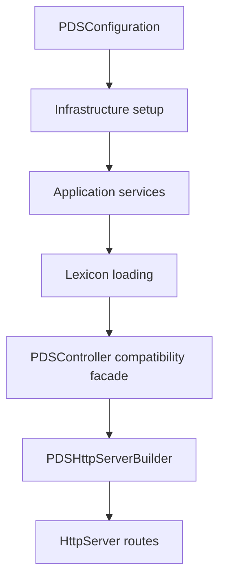
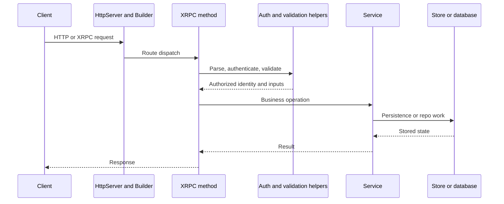

# Runtime Flow Walkthrough

## Overview

[Services Overview](./services-overview) explains the service split. This page
shows how that split is wired at runtime, from process startup through an
incoming request.

The main point is that Garazyk has a composition root. The service graph is
not accidental. `PDSApplication` builds it deliberately, then
`PDSHttpServerBuilder` exposes it through HTTP, XRPC, and WebSocket routes.

## Startup Has A Real Dependency Order

`PDSApplication` configures shared runtime state before it exposes any routes.



The order matters because services depend on infrastructure that is configured
earlier:

- logging and rate limiting read config first
- database pools and service databases come next
- JWT infrastructure depends on config and service storage
- services depend on the pools, minter, and storage layers already existing

## `PDSApplication` Is The Composition Root

The service graph is assembled in one place rather than spread across handlers.

```objc
_recordService = [[PDSRecordService alloc] initWithDatabasePool:_userDatabasePool];
_blobService = [[PDSBlobService alloc] initWithDatabasePool:_userDatabasePool
                                                    storage:blobStorage];
_repositoryService = [[PDSRepositoryService alloc] initWithDatabasePool:_userDatabasePool];
_adminController = [[PDSAdminController alloc] initWithServiceDatabases:_serviceDatabases
                                                         accountService:_accountService];
_subscribeReposHandler = [[SubscribeReposHandler alloc]
    initWithServiceDatabases:_serviceDatabases
              userDatabasePool:_userDatabasePool];
```

Why this matters:

- contributors can see the runtime seams in one file
- the builder later receives fully initialized services instead of creating them
  ad hoc
- older `PDSController` paths remain possible without defining new architecture

## Route Registration Is A Separate Concern

Once the services exist, `PDSHttpServerBuilder` wires the protocol surface.

```objc
if (self.application) {
  [XrpcMethodRegistry registerMethodsWithDispatcher:dispatcher
                                        application:self.application];
}

[server addWebSocketRoute:@"/xrpc/com.atproto.sync.subscribeRepos"
                  handler:^(HttpRequest *request, HttpResponse *response,
                            id<PDSNetworkConnection> connection) {
                    [strongSubscribeReposHandler acceptUpgradedConnection:connection
                                                                   request:request];
                  }];
```

This separation is intentional:

- `PDSApplication` owns object lifetime and dependencies
- the builder owns transport exposure
- the method registry owns endpoint registration

That keeps "how the process starts" separate from "which protocol route maps to
which behavior."

## A Typical Request Path

Most protocol requests still follow the same runtime pattern.



That is why the docs keep emphasizing service ownership and request flow over
controller inventories.

## The Legacy Controller Still Exists, But It Is Not The Center

`PDSController` is still created during startup because older handlers and
compatibility surfaces still need it.

What changed is the architectural priority:

- new runtime wiring is service-first
- the legacy controller is a facade for compatibility
- new contributors should trace behavior through services before assuming
  `PDSController` is authoritative

## Practical Tracing Advice

When you need to change runtime behavior, trace in this order:

1. `PDSApplication` for dependency construction
2. `PDSHttpServerBuilder` for route exposure
3. the relevant XRPC or HTTP method registration
4. the owning service
5. the underlying repo, blob, or database code

That path matches the actual runtime shape of the process.

## Related Reading

- [Services Overview](./services-overview)
- [Request Lifecycle](../01-getting-started/request-lifecycle)
- [Protocol Flow Walkthrough](../02-core-concepts/protocol-flow-walkthrough)
- [Firehose Flow Walkthrough](../08-sync-firehose/firehose-flow-walkthrough)

## Related

- [Documentation Map](../11-reference/documentation-map.md)
- [Contributor Guide](../index.md)
- [Repository Documentation Index](../repo-index/index.md)

