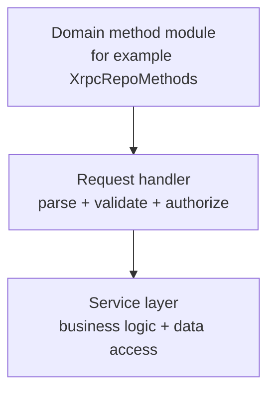

# Domain Methods

## Overview

Domain methods are the concrete implementations of XRPC endpoints organized by domain. Each domain module (XrpcRepoMethods, XrpcServerMethods, etc.) implements a set of related endpoints and handles the request/response cycle for those endpoints.

## Architecture



## Domain Module Pattern

Each domain module follows a consistent pattern:

### 1. Initialization

**Implementation (from XrpcRepoMethods.m):**

```objc
@interface XrpcRepoMethods : NSObject

@property (nonatomic, strong) PDSRecordService *recordService;
@property (nonatomic, strong) PDSBlobService *blobService;
@property (nonatomic, strong) PDSRepositoryService *repositoryService;

- (instancetype)initWithRecordService:(PDSRecordService *)recordService
                          blobService:(PDSBlobService *)blobService
                    repositoryService:(PDSRepositoryService *)repositoryService;

@end
```

### 2. Registration

Domain modules register their methods with the dispatcher:

```objc
- (void)registerMethodsWithRegistry:(XrpcDispatcher *)dispatcher {
    [dispatcher registerHandler:^(HttpRequest *request, HttpResponse *response) {
        [self handleCreateRecord:request response:response];
    } forNSID:@"com.atproto.repo.createRecord"];
    
    [dispatcher registerHandler:^(HttpRequest *request, HttpResponse *response) {
        [self handleGetRecord:request response:response];
    } forNSID:@"com.atproto.repo.getRecord"];
    
    [dispatcher registerHandler:^(HttpRequest *request, HttpResponse *response) {
        [self handleDeleteRecord:request response:response];
    } forNSID:@"com.atproto.repo.deleteRecord"];
    
    // ... more methods
}
```

### 3. Handler Implementation

Each handler follows a consistent pattern for request processing:

```objc
- (void)handleCreateRecord:(HttpRequest *)request response:(HttpResponse *)response {
    // 1. Extract authentication
    // 2. Parse request parameters
    // 3. Validate parameters
    // 4. Call service layer
    // 5. Serialize response
}
```

## Request Handler Pattern

### Step 1: Extract Authentication

```objc
NSString *authHeader = [request headerForName:@"Authorization"];
NSString *did = [XrpcAuthHelper extractDIDFromAuthHeader:authHeader
                                              jwtMinter:self.jwtMinter
                                        adminController:self.adminController
                                                request:request];

if (!did) {
    [XrpcErrorHelper setAuthenticationError:response];
    return;
}
```

### Step 2: Parse Request Parameters

**Implementation (from XrpcRepoMethods.m):**

```objc
// Parse JSON body
NSError *parseError = nil;
NSDictionary *params = [NSJSONSerialization JSONObjectWithData:request.body
                                                       options:0
                                                         error:&parseError];

if (!params) {
    [XrpcErrorHelper setValidationError:response message:@"Invalid JSON"];
    return;
}

// Extract parameters
NSString *repo = params[@"repo"];
NSString *collection = params[@"collection"];
NSDictionary *record = params[@"record"];
```

### Step 3: Validate Parameters

```objc
// Check required parameters
if (!repo || !collection || !record) {
    [XrpcErrorHelper setValidationError:response 
                                message:@"Missing required parameters"];
    return;
}

// Validate parameter types
if (![repo isKindOfClass:[NSString class]]) {
    [XrpcErrorHelper setValidationError:response 
                                message:@"repo must be a string"];
    return;
}

// Validate parameter values
if (![repo hasPrefix:@"did:"]) {
    [XrpcErrorHelper setValidationError:response 
                                message:@"repo must be a valid DID"];
    return;
}
```

### Step 4: Call Service Layer

```objc
NSError *serviceError = nil;
NSDictionary *result = [self.recordService putRecord:collection
                                                rkey:rkey
                                               value:record
                                              forDid:repo
                                            actorDid:did
                                      validationMode:PDSValidationModeOptimistic
                                               error:&serviceError];

if (!result) {
    [XrpcErrorHelper setInternalServerError:response 
                                    message:serviceError.localizedDescription];
    return;
}
```

### Step 5: Serialize Response

```objc
// Serialize to JSON
NSError *serializeError = nil;
NSData *responseData = [NSJSONSerialization dataWithJSONObject:result
                                                       options:0
                                                         error:&serializeError];

if (!responseData) {
    [XrpcErrorHelper setInternalServerError:response];
    return;
}

// Set response
response.statusCode = 200;
response.body = responseData;
[response setHeaderValue:@"application/json" forName:@"Content-Type"];
```

### Step 3: Validate Parameters

```objc
// Check required parameters
if (!repo || !collection || !record) {
    [XrpcErrorHelper setValidationError:response 
                                message:@"Missing required parameters"];
    return;
}

// Validate parameter types
if (![repo isKindOfClass:[NSString class]]) {
    [XrpcErrorHelper setValidationError:response 
                                message:@"repo must be a string"];
    return;
}

// Validate parameter values
if (![repo hasPrefix:@"did:"]) {
    [XrpcErrorHelper setValidationError:response 
                                message:@"repo must be a valid DID"];
    return;
}
```

### Step 4: Call Service Layer

```objc
NSError *serviceError = nil;
NSDictionary *result = [self.recordService putRecord:collection
                                                rkey:rkey
                                               value:record
                                              forDid:repo
                                            actorDid:did
                                      validationMode:PDSValidationModeOptimistic
                                               error:&serviceError];

if (!result) {
    [XrpcErrorHelper setInternalServerError:response 
                                    message:serviceError.localizedDescription];
    return;
}
```

### Step 5: Serialize Response

```objc
// Serialize to JSON
NSError *serializeError = nil;
NSData *responseData = [NSJSONSerialization dataWithJSONObject:result
                                                       options:0
                                                         error:&serializeError];

if (!responseData) {
    [XrpcErrorHelper setInternalServerError:response];
    return;
}

// Set response
response.statusCode = 200;
response.body = responseData;
[response setHeaderValue:@"application/json" forName:@"Content-Type"];
```

## Common Domain Modules

### XrpcServerMethods

Account and server operations:

```objc
- (void)handleCreateAccount:(HttpRequest *)request response:(HttpResponse *)response {
    // 1. Parse email, password, handle
    // 2. Validate credentials
    // 3. Call accountService.createAccount()
    // 4. Return account info with tokens
}

- (void)handleCreateSession:(HttpRequest *)request response:(HttpResponse *)response {
    // 1. Parse identifier (handle/email), password
    // 2. Call accountService.login()
    // 3. Return access and refresh tokens
}

- (void)handleRefreshSession:(HttpRequest *)request response:(HttpResponse *)response {
    // 1. Extract refresh token from body
    // 2. Call accountService.refreshAccessToken()
    // 3. Return new access token
}
```

### XrpcRepoMethods

Record and blob operations:

```objc
- (void)handleCreateRecord:(HttpRequest *)request response:(HttpResponse *)response {
    // 1. Extract auth
    // 2. Parse repo, collection, record
    // 3. Call recordService.putRecord()
    // 4. Return URI and CID
}

- (void)handleUploadBlob:(HttpRequest *)request response:(HttpResponse *)response {
    // 1. Extract auth
    // 2. Get binary blob from request body
    // 3. Call blobService.uploadBlob()
    // 4. Return CID and metadata
}

- (void)handleApplyWrites:(HttpRequest *)request response:(HttpResponse *)response {
    // 1. Extract auth
    // 2. Parse writes array
    // 3. Call recordService.applyWrites()
    // 4. Return commit info
}
```

### XrpcSyncMethods

Repository synchronization:

```objc
- (void)handleGetLatestCommit:(HttpRequest *)request response:(HttpResponse *)response {
    // 1. Parse repo DID
    // 2. Call repositoryService.getLatestCommit()
    // 3. Return commit CID and revision
}

- (void)handleGetRepo:(HttpRequest *)request response:(HttpResponse *)response {
    // 1. Parse repo DID and optional since parameter
    // 2. Call repositoryService.getRepoContents()
    // 3. Stream CAR data to response
}

- (void)handleSubscribeRepos:(HttpRequest *)request response:(HttpResponse *)response {
    // 1. Upgrade to WebSocket
    // 2. Start streaming commits
    // 3. Handle backpressure
}
```

### XrpcIdentityMethods

DID and handle resolution:

```objc
- (void)handleResolveHandle:(HttpRequest *)request response:(HttpResponse *)response {
    // 1. Parse handle parameter
    // 2. Call identityService.resolveDID()
    // 3. Return DID
}

- (void)handleGetDidDocument:(HttpRequest *)request response:(HttpResponse *)response {
    // 1. Parse DID parameter
    // 2. Call identityService.getDidDocument()
    // 3. Return DID document
}
```

### XrpcModerationMethods

Moderation and safety operations:

```objc
- (void)handleCreateReport:(HttpRequest *)request response:(HttpResponse *)response {
    // 1. Extract auth
    // 2. Parse subject and reason
    // 3. Call adminController.createReport()
    // 4. Return report status
}
```

## Error Handling in Domain Methods

### Validation Errors

```objc
if (!repo) {
    [XrpcErrorHelper setValidationError:response message:@"Missing repo"];
    return;
}
```

### Authorization Errors

```objc
if (![repo isEqualToString:did]) {
    [XrpcErrorHelper setAuthorizationError:response message:@"Cannot modify other's repo"];
    return;
}
```

### Not Found Errors

```objc
if (!record) {
    [XrpcErrorHelper setNotFoundError:response message:@"Record not found"];
    return;
}
```

### Conflict Errors

```objc
if (error.code == 409) {
    response.statusCode = 409;
    [response setHeaderValue:@"application/json" forName:@"Content-Type"];
    response.body = [NSJSONSerialization dataWithJSONObject:@{
        @"error": @"InvalidSwapCommit",
        @"message": @"Repository was modified"
    } options:0 error:nil];
    return;
}
```

## Best Practices

1. **Consistent Error Handling**
   - Use XrpcErrorHelper for all errors
   - Set appropriate HTTP status codes
   - Include helpful error messages

2. **Parameter Validation**
   - Validate all required parameters
   - Check parameter types
   - Validate parameter values

3. **Authorization**
   - Always verify authentication
   - Check authorization for operations
   - Log authorization failures

4. **Service Layer Delegation**
   - Keep handlers thin
   - Delegate business logic to services
   - Handle service errors appropriately

5. **Response Serialization**
   - Always set Content-Type header
   - Serialize to JSON or binary as appropriate
   - Handle serialization errors

## Common Patterns

### Handling Optional Parameters

```objc
NSString *cursor = params[@"cursor"];
NSNumber *limit = params[@"limit"];

// Use defaults if not provided
if (!limit) {
    limit = @50;
}

NSUInteger limitValue = [limit unsignedIntegerValue];
if (limitValue > 100) {
    limitValue = 100; // Cap at 100
}
```

### Handling Pagination

```objc
NSError *error = nil;
NSArray *records = [self.recordService listRecords:collection
                                           forDid:repo
                                            limit:limitValue
                                           cursor:cursor
                                            error:&error];

if (!records) {
    [XrpcErrorHelper setInternalServerError:response];
    return;
}

// Build response with cursor for next page
NSMutableDictionary *response = [NSMutableDictionary dictionary];
response[@"records"] = records;

if (records.count >= limitValue) {
    response[@"cursor"] = records.lastObject[@"cursor"];
}
```

### Handling Binary Data

```objc
// Get binary blob from request
NSData *blobData = request.body;

// Upload blob
NSError *error = nil;
NSDictionary *blob = [self.blobService uploadBlob:blobData
                                          forDid:repo
                                        mimeType:mimeType
                                           error:&error];

// Return binary response
response.statusCode = 200;
response.body = blobData;
[response setHeaderValue:mimeType forName:@"Content-Type"];
```

## Related Deep Dives

- [HTTP Request and Route Pipeline](./http-request-and-route-pipeline)
- [From NSID to Service Call](./from-nsid-to-service-call)

## See Also

- [XRPC Dispatch](xrpc-dispatch)
- [Method Registry](method-registry)
- [Auth Helpers](auth-helpers)
- [Error Handling](error-handling)\n\n## Related\n\n- [Documentation Map](../11-reference/documentation-map.md)\n- [Contributor Guide](../index.md)\n- [Repository Documentation Index](../repo-index/index.md)\n\n