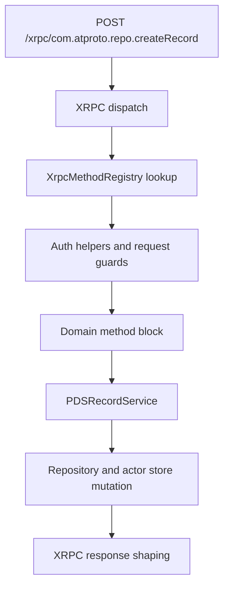

# From NSID to Service Call

## Goal

Read this page when you want one concrete answer to "what happens after `/xrpc/com.atproto...` hits the server?" It complements Tutorial 8 by focusing on the stable runtime seams: method registration, auth, validation, service delegation, and test surfaces.

## Full Flow

## Why This Boundary Matters

Contributors often over-attribute behavior to the handler block they happen to be reading. In practice, the outcome of one endpoint is split across several layers:

- `XrpcMethodRegistry` decides whether the NSID exists at all.
- auth helpers decide whether the request is allowed to run.
- the domain block decides how request data becomes service inputs.
- the service decides the business behavior and persistence order.
- the XRPC layer decides how errors and output are serialized.

If you collapse those into one mental model, debugging gets slow immediately.

## Walkthrough: `com.atproto.repo.createRecord`

This endpoint is a good example because it crosses every important seam.

1. The request matches `/xrpc/*` and enters the XRPC dispatch path.
2. `XrpcMethodRegistry` resolves `com.atproto.repo.createRecord` to the block registered by the repo domain methods.
3. The dispatch layer runs auth and request validation before service logic. This is where missing `Bearer` or `DPoP` state should fail.
4. The domain block extracts `repo`, `collection`, `rkey`, `record`, and optional commit guards from the input payload.
5. The block delegates to `PDSRecordService`, which validates record shape, prepares repository writes, and returns commit metadata for the response.
6. The service persists actor-state changes and signs the resulting commit in the actor store path.
7. The XRPC layer turns the service result into the final JSON response or into a structured protocol error.

That means a bad response shape does not always mean the service is wrong. The bug may be in the domain adapter or the dispatcher's error shaping.

## What The Registry Actually Buys You

`Garazyk/Sources/Network/XrpcMethodRegistry.m` is not just a big lookup table. It is the place where the runtime assembles the public protocol surface from domain-specific registration helpers.

That matters for contributor work because:

- adding a service method does not expose a new endpoint by itself,
- removing a registration can make a handler disappear even when service tests still pass,
- auth requirements are easiest to reason about when you read the registration and the owning handler together.

## Where To Debug When This Breaks

- Start in `Garazyk/Sources/Network/XrpcMethodRegistry.m` when the NSID is missing or the wrong method fires.
- Start in `Garazyk/Sources/Network/XrpcDispatcher.m` and the auth helpers when the failure is a protocol error before service code runs.
- Start in `Garazyk/Sources/App/Services/PDSRecordService.m` when the endpoint reaches the service but the repository result is wrong.
- Start in the domain methods module when the response shape or parameter mapping is wrong even though the service behavior looks correct.

## Tests That Should Fail If This Changes

- `Garazyk/Tests/Network/XrpcMethodRegistryTests.m`
- `Garazyk/Tests/CharacterizationTests/XrpcMethodRegistryCharacterizationTests.m`
- `Garazyk/Tests/App/Services/PDSRecordServiceTests.m`
- `Garazyk/Tests/Integration/CommitChainTests.m`

## Appendix

### Fast checklist for endpoint debugging

1. Is the NSID registered?
2. Does auth fail before the service call?
3. Does the domain block transform the payload correctly?
4. Does the service return the expected commit or error?
5. Does the XRPC adapter serialize the result you think it does?

## Related

- [Documentation Map](../11-reference/documentation-map.md)
- [Contributor Guide](../index.md)
- [Repository Documentation Index](../repo-index/index.md)

