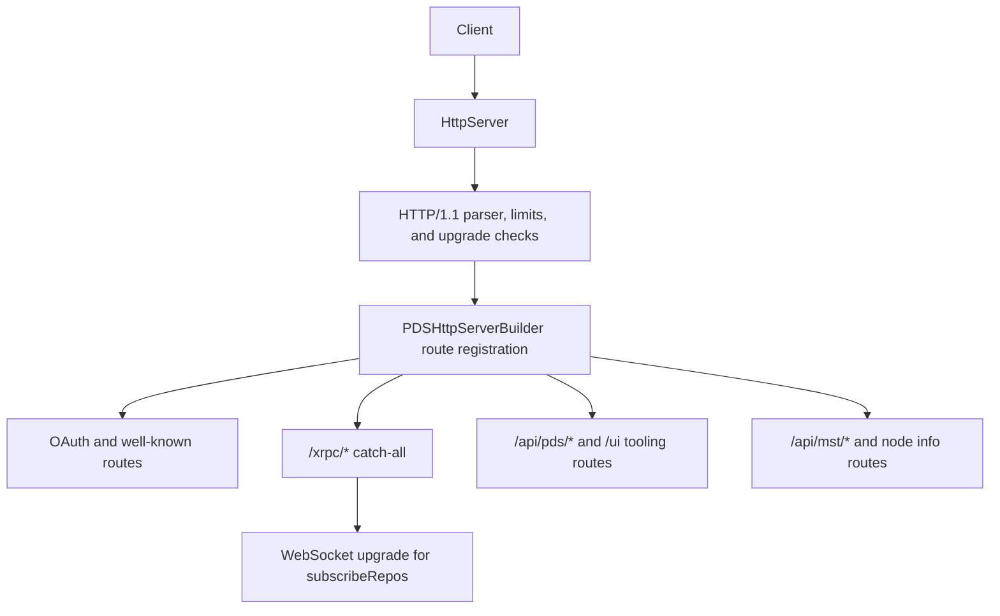

# HTTP Request and Route Pipeline

## Goal

Read this page when you need the concrete route from socket-level request parsing to the handler family that finally owns the request. The point is not to memorize every route; it is to know where the runtime decides whether a request is XRPC, Explorer, OAuth, UI, or a WebSocket upgrade.

## Full Flow

## Why The Route Order Matters

`HttpServer` owns request parsing, queueing, response serialization, and upgrade handoff. `PDSHttpServerBuilder` owns which route families exist and the order they are registered. Those are different responsibilities, and contributors lose time when they debug one while the bug lives in the other.

The builder currently registers route families in this order:

1. OAuth and discovery routes
2. XRPC routes
3. Explorer and UI routes
4. OAuth demo routes when enabled
5. MST viewer routes
6. Node info routes

That order comes from `ATProtoPDS/Sources/Network/PDSHttpServerBuilder.m`. If a specific path is being shadowed, start there before looking at service logic.

## Walkthrough: `describeServer`

Use `GET /xrpc/com.atproto.server.describeServer` as the mental model for the plain request path.

1. `HttpServer` accepts the connection and feeds bytes through the HTTP/1.1 parser.
2. The parser enforces header and body limits before any XRPC code runs.
3. The normalized path reaches the route table that `PDSHttpServerBuilder` created during startup.
4. Because the path starts with `/xrpc/`, the request goes to the XRPC route family rather than the Explorer or UI family.
5. The XRPC layer resolves the NSID and calls the method block that was registered for `com.atproto.server.describeServer`.
6. The handler writes the response body and headers back through `HttpServer`.

This is the simplest happy path because it proves transport, route selection, method lookup, and response shaping without adding actor-state mutations.

## Walkthrough: `subscribeRepos` Upgrade

The WebSocket path is different only after route selection.

1. The request still enters through `HttpServer`.
2. The route still matches through the builder's XRPC family.
3. The server detects the upgrade headers and switches from normal response handling to WebSocket connection setup.
4. The request is handed to the sync handler that owns `com.atproto.sync.subscribeRepos`.
5. From that point on, you are debugging WebSocket lifecycle and firehose event delivery rather than regular HTTP responses.

This is why a firehose bug can look like "routing is broken" even when the route match was correct.

## Where To Debug When This Breaks

- Start in `ATProtoPDS/Sources/Network/HttpServer.m` when the request never reaches the expected route family.
- Start in `ATProtoPDS/Sources/Network/PDSHttpServerBuilder.m` when the wrong family answers the path or a route disappears after startup changes.
- Inspect host and proxy handling when OAuth or DPoP URLs look correct locally but wrong behind nginx.
- Inspect the WebSocket handoff when only `subscribeRepos` fails and normal XRPC methods still work.

## Tests That Should Fail If This Changes

- `ATProtoPDS/Tests/Network/PDSHttpServerBuilderTests.m`
- `ATProtoPDS/Tests/Network/XrpcMethodRegistryTests.m`
- `ATProtoPDS/Tests/Sync/SubscribeReposHandlerTests.m`
- `ATProtoPDS/Tests/App/PDSApplicationTests.m`

## Appendix

### Route families worth knowing

- `/xrpc/*` is the protocol surface.
- `/api/pds/*` is contributor and operator tooling.
- `/ui` serves the browser-facing Cappuccino UI.
- `/oauth/*` and `/.well-known/*` cover authorization and discovery.
- `/api/mst/*` and node-info routes are debugging and inspection surfaces.
