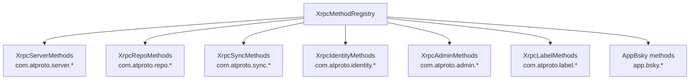

# Method Registry

## Overview

<!-- Image placeholder: XRPC Method Registration -->

*XrpcMethodRegistry orchestration layer delegating to domain-specific method modules*

The `XrpcMethodRegistry` orchestrates the registration of all ATProto XRPC methods with the dispatcher. It acts as a thin orchestration layer that delegates endpoint registration to domain-specific modules, ensuring all methods are registered in the correct order with proper dependencies.

## Architecture



## Responsibilities

The registry:

1. **Extracts services** from PDSApplication or PDSController
2. **Delegates registration** to domain-specific modules
3. **Ensures correct order** of registration
4. **Manages dependencies** between modules
5. **Installs interceptors** for request forwarding

## Domain Modules

### XrpcServerMethods

Handles `com.atproto.server.*` endpoints:

- `com.atproto.server.createAccount` — Create new account
- `com.atproto.server.createSession` — Login
- `com.atproto.server.refreshSession` — Refresh tokens
- `com.atproto.server.getSession` — Get current session
- `com.atproto.server.deleteSession` — Logout
- `com.atproto.server.describeServer` — Server information

**Dependencies:**
- PDSAccountService
- JWTMinter
- PDSConfiguration

### XrpcRepoMethods

Handles `com.atproto.repo.*` endpoints:

- `com.atproto.repo.createRecord` — Create record
- `com.atproto.repo.putRecord` — Update record
- `com.atproto.repo.deleteRecord` — Delete record
- `com.atproto.repo.getRecord` — Get record
- `com.atproto.repo.listRecords` — List records
- `com.atproto.repo.uploadBlob` — Upload blob
- `com.atproto.repo.applyWrites` — Batch writes

**Dependencies:**
- PDSRecordService
- PDSBlobService
- PDSRepositoryService

### XrpcSyncMethods

Handles `com.atproto.sync.*` endpoints:

- `com.atproto.sync.getLatestCommit` — Get repo root
- `com.atproto.sync.getRepo` — Export repository
- `com.atproto.sync.getBlocks` — Get specific blocks
- `com.atproto.sync.subscribeRepos` — WebSocket firehose

**Dependencies:**
- PDSRepositoryService
- PDSBlobService
- SubscribeReposHandler

### XrpcIdentityMethods

Handles `com.atproto.identity.*` endpoints:

- `com.atproto.identity.resolveHandle` — Resolve handle to DID
- `com.atproto.identity.getDidDocument` — Get DID document

**Dependencies:**
- PDSIdentityService
- PLCClient

### XrpcAdminMethods

Handles `com.atproto.admin.*` endpoints:

- `com.atproto.admin.getModeration` — Get moderation status
- `com.atproto.admin.emitModerationEvent` — Emit moderation event
- `com.atproto.admin.takdownRepo` — Takedown repository
- `com.atproto.admin.takdownRecord` — Takedown record

**Dependencies:**
- PDSAdminService
- PDSAdminController

### XrpcLabelMethods

Handles `com.atproto.label.*` and `com.atproto.temp.*` endpoints:

- `com.atproto.label.queryLabels` — Query labels
- `com.atproto.temp.checkSignupQueue` — Check signup queue

**Dependencies:**
- PDSLabelService

### XrpcAppBskyMethods

Handles `app.bsky.*` endpoints:

- `app.bsky.feed.post` — Create post
- `app.bsky.feed.like` — Like post
- `app.bsky.graph.follow` — Follow user

**Dependencies:**
- PDSRecordService
- PDSBlobService

## Registration Flow

### Initialization

```objc
// In PDSApplication or PDSController
[XrpcMethodRegistry registerMethodsWithDispatcher:dispatcher
                                     application:application];
```

### Registration Order

Methods are registered in dependency order:

```

1. XrpcServerMethods (no dependencies on other XRPC methods)
2. XrpcIdentityMethods (used by other methods)
3. XrpcRepoMethods (depends on identity resolution)
4. XrpcSyncMethods (depends on repo methods)
5. XrpcAdminMethods (depends on repo methods)
6. XrpcLabelMethods (independent)
7. XrpcAppBskyMethods (depends on repo methods)
```

### Service Extraction

```objc
// Extract services from application
PDSAccountService *accountService = application.accountService;
PDSRecordService *recordService = application.recordService;
PDSBlobService *blobService = application.blobService;
PDSRepositoryService *repositoryService = application.repositoryService;
PDSAdminService *adminService = application.adminService;
PDSRelayService *relayService = application.relayService;

// Pass to domain modules
XrpcRepoMethods *repoMethods = [[XrpcRepoMethods alloc]
    initWithRecordService:recordService
              blobService:blobService
        repositoryService:repositoryService];

[repoMethods registerMethodsWithRegistry:dispatcher];
```

## Helper Modules

### XrpcAuthHelper

Provides centralized authentication:

```objc
NSString *did = [XrpcAuthHelper extractDIDFromAuthHeader:authHeader
                                              jwtMinter:jwtMinter
                                        adminController:adminController
                                                request:request];
```

### XrpcIdentityHelper

Provides DID and handle resolution:

```objc
NSString *did = [XrpcIdentityHelper resolveDIDForHandle:handle
                                                  error:&error];

NSDictionary *didDocument = [XrpcIdentityHelper getDidDocument:did
                                                         error:&error];
```

### XrpcErrorHelper

Provides standardized error responses:

```objc
[XrpcErrorHelper setAuthenticationError:response];
[XrpcErrorHelper setValidationError:response message:@"Invalid parameter"];
[XrpcErrorHelper setNotFoundError:response message:@"Record not found"];
```

## Backward Compatibility

The registry supports both old and new initialization patterns:

### Old Pattern (PDSController)

```objc
[XrpcMethodRegistry registerMethodsWithDispatcher:dispatcher
                                      controller:controller];
```

### New Pattern (PDSApplication)

```objc
[XrpcMethodRegistry registerMethodsWithDispatcher:dispatcher
                                     application:application];
```

## Common Patterns

### Adding a New Domain Module

```objc
// 1. Create domain module class
@interface XrpcCustomMethods : NSObject
- (void)registerMethodsWithRegistry:(XrpcDispatcher *)dispatcher;
@end

// 2. Implement registration
- (void)registerMethodsWithRegistry:(XrpcDispatcher *)dispatcher {
    [dispatcher registerHandler:^(HttpRequest *request, HttpResponse *response) {
        // Handle request
    } forNSID:@"com.custom.method"];
}

// 3. Add to registry
XrpcCustomMethods *customMethods = [[XrpcCustomMethods alloc] init];
[customMethods registerMethodsWithRegistry:dispatcher];
```

### Extracting Services

```objc
// In domain module initialization
- (instancetype)initWithServices:(PDSApplication *)application {
    self = [super init];
    if (self) {
        self.recordService = application.recordService;
        self.blobService = application.blobService;
        self.repositoryService = application.repositoryService;
    }
    return self;
}
```

### Registering Multiple Related Methods

```objc
- (void)registerMethodsWithRegistry:(XrpcDispatcher *)dispatcher {
    // Create/Update
    [dispatcher registerHandler:^(HttpRequest *request, HttpResponse *response) {
        [self handleCreateRecord:request response:response];
    } forNSID:@"com.atproto.repo.createRecord"];
    
    // Get
    [dispatcher registerHandler:^(HttpRequest *request, HttpResponse *response) {
        [self handleGetRecord:request response:response];
    } forNSID:@"com.atproto.repo.getRecord"];
    
    // Delete
    [dispatcher registerHandler:^(HttpRequest *request, HttpResponse *response) {
        [self handleDeleteRecord:request response:response];
    } forNSID:@"com.atproto.repo.deleteRecord"];
}
```

## Error Handling

### Missing Service

If a required service is nil:

```objc
if (!self.recordService) {
    NSLog(@"ERROR: RecordService not available");
    return;
}
```

### Duplicate Registration

If a method is registered twice:

```objc
// Second registration overwrites first
[dispatcher registerHandler:handler1 forNSID:@"com.atproto.repo.createRecord"];
[dispatcher registerHandler:handler2 forNSID:@"com.atproto.repo.createRecord"];
// handler2 is now active
```

## Best Practices

1. **Service Injection**
   - Pass services explicitly to domain modules
   - Avoid accessing global state
   - Make dependencies clear

2. **Registration Order**
   - Register in dependency order
   - Document dependencies
   - Test registration order

3. **Error Handling**
   - Check for nil services
   - Log registration errors
   - Fail fast on missing dependencies

4. **Modularity**
   - Keep domain modules focused
   - Delegate to service layer
   - Use helper modules for shared logic

5. **Testing**
   - Test each domain module independently
   - Mock services for testing
   - Verify registration order

## Related Deep Dives

- [HTTP Request and Route Pipeline](./http-request-and-route-pipeline)
- [From NSID to Service Call](./from-nsid-to-service-call)

## See Also

- [XRPC Dispatch](xrpc-dispatch)
- [Domain Methods](domain-methods)
- [Auth Helpers](auth-helpers)
- [Error Handling](error-handling)
