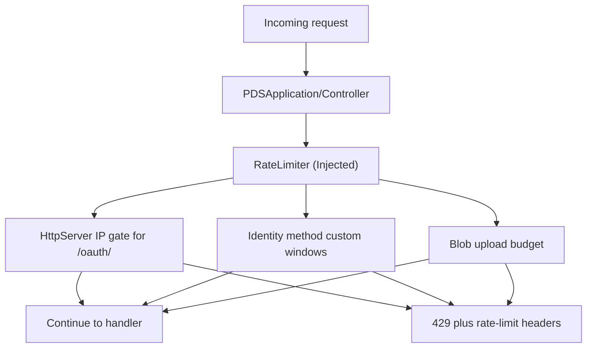

# Rate Limiting

## Overview

Garazyk uses rate limiting as a shared safety layer around a few abuse-prone paths. The important contributor fact is not the textbook algorithm. It is where the limiter is actually wired into the runtime, which identifiers it tracks, and which requests can still reach business logic before any deeper validation happens.

## Full Flow

## What Exists Today

The live implementation is `Garazyk/Sources/Network/RateLimiter.{h,m}`. It stores counters in SQLite and exposes four practical surfaces:

- DID-based limits for authenticated API activity
- IP-based limits for unauthenticated traffic
- blob-upload limits for per-actor media pressure
- custom keyed limits for sensitive endpoints that need their own window

### Dependency Injection

In the current runtime, the `RateLimiter` is owned by `PDSApplication` and its compatibility facade `PDSController`. It is explicitly injected into XRPC method packs (like `XrpcRepoPack`) during registration. This ensures that handlers use the correctly configured limiter instance and facilitates easier testing by allowing mock limiters.

- `PDSApplication` initializes and configures the `rateLimiter`.
- `XrpcMethodRegistry` orchestrates the injection into various XRPC handlers.
- `XrpcRepoPack` applies `checkBlobUploadRateLimitForDid:` for blob uploads.

In the current runtime, those checks are not applied everywhere in one generic middleware layer. They are attached where the repo needs them:

- `HttpServer` applies shared IP limiting to `/oauth/` requests before they enter the OAuth handlers.
- identity methods use custom short and long windows for PLC and handle update paths.
- blob flows use a dedicated upload budget instead of sharing the same bucket as normal API traffic.

## How Callers See The Result

When a request is limited, the runtime returns `429 Too Many Requests` and can attach `X-RateLimit-*` metadata plus `Retry-After`. That makes this layer observable to clients, but it is still intentionally small in scope. It answers "should this request proceed right now," not "is this request otherwise valid."

The configuration surface lives under the real `rate_limit` section, not the older camelCase names:

- `rate_limit.enabled`
- `rate_limit.did_limit` and `rate_limit.did_window`
- `rate_limit.ip_limit` and `rate_limit.ip_window`
- `rate_limit.blob_limit` and `rate_limit.blob_window`

## What This Layer Does Not Own

Rate limiting does not replace:

- auth checks
- request validation
- account suspension or moderation rules
- per-endpoint business logic

It also is not a universal fairness scheduler across every route. If a path is behaving badly, the first question is whether it is actually wired to the limiter at all.

## Related Deep Dives

- [HTTP Request and Route Pipeline](./http-request-and-route-pipeline)
- [Blob Flow Walkthrough](../07-repository-protocol/blob-flow-walkthrough)
- [Local Debug Workflow](../01-getting-started/local-debug-workflow)

## Related Reading

- [Auth Helpers](./auth-helpers)
- [Troubleshooting a Failing Endpoint](../11-reference/troubleshooting-a-failing-endpoint)
- [Blob Quotas](../07-repository-protocol/blob-quotas)

## Related

- [Documentation Map](../11-reference/documentation-map.md)
- [Contributor Guide](../index.md)

