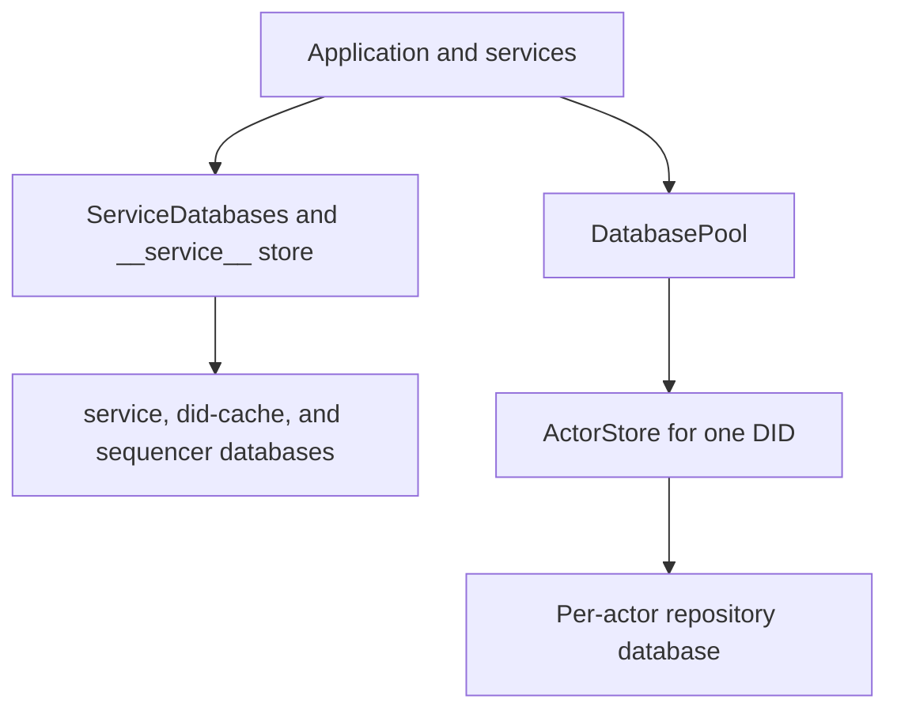

# Shared vs Actor Database Boundary

## Goal

This page explains the storage split between shared service databases and per-actor stores. It covers how the pool opens them and identifies why failures in one path do not necessarily affect the other.

## Full Flow

## Storage Isolation

The runtime uses multiple SQLite files instead of a single monolith:

- Shared service databases hold process-wide data.
- Actor stores hold repository and blob state for a single DID.
- The sequencer and DID cache are shared operational stores.

This design isolates per-actor repository work. A successful query against `service.sqlite` does not guarantee the health of a specific actor store.

## Walkthrough: Account Lookup Versus Record Write

1. Account lookup: `Garazyk/Sources/Database/Service/ServiceDatabases.m` uses `servicePool` with the synthetic DID `__service__` to open the shared store.
2. Record write: `Garazyk/Sources/Database/Pool/DatabasePool.m` uses `storeForDid:` to resolve a per-actor path (sharded by DID prefix) and opens or reuses an `ActorStore`.

Shared identity and account state live in one place; repository state, commit blocks, and blob metadata live in another.

## Data Placement

Use these defaults for new features:

- Service databases: accounts, invites, sessions, DID cache, sequencer events, shared operational state.
- Actor stores: records, repo root, tombstones, blob metadata, IPLD blocks, repository state.

If you are unsure where data belongs, determine if it is global operational state or a single actor's repository truth.

## Debugging

- Check `Garazyk/Sources/Database/Service/ServiceDatabases.m` if account or session lookups fail while repo reads work.
- Check `Garazyk/Sources/Database/Pool/DatabasePool.m` if DID-specific paths fail to open.
- Check `Garazyk/Sources/Database/ActorStore/ActorStore.m` if per-actor repository state is missing or corrupt.
- Check data-path configuration for incorrect base directories or sharding paths.

## Relevant Tests

- `Garazyk/Tests/Database/Pool/DatabasePoolTests.m`
- `Garazyk/Tests/Database/Integration/DatabaseMigrationTests.m`
- `Garazyk/Tests/App/Services/PDSRecordServiceTests.m`
- `Garazyk/Tests/Auth/SessionStoreTests.m`

## Appendix

### Key Questions

1. Is this shared operational state or actor-specific repository state?
2. Should the data survive independently of an actor database?
3. Does the bug affect one DID or every request?

## Related

- [Documentation Map](../11-reference/documentation-map.md)
- [Contributor Guide](../index.md)
- [Repository Documentation Index](../repo-index/index.md)

