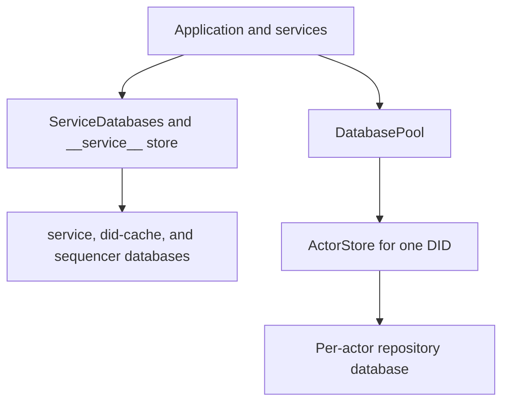

# Shared vs Actor Database Boundary

Garazyk splits storage into shared service databases and isolated per-actor stores. This split ensures process-wide data is decoupled from individual repository state.

## Architecture

## Storage Isolation
- **Service Databases**: Manage process-wide data, including the sequencer and DID cache.
- **Actor Stores**: Manage repository, block, and blob metadata for a single DID.

Queries against the shared service database operate independently of actor-specific stores.

## Implementation Path

### Account and Service Lookup
`ServiceDatabases.m` uses a dedicated pool for the `__service__` synthetic DID to manage shared stores.

### Per-Actor Operations
`DatabasePool.m` uses `storeForDid:` to resolve sharded actor paths. It instantiates or reuses an `ActorStore` for the specific DID.

## Data Placement Guidelines

### Service Databases
- Account metadata and invite codes.
- Authentication sessions and same-handle early returns.
- DID cache and sequencer event sequencing.
- Global operational configuration.

### Actor Stores
- Repository records and the Merkle Search Tree (MST) root.
- IPLD blocks and commit tombstones.
- Blob metadata and per-actor repository state.

## Debugging Surfaces
- **Global Failures**: See [Service Databases](./service-databases). Investigate `ServiceDatabases.m` for account, session, or sequencer issues.
- **Path Resolution**: See [Actor Databases](./actor-databases). Investigate `DatabasePool.m` if DID-specific storage paths fail to resolve or open.
- **State Corruption**: See [Data Integrity Verification](./data-integrity). Investigate `ActorStore.m` for repository or block integrity failures.

## Related Deep Dives
- [SQLite Architecture](./sqlite-architecture)
- [Actor Databases](./actor-databases)
- [Service Databases](./service-databases)
- [WAL Mode](./wal-mode)

## Related Reading
- [Repository Basics](../07-repository-protocol/repository-basics)
- [Firehose Overview](../08-sync-firehose/firehose-overview)
- [Session and JWT Lifecycle](../06-authentication/session-and-jwt-lifecycle)

