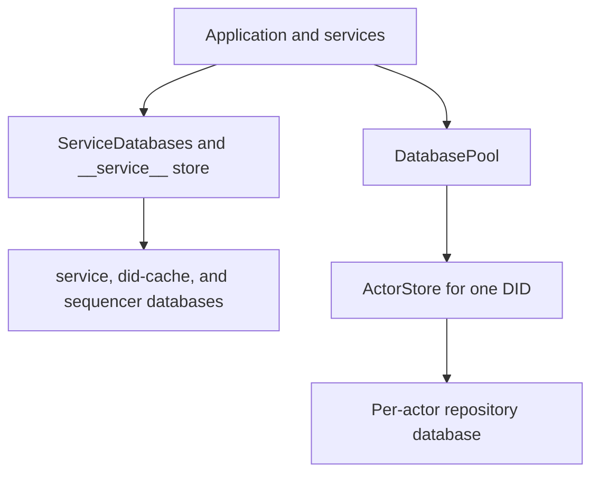

# Shared vs Actor Database Boundary

## Goal

Read this page when you need the storage split that explains most contributor confusion: what belongs in the shared service databases, what belongs in per-actor stores, how the pool opens them, and why one healthy query path does not prove the other is healthy.

## Full Flow

## Why The Split Exists

The runtime is deliberately not one giant SQLite file.

- shared service databases hold data that applies across the whole process,
- actor stores hold repository and blob state for one DID,
- the sequencer and DID cache are shared operational stores, not actor state.

That design keeps per-actor repository work isolated and makes it easier to reason about data ownership. It also means a query that succeeds against `service.sqlite` says nothing about the health of a specific actor store.

## Walkthrough: Account Lookup Versus Record Write

Use one shared operation and one actor operation to anchor the model.

1. Account lookup goes through `Garazyk/Sources/Database/Service/ServiceDatabases.m`.
2. That code uses `servicePool` with the synthetic DID `__service__` to open the shared store and run prepared statements.
3. Record write paths go through `Garazyk/Sources/Database/Pool/DatabasePool.m`.
4. `storeForDid:` resolves a per-actor path, shards it by DID prefix, opens or reuses an `ActorStore`, and then runs the repository mutation there.

The practical lesson is simple: shared identity and account state lives in one place, but repository state, commit blocks, and blob metadata live somewhere else entirely.

## What Usually Lives Where

Treat this as the contributor default:

- service databases: accounts, invites, sessions, DID cache, sequencer events, shared operational state
- actor stores: records, repo root, tombstones, blob metadata, IPLD blocks, signing-key-adjacent repository state

If you are unsure where a new feature belongs, ask whether the data is global operational state or one actor's repository truth.

## Where To Debug When This Breaks

- Start in `Garazyk/Sources/Database/Service/ServiceDatabases.m` when account or session lookups fail but repo reads still work.
- Start in `Garazyk/Sources/Database/Pool/DatabasePool.m` when a DID-specific path cannot open or keeps reopening unexpectedly.
- Start in `Garazyk/Sources/Database/ActorStore/ActorStore.m` when per-actor repository state is missing or corrupt.
- Start in data-path configuration when the wrong base directory or sharding path is being used.

## Tests That Should Fail If This Changes

- `Garazyk/Tests/Database/Pool/DatabasePoolTests.m`
- `Garazyk/Tests/Database/Integration/DatabaseMigrationTests.m`
- `Garazyk/Tests/App/Services/PDSRecordServiceTests.m`
- `Garazyk/Tests/Auth/SessionStoreTests.m`

## Appendix

### Ownership questions to ask first

1. Is this shared operational state or one actor's repository state?
2. Should the data survive independently of one actor database?
3. Does the bug reproduce only for one DID or for every request?\n\n## Related\n\n- [Documentation Map](../11-reference/documentation-map.md)\n- [Contributor Guide](../index.md)\n- [Repository Documentation Index](../repo-index/index.md)\n\n