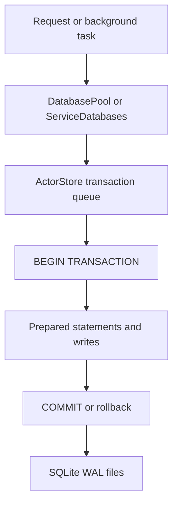

# Transactions, WAL, and Concurrency

## Goal

Read this page when a storage bug smells like ordering, locking, or durability rather than schema shape. The point is to explain how this repo combines WAL mode, prepared statements, serial actor-store writes, and multi-database coordination without pretending there is a global distributed transaction manager.

## Full Flow

## Why WAL Is Only Part Of The Story

`WAL` improves concurrency, but it is not the whole design. The runtime also relies on:

- serial queues around actor-store transactions,
- prepared statements instead of ad hoc SQL assembly,
- service-database pools for shared stores,
- application-level coordination when one request touches both actor and shared state.

If you only think "SQLite has WAL enabled," you will miss half the failure modes.

## Walkthrough: A Normal Actor Write

The actor-store path in `Garazyk/Sources/Database/ActorStore/ActorStore.m` is the core example.

1. A request reaches the store through `DatabasePool`.
2. The store executes work on its transaction queue so one actor's writes are serialized.
3. The write starts an explicit SQLite transaction.
4. Prepared statements insert or update rows such as records, blocks, tombstones, or repo-root metadata.
5. The transaction commits or rolls back as one unit.
6. Because WAL mode is enabled, readers can continue using the database while the write is being staged.

This is why "locked database" issues are usually about queueing or transaction length, not about one missing PRAGMA alone.

## Walkthrough: Shared And Actor Work In One Request

Some higher-level operations touch more than one store family. For example, a request can mutate actor repository state and later persist sequencer or session information in a shared service database.

The important constraint is that those are coordinated by application code, not by a single cross-database transaction. If the actor write succeeds and the later shared-state write fails, the recovery and retry story lives in the service layer.

That is a design fact contributors need to keep in mind when changing side-effect ordering.

## Where To Debug When This Breaks

- Start in `Garazyk/Sources/Database/ActorStore/ActorStore.m` for transaction queueing, explicit `BEGIN` and `COMMIT`, and prepared-statement failures.
- Start in `Garazyk/Sources/Database/Service/ServiceDatabases.m` for WAL pragmas and shared-store coordination.
- Start in `Garazyk/Sources/Database/Pool/DatabasePool.m` when store reuse, eviction, or path selection causes repeated open-close churn.
- Start in the owning service when the bug is really cross-store ordering rather than raw SQLite behavior.

## Tests That Should Fail If This Changes

- `Garazyk/Tests/Database/Pool/DatabasePoolTests.m`
- `Garazyk/Tests/Database/Integration/DatabaseMigrationTests.m`
- `Garazyk/Tests/App/Services/PDSRecordServiceTests.m`
- `Garazyk/Tests/Integration/CommitChainTests.m`

## Appendix

### Relevant pragmas and seams

- service databases apply `PRAGMA journal_mode=WAL`
- actor stores also configure WAL during database setup
- long-running writes still block per-actor progress because the transaction queue is serial
