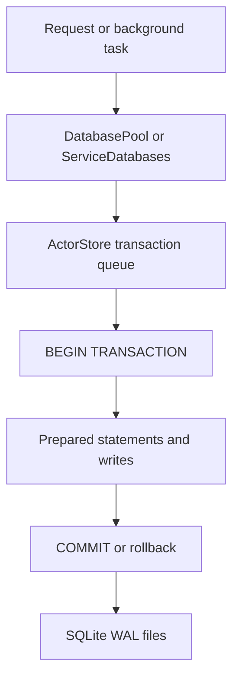

# Transactions, WAL, and Concurrency

## Overview

Garazyk combines WAL mode, prepared statements, serial actor-store writes, and multi-database coordination to ensure data integrity and performance.

## Write Flow

## Concurrency Design

Beyond WAL, the runtime relies on:

- **Serial Queues**: Actor-store transactions are serialized to prevent race conditions.
- **Prepared Statements**: Mandatory for all queries to ensure safety and performance.
- **Service Pools**: Dedicated pools for shared service databases.
- **Application Coordination**: The service layer coordinates operations that touch both actor and shared state.

## Walkthrough: Actor Write

1. A request accesses the store through `PDSDatabasePool`.
2. The store executes work on its serial transaction queue.
3. The write starts an explicit SQLite transaction.
4. Prepared statements update records, blocks, or repository metadata.
5. The transaction commits or rolls back as a single unit.
6. WAL mode allows concurrent readers to continue during the write.

## Cross-Database Coordination

Operations that touch multiple database families (e.g., updating a repository and the sequencer) are coordinated by application code. There is no global distributed transaction manager; the service layer must handle recovery if a partial failure occurs.

## Where to Debug
- **Transaction/Queueing**: `Garazyk/Sources/Database/ActorStore/ActorStore.m`
- **WAL/Shared Coordination**: `Garazyk/Sources/Database/Service/ServiceDatabases.m`
- **Pool/Path Resolution**: `Garazyk/Sources/Database/Pool/DatabasePool.m`

## Related Deep Dives
- [Shared vs Actor Database Boundary](./shared-vs-actor-database-boundary)
- [WAL Mode](./wal-mode)
- [SQLite Architecture](./sqlite-architecture)

## Related Reading
- [Actor Databases](./actor-databases)
- [Service Databases](./service-databases)
- [Data Integrity Verification](./data-integrity)
- [Firehose Overview](../08-sync-firehose/firehose-overview)

