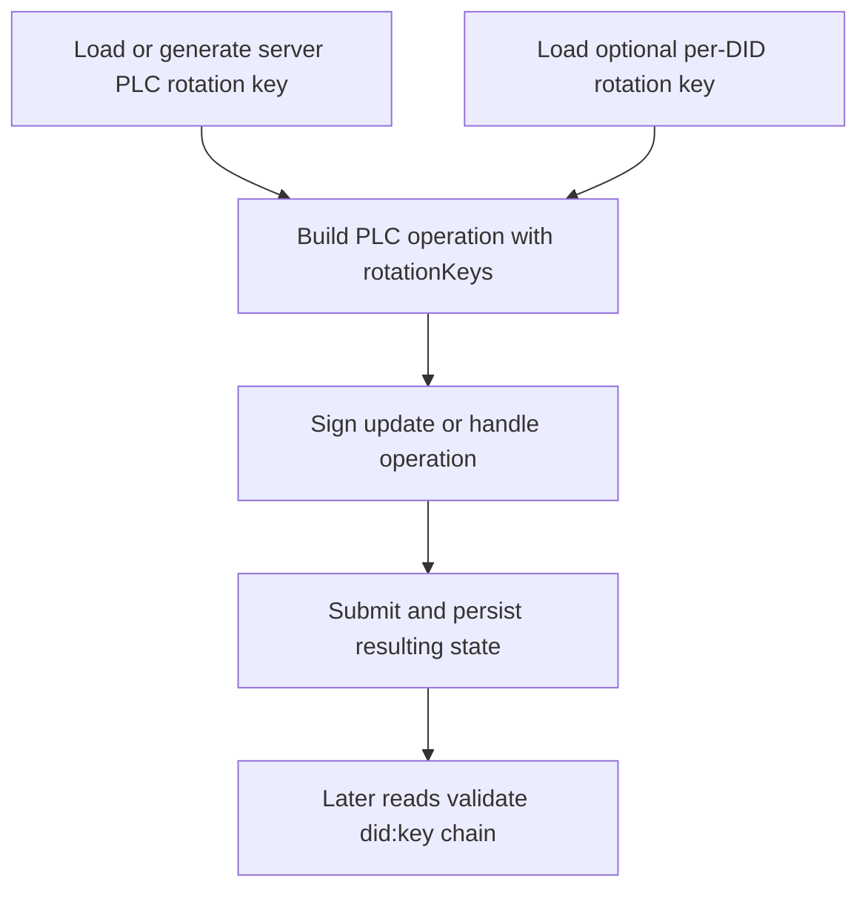

# Key Rotation

## Overview

In September, "key rotation" mainly means PLC rotation keys and the actor-scoped signing material that participates in identity updates. This is not a general scheduler that periodically rolls every secret in the system. It is a narrower set of repo-grounded flows for generating, storing, selecting, and using keys when the server signs PLC operations.

## Full Flow

## What Exists Today

The live rotation-key path spans a few concrete files:

- `Garazyk/Sources/PLC/PLCRotationKeyManager.m` loads or generates the server rotation key and persists it on disk, encrypting it when the master-secret path is available.
- `Garazyk/Sources/Database/ActorStore/ActorStore.m` can store and retrieve per-DID rotation keys in encrypted form.
- `Garazyk/Sources/Network/XrpcIdentityMethods.m` builds PLC operations, requires `rotationKeys` on update paths, and chooses whether to sign with the actor-specific key or the server-wide key.
- the PLC validation layer rejects malformed `did:key` material and verifies signature chains before accepting state.

That is the real boundary: load keys, choose the right signer, produce a valid PLC operation, and keep the state consistent with what the directory will later verify.

## What This Page Does Not Mean

This page is not describing:

- automatic time-based rollover for every JWT or OAuth key
- a background daemon that rotates all account keys on a schedule
- a generic "best practices" lifecycle independent of the PLC runtime

Those would be different subsystems. The current repo-grounded meaning is identity and PLC update signing.

## Common Failure Modes

When this area breaks, the usual causes are:

- the server rotation key cannot be loaded or decrypted
- a per-DID rotation key exists but cannot be recovered from actor storage
- the request omits `rotationKeys` or provides invalid `did:key` entries
- the operation is signed with a key that does not match the declared rotation chain

These failures often look like "PLC rejected my update," but the root cause is usually local key state, not the remote directory.

## Related Deep Dives

- [PLC Operation Walkthrough](../02-core-concepts/plc-operation-walkthrough)
- [DID Update Walkthrough](../02-core-concepts/did-update-walkthrough)
- [Cryptography in Practice](../02-core-concepts/cryptography-in-practice)

## Related Reading

- [PLC Directory](../02-core-concepts/plc-directory)
- [PLC Server Operations](../11-reference/plc-server-operations)
- [Cryptography](../02-core-concepts/cryptography)
