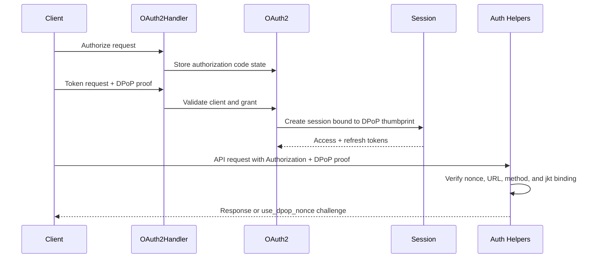

# OAuth + DPoP Request Walkthrough

## Goal

Read this page when you need the real flow for ATProto OAuth with DPoP in this codebase: authorization state, token exchange, nonce challenges, thumbprint binding, and the later bound API request. The goal is to explain where each guarantee is enforced, not to restate the spec.

## Full Flow

## Why This Flow Feels More Complicated Than Bearer Auth

Bearer auth asks only whether the token is valid. DPoP asks whether the caller also controls the key the token was minted for. In this repo, that extra guarantee is split across two stages:

- `OAuth2Handler` and `OAuth2` bind the token to a DPoP thumbprint during the token exchange.
- auth helpers verify that later request proofs match the stored or embedded binding.

If either stage is broken, the whole security story is broken.

## Walkthrough: Token Exchange

The token exchange enters `Garazyk/Sources/Auth/OAuth2Handler.m`.

1. The handler parses the form body and collects client credentials, DPoP proof, and grant details.
2. Client metadata and redirect details are validated before the grant is processed.
3. The handler verifies the DPoP proof against the token endpoint URL and extracts a thumbprint.
4. The request is handed to `Garazyk/Sources/Auth/OAuth2.m`.
5. `processAuthorizationCodeGrant:` checks the authorization code, PKCE state, and the expected DPoP thumbprint.
6. A session is created through `Session` with the DPoP thumbprint attached.
7. The token response returns access and refresh tokens that are now bound to that proof key.

The key point is that the thumbprint is not inferred later. It is captured at issuance time and then enforced on later requests.

## Walkthrough: Bound API Request

The later API request goes through auth helpers instead of the token endpoint.

1. The request arrives with `Authorization: DPoP ...` and a `DPoP` proof header.
2. The helper computes the expected URL from the request and proxy settings.
3. The DPoP proof is verified for method, URL, issued-at window, and nonce.
4. If the server requires a fresh nonce, the helper returns `use_dpop_nonce` and the client retries with the new challenge value.
5. The access token's `cnf.jkt` or stored session thumbprint is compared against the DPoP proof thumbprint.
6. Only then does the request continue to service logic.

This is why bad proxy headers or mismatched issuers show up as DPoP failures even when the JWT itself is valid.

## Where To Debug When This Breaks

- Start in `Garazyk/Sources/Auth/OAuth2Handler.m` when the token request itself fails.
- Start in `Garazyk/Sources/Auth/OAuth2.m` when the grant should succeed but the session or token binding is wrong.
- Start in `Garazyk/Sources/Auth/Session.m` when tokens are minted but later cannot be found or refreshed correctly.
- Start in the auth helper path when nonce challenges loop or the request URL does not match what the server expects behind a proxy.

## Tests That Should Fail If This Changes

- `Garazyk/Tests/Auth/OAuth2HandlerTests.m`
- `Garazyk/Tests/Auth/OAuthSessionTests.m`
- `Garazyk/Tests/Auth/SessionStoreTests.m`
- `Garazyk/Tests/Network/XrpcMethodRegistryTests.m`

## Appendix

### Fast failure split

- `invalid_client` usually means client metadata or secret handling is wrong.
- `use_dpop_nonce` means the proof was structurally acceptable but must be retried with the fresh nonce.
- a later auth failure with a valid JWT usually means the DPoP thumbprint or expected URL does not match.

## Related

- [Documentation Map](../11-reference/documentation-map.md)
- [Contributor Guide](../index.md)
- [Repository Documentation Index](../repo-index/index.md)

