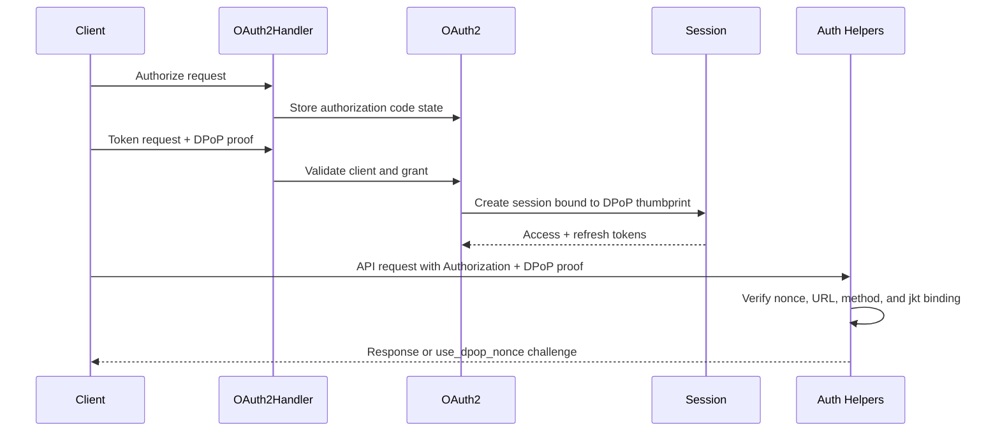

# OAuth + DPoP Request Walkthrough

## Overview

This walkthrough explains how ATProto OAuth and DPoP are enforced in Garazyk, covering authorization, token exchange, and authenticated API requests.

## Request Flow

## 1. Token Exchange

1. `OAuth2Handler.m` parses the request and validates client credentials.
2. The handler verifies the initial DPoP proof against the token endpoint URL.
3. `OAuth2.m` processes the grant (authorization code or refresh token).
4. A session is created and bound to the extracted DPoP thumbprint.
5. Access and refresh tokens are returned to the client.

## 2. Authenticated API Request

1. The client sends an API request with `Authorization: DPoP ...` and a `DPoP` proof header.
2. Auth helpers verify the DPoP proof for the specific method, URL, and nonce.
3. If a fresh nonce is required, the server returns a `use_dpop_nonce` challenge.
4. The access token's thumbprint binding is compared against the current request's proof.
5. If all checks pass, the request is authorized.

## Where to Debug
- **Token Request Failures**: `Garazyk/Sources/Auth/OAuth2Handler.m`
- **Grant/Binding Issues**: `Garazyk/Sources/Auth/OAuth2.m`
- **Session State**: `Garazyk/Sources/Auth/Session.m`
- **Request Verification/Nonces**: Auth helper path (e.g., `Sources/Network/XrpcAuthHelper.m`)

## Related Deep Dives
- [OAuth 2.0 with DPoP](./oauth2-dpop)
- [Session and JWT Lifecycle](./session-and-jwt-lifecycle)
- [JWT Tokens](./jwt-tokens)

## Related Reading
- [Security Best Practices](./security-best-practices)
- [Auth Helpers](../04-network-layer/auth-helpers)
- [Glossary](../GLOSSARY)

