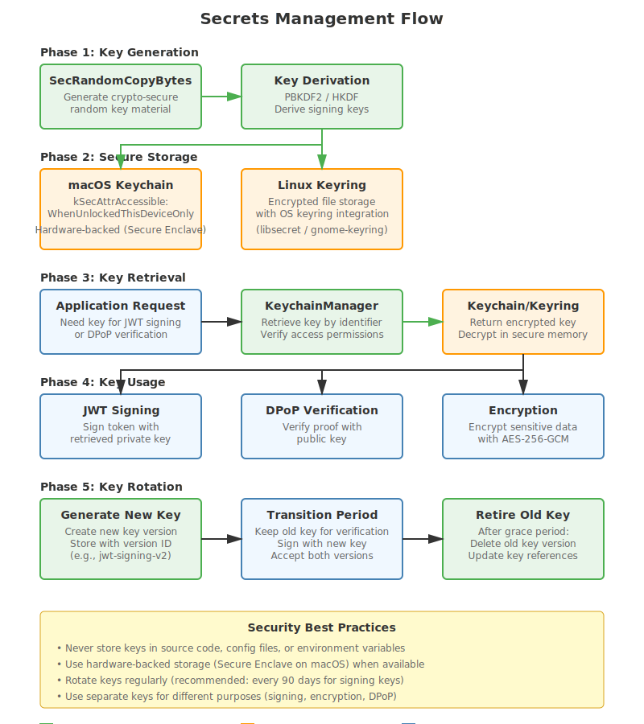

# Secrets Management

This guide covers secrets management in September PDS, including key storage, rotation strategies, and platform-specific security features.

## Overview



*Secure storage and retrieval of sensitive configuration data with platform-specific implementations*

September PDS manages several types of secrets:

- **Signing keys**: secp256k1 private keys for AT Protocol signing
- **JWT secrets**: Keys for minting and verifying tokens
- **Admin tokens**: Authentication for admin endpoints
- **Database encryption keys**: For encrypted data at rest
- **API keys**: External service credentials (email, relay)

## Key Storage Strategies

### macOS: Keychain Integration

On macOS, September PDS uses the system Keychain for secure key storage:

```objc
- (BOOL)importSigningKey:(NSData *)privateKey error:(NSError **)error {
    NSString *account = [self keychainAccount];
    
    // Delete existing key
    NSDictionary *deleteQuery = @{
        (__bridge id)kSecClass: (__bridge id)kSecClassGenericPassword,
        (__bridge id)kSecAttrService: kSigningKeyService,
        (__bridge id)kSecAttrAccount: account
    };
    SecItemDelete((__bridge CFDictionaryRef)deleteQuery);
    
    // Add new key
    NSMutableDictionary *addQuery = [NSMutableDictionary dictionaryWithDictionary:deleteQuery];
    addQuery[(__bridge id)kSecValueData] = privateKey;
    addQuery[(__bridge id)kSecAttrAccessible] = (__bridge id)kSecAttrAccessibleAfterFirstUnlock;
    
    OSStatus status = SecItemAdd((__bridge CFDictionaryRef)addQuery, NULL);
    if (status == errSecSuccess) {
        return YES;
    }
    
    // Handle errors...
}
```

*Source: [ATProtoPDS/Sources/Auth/PDSAppleActorKeyManager.m](../../ATProtoPDS/Sources/Auth/PDSAppleActorKeyManager.m#L67-L87)*

**Keychain Benefits**:
- Hardware-backed encryption on devices with Secure Enclave
- Automatic synchronization across devices (optional)
- OS-level access control
- Survives application reinstalls

### Linux: File-Based Keystore

On Linux/GNUstep, keys are stored in encrypted files with strict permissions:

```objc
- (BOOL)writePrivateKey:(NSData *)privateKey error:(NSError **)error {
    NSFileManager *fm = [NSFileManager defaultManager];
    
    // Create keystore directory with restricted permissions
    if (![fm createDirectoryAtPath:self.keystorePath
       withIntermediateDirectories:YES
                        attributes:@{NSFilePosixPermissions: @0700}
                             error:error]) {
        return NO;
    }
    
    NSString *targetPath = [self privateKeyPath];
    NSString *tmpPath = [self.keystorePath stringByAppendingPathComponent:
                        [NSString stringWithFormat:@".%@.tmp", [[NSUUID UUID] UUIDString]]];
    
    // Write atomically with restricted permissions
    int fd = open([tmpPath fileSystemRepresentation], O_WRONLY | O_CREAT | O_TRUNC, 0600);
    if (fd == -1) {
        if (error) {
            *error = [NSError errorWithDomain:NSPOSIXErrorDomain code:errno userInfo:nil];
        }
        return NO;
    }
    
    ssize_t written = write(fd, privateKey.bytes, (size_t)privateKey.length);
    fsync(fd);
    close(fd);
    
    // Atomic rename
    if (rename([tmpPath fileSystemRepresentation], [targetPath fileSystemRepresentation]) != 0) {
        unlink([tmpPath fileSystemRepresentation]);
        return NO;
    }
    
    return YES;
}
```

*Source: [ATProtoPDS/Sources/Auth/PDSOpenSSLKeyManager.m](../../ATProtoPDS/Sources/Auth/PDSOpenSSLKeyManager.m#L147-L186)*

**File-Based Security**:
- POSIX permissions: 0600 (owner read/write only)
- Atomic writes to prevent corruption
- Directory permissions: 0700 (owner access only)
- Filesystem encryption recommended (LUKS, dm-crypt)

### Memory-Only Fallback

If persistent storage fails, keys are kept in memory:

```objc
- (BOOL)importSigningKey:(NSData *)privateKey error:(NSError **)error {
    NSError *writeError = nil;
    if (![self writePrivateKey:privateKey error:&writeError]) {
        // Keep service available when persistent storage is not writable
        self.memoryKeyData = [privateKey copy];
        return YES;
    }
    
    self.memoryKeyData = nil;
    return YES;
}
```

*Source: [ATProtoPDS/Sources/Auth/PDSOpenSSLKeyManager.m](../../ATProtoPDS/Sources/Auth/PDSOpenSSLKeyManager.m#L50-L61)*

**Memory-Only Considerations**:
- Keys lost on process restart
- No protection against memory dumps
- Use only as last resort
- Log warning when falling back to memory storage

## Configuration

### Enabling Keychain (macOS)

In `config.json`:

```json
{
  "auth": {
    "use_keychain": true
  }
}
```

When enabled, signing keys are stored in macOS Keychain. When disabled, keys are stored in files.

### Keystore Path (Linux)

```json
{
  "auth": {
    "keystore_path": "/var/lib/pds/keys"
  }
}
```

Ensure this directory:
- Is on an encrypted filesystem
- Has restricted permissions (0700)
- Is backed up securely
- Is not in a shared/network mount

## Key Generation

### Generating Signing Keys

September PDS uses secp256k1 keys for AT Protocol signing:

```objc
- (BOOL)generateSigningKeyWithError:(NSError **)error {
    NSError *genError = nil;
    Secp256k1KeyPair *keyPair = [Secp256k1KeyPair generateKeyPair:&genError];
    if (!keyPair) {
        if (error) {
            *error = genError;
        }
        return NO;
    }
    return [self importSigningKey:keyPair.privateKey error:error];
}
```

*Source: [ATProtoPDS/Sources/Auth/PDSOpenSSLKeyManager.m](../../ATProtoPDS/Sources/Auth/PDSOpenSSLKeyManager.m#L35-L45)*

**Key Properties**:
- Algorithm: secp256k1 (same as Bitcoin)
- Private key: 32 bytes
- Public key: 33 bytes (compressed)
- Signature: 64 bytes (compact format)

### CLI Key Generation

Generate keys via CLI:

```bash
# Generate new signing key for a DID
kaszlak key generate --did did:plc:abc123

# Import existing key
kaszlak key import --did did:plc:abc123 --key-file private.key

# Export public key
kaszlak key export --did did:plc:abc123 --public
```

## Key Rotation

### When to Rotate Keys

Rotate keys when:
- **Suspected compromise**: Key may have been exposed
- **Scheduled rotation**: Regular security practice (annually)
- **Personnel changes**: Team member with key access leaves
- **Compliance requirements**: Regulatory mandates
- **Algorithm upgrade**: Moving to stronger cryptography

### Rotation Process

1. **Generate new key**:
```bash
kaszlak key generate --did did:plc:abc123 --output new-key.pem
```

2. **Update DID document** with new public key:
```bash
kaszlak plc update --did did:plc:abc123 --signing-key new-key.pem
```

3. **Wait for propagation** (PLC directory replication)

4. **Import new key**:
```bash
kaszlak key import --did did:plc:abc123 --key-file new-key.pem
```

5. **Verify** new key works:
```bash
kaszlak key verify --did did:plc:abc123
```

6. **Securely delete** old key:
```bash
# Overwrite old key file
shred -vfz -n 10 old-key.pem

# Remove from keychain (macOS)
security delete-generic-password -s "com.atproto.pds.signing" -a "signing-key-did:plc:abc123"
```

### Zero-Downtime Rotation

For production systems, use overlapping keys:

1. Add new key to DID document (keep old key)
2. Configure PDS to sign with new key
3. Wait for all clients to see new key (24-48 hours)
4. Remove old key from DID document

## Biometric Protection (macOS)

### Hardware-Backed Keys

Use Secure Enclave for hardware-backed key storage:

```objc
- (BOOL)storeKeyWithBiometricProtection:(NSData *)keyData 
                              forAccount:(NSString *)account 
                                   error:(NSError **)error {
    SecAccessControlRef access = SecAccessControlCreateWithFlags(
        kCFAllocatorDefault,
        kSecAttrAccessibleWhenUnlockedThisDeviceOnly,
        kSecAccessControlBiometryCurrentSet | kSecAccessControlPrivateKeyUsage,
        error
    );
    
    if (!access) {
        return NO;
    }
    
    NSDictionary *query = @{
        (__bridge id)kSecClass: (__bridge id)kSecClassGenericPassword,
        (__bridge id)kSecAttrService: @"com.atproto.pds.signing",
        (__bridge id)kSecAttrAccount: account,
        (__bridge id)kSecValueData: keyData,
        (__bridge id)kSecAttrAccessControl: (__bridge_transfer id)access
    };
    
    OSStatus status = SecItemAdd((__bridge CFDictionaryRef)query, NULL);
    return status == errSecSuccess;
}
```

*Source: [ATProtoPDS/Sources/Security/PDSBiometricKeychain.m](../../ATProtoPDS/Sources/Security/PDSBiometricKeychain.m#L50-L76)*

**Biometric Features**:
- Touch ID / Face ID required for key access
- Keys never leave Secure Enclave
- Automatic invalidation if biometrics change
- Device-specific (not synced to iCloud)

### Accessing Protected Keys

```objc
- (nullable NSData *)loadKeyForAccount:(NSString *)account 
                                 error:(NSError **)error {
    NSDictionary *query = @{
        (__bridge id)kSecClass: (__bridge id)kSecClassGenericPassword,
        (__bridge id)kSecAttrService: @"com.atproto.pds.signing",
        (__bridge id)kSecAttrAccount: account,
        (__bridge id)kSecReturnData: @YES,
        (__bridge id)kSecUseOperationPrompt: @"Authenticate to access signing key"
    };
    
    CFTypeRef result = NULL;
    OSStatus status = SecItemCopyMatching((__bridge CFDictionaryRef)query, &result);
    
    if (status != errSecSuccess) {
        if (error) {
            *error = [NSError errorWithDomain:NSOSStatusErrorDomain 
                                         code:status 
                                     userInfo:nil];
        }
        return nil;
    }
    
    return (__bridge_transfer NSData *)result;
}
```

*Source: [ATProtoPDS/Sources/Security/PDSBiometricKeychain.m](../../ATProtoPDS/Sources/Security/PDSBiometricKeychain.m#L90-L107)*

## HSM Integration

### Hardware Security Modules

For high-security deployments, integrate with HSMs:

**Supported HSMs**:
- YubiHSM 2
- AWS CloudHSM
- Azure Key Vault
- Google Cloud KMS

### PKCS#11 Integration

Use PKCS#11 for HSM access:

```objc
@interface PDSHSMKeyManager : NSObject <PDSActorKeyManager>

- (instancetype)initWithPKCS11Library:(NSString *)libraryPath
                                 slot:(NSUInteger)slot
                                  pin:(NSString *)pin;

- (BOOL)generateSigningKeyWithError:(NSError **)error;
- (nullable NSData *)signData:(NSData *)data error:(NSError **)error;

@end
```

**Implementation considerations**:
- Keys never leave HSM
- Signing operations performed in hardware
- PIN/password protection
- Audit logging
- FIPS 140-2 compliance

### Cloud KMS Example

Using AWS CloudHSM:

```bash
# Configure AWS credentials
export AWS_ACCESS_KEY_ID=...
export AWS_SECRET_ACCESS_KEY=...
export AWS_DEFAULT_REGION=us-east-1

# Configure PDS to use KMS
cat > config.json <<EOF
{
  "auth": {
    "key_manager": "aws-kms",
    "kms_key_id": "arn:aws:kms:us-east-1:123456789:key/abc-def-ghi"
  }
}
EOF
```

## Secrets in Configuration

### Environment Variables

Store secrets in environment variables, not config files:

```bash
# Bad: Secrets in config.json
{
  "email": {
    "smtp_password": "hunter2"
  }
}

# Good: Reference environment variable
{
  "email": {
    "smtp_password": "${SMTP_PASSWORD}"
  }
}
```

Set environment variables:

```bash
export SMTP_PASSWORD="hunter2"
export ADMIN_TOKEN="$(openssl rand -hex 32)"
export JWT_SECRET="$(openssl rand -hex 32)"
```

### Docker Secrets

Use Docker secrets for containerized deployments:

```yaml
# docker-compose.yml
services:
  pds:
    image: september-pds:latest
    secrets:
      - smtp_password
      - admin_token
      - jwt_secret
    environment:
      SMTP_PASSWORD_FILE: /run/secrets/smtp_password
      ADMIN_TOKEN_FILE: /run/secrets/admin_token
      JWT_SECRET_FILE: /run/secrets/jwt_secret

secrets:
  smtp_password:
    file: ./secrets/smtp_password.txt
  admin_token:
    file: ./secrets/admin_token.txt
  jwt_secret:
    file: ./secrets/jwt_secret.txt
```

### Kubernetes Secrets

For Kubernetes deployments:

```yaml
apiVersion: v1
kind: Secret
metadata:
  name: pds-secrets
type: Opaque
stringData:
  smtp-password: "hunter2"
  admin-token: "abc123"
  jwt-secret: "def456"
---
apiVersion: v1
kind: Pod
metadata:
  name: pds
spec:
  containers:
  - name: pds
    image: september-pds:latest
    env:
    - name: SMTP_PASSWORD
      valueFrom:
        secretKeyRef:
          name: pds-secrets
          key: smtp-password
    - name: ADMIN_TOKEN
      valueFrom:
        secretKeyRef:
          name: pds-secrets
          key: admin-token
```

## Backup and Recovery

### Backing Up Keys

**macOS Keychain**:
```bash
# Export keychain item (requires authentication)
security export -k login.keychain -t identities -f pkcs12 -o backup.p12

# Encrypt backup
openssl enc -aes-256-cbc -salt -in backup.p12 -out backup.p12.enc

# Store encrypted backup securely
```

**Linux File-Based**:
```bash
# Backup keystore directory
tar -czf keys-backup-$(date +%Y%m%d).tar.gz /var/lib/pds/keys

# Encrypt backup
gpg --symmetric --cipher-algo AES256 keys-backup-*.tar.gz

# Store encrypted backup offsite
```

### Recovery Process

1. **Restore from backup**:
```bash
# Decrypt backup
gpg --decrypt keys-backup-20250115.tar.gz.gpg > keys-backup.tar.gz

# Extract to keystore
tar -xzf keys-backup.tar.gz -C /var/lib/pds/

# Set correct permissions
chmod 700 /var/lib/pds/keys
chmod 600 /var/lib/pds/keys/*
```

2. **Verify keys**:
```bash
kaszlak key verify --did did:plc:abc123
```

3. **Test signing**:
```bash
echo "test" | kaszlak key sign --did did:plc:abc123
```

## Security Best Practices

### Do's

- **Use hardware-backed storage**: Keychain on macOS, HSM in production
- **Encrypt at rest**: Use filesystem encryption (FileVault, LUKS)
- **Restrict permissions**: 0600 for key files, 0700 for directories
- **Rotate regularly**: Annual rotation minimum
- **Backup securely**: Encrypted backups in separate location
- **Audit access**: Log all key access attempts
- **Use strong entropy**: System random number generator
- **Separate keys per DID**: Don't reuse keys

### Don'ts

- **Don't commit secrets**: Never commit keys to version control
- **Don't share keys**: Each instance should have unique keys
- **Don't log keys**: Redact keys from logs
- **Don't transmit unencrypted**: Always use TLS for key transfer
- **Don't store in plaintext**: Always encrypt keys at rest
- **Don't use weak permissions**: Never 0644 or world-readable
- **Don't skip backups**: Keys are unrecoverable if lost
- **Don't ignore rotation**: Old keys are security risks

## Compliance Considerations

### GDPR

- Document key storage locations
- Implement key deletion on user request
- Encrypt personal data with user-specific keys
- Log key access for audit trail

### PCI DSS

- Use HSM for payment-related keys
- Rotate keys every 90 days
- Implement dual control for key management
- Maintain key inventory

### SOC 2

- Document key management procedures
- Implement access controls
- Maintain audit logs
- Regular security assessments

## Related Documentation

- [JWT Tokens](jwt-tokens) - Token generation and verification
- [OAuth 2.0 with DPoP](oauth2-dpop) - Authentication flows
- [Key Rotation](key-rotation) - Detailed rotation procedures
- [Security Best Practices](security-best-practices) - Overall security guidance
- [Security Audit Guide](../11-reference/security-audit-guide) - Using audit skills

## See Also

- [Apple Keychain Services](https://developer.apple.com/documentation/security/keychain_services)
- [OWASP Key Management Cheat Sheet](https://cheatsheetseries.owasp.org/cheatsheets/Key_Management_Cheat_Sheet.html)
- [NIST SP 800-57: Key Management](https://csrc.nist.gov/publications/detail/sp/800-57-part-1/rev-5/final)
