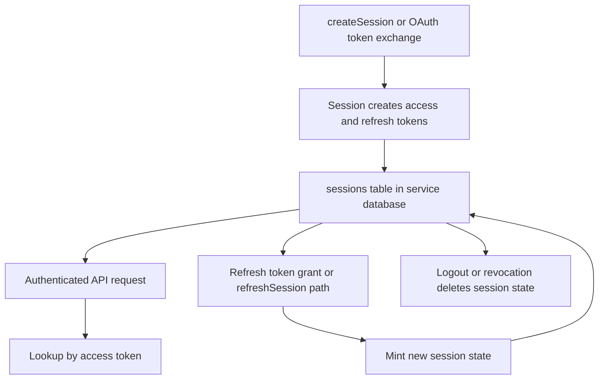

# Session and JWT Lifecycle

## Goal

Read this page when you need the concrete lifecycle for direct sessions and JWT-backed request auth: session creation, access-token lookup, refresh rotation, revocation, and the places issuer and audience checks matter.

## Full Flow

## Why Session State Still Matters With JWTs

The tokens look self-contained, but the runtime does not treat them as purely stateless. It stores session rows so it can:

- find access and refresh tokens quickly,
- bind DPoP thumbprints to session state,
- revoke or rotate tokens,
- enforce account state checks outside of raw signature validation.

That means a "JWT bug" is often a session-store bug instead.

## Walkthrough: Session Creation

The direct session path and the OAuth path converge on the same storage idea.

1. A login flow decides the actor is allowed to authenticate.
2. `Garazyk/Sources/Auth/Session.m` creates a session object with DID, handle, scope, token type, and optional DPoP thumbprint.
3. Access and refresh tokens are minted and expiration times are calculated.
4. The session row is written into the service database.
5. Later request auth looks the session back up by access token, not just by decoding the JWT and trusting it blindly.

This is why account suspension or token revocation can still invalidate an otherwise well-formed token.

## Walkthrough: Refresh And Rotation

Refresh is not just "same session, new expiry".

1. The runtime finds the existing session by refresh token.
2. Expiry and account checks run before new tokens are minted.
3. The new session state is created, optionally with updated DPoP binding.
4. The old session row is removed or replaced so the runtime does not keep serving stale credentials.

If refresh bugs leave the old and new session state inconsistent, later request auth becomes confusing fast.

## Issuer And Audience Checks In Practice

The runtime identity comes from configuration, startup checks, and auth helpers together. The practical failure cases are:

- token issuer does not match the configured public server identity,
- the audience is wrong for the current server,
- the request uses a token minted for a different environment,
- proxy or host configuration makes the runtime think it is serving a different public URL.

When this happens, do not start by changing JWT parsing. Start by confirming the runtime identity and the session record.

## Where To Debug When This Breaks

- Start in `Garazyk/Sources/Auth/Session.m` for session lookup, refresh, and revocation behavior.
- Start in `Garazyk/Sources/Auth/OAuth2.m` when refresh via OAuth rotates incorrectly.
- Start in auth helpers when the session row exists but request auth still rejects the token.
- Start in `Garazyk/Sources/App/PDSApplication.m` and configuration when issuer or environment identity is wrong.

## Tests That Should Fail If This Changes

- `Garazyk/Tests/Auth/SessionStoreTests.m`
- `Garazyk/Tests/Auth/OAuthSessionTests.m`
- `Garazyk/Tests/Auth/OAuth2HandlerTests.m`
- `Garazyk/Tests/CharacterizationTests/SessionCharacterizationTests.m`

## Appendix

### The three questions to ask first

1. Was the session row created at all?
2. Is the request using the right token family for this route?
3. Did refresh or revocation leave the store in a surprising state?
