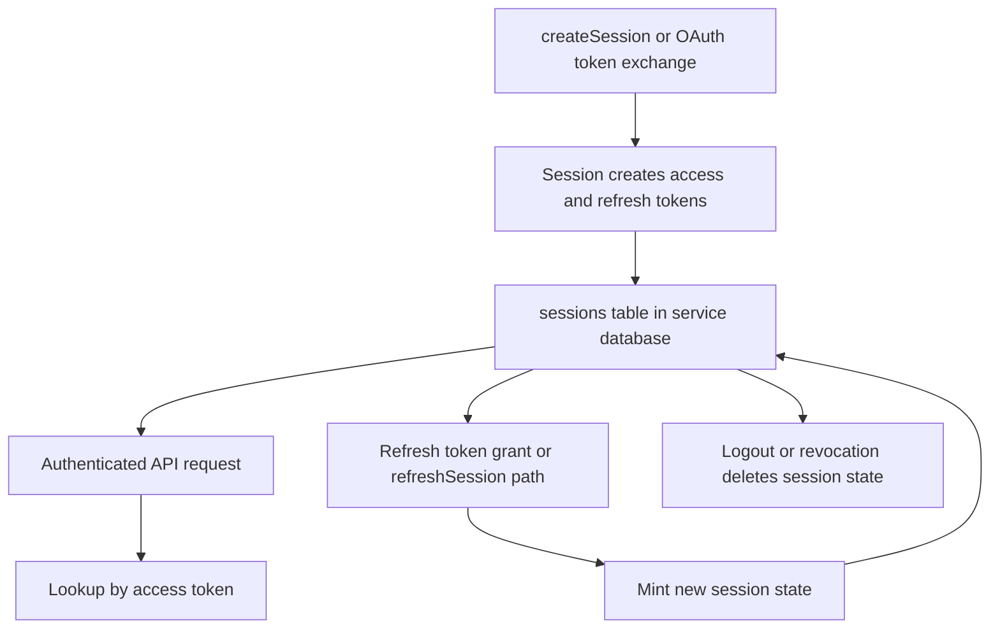

# Session and JWT Lifecycle

## Overview

This document describes the lifecycle of authentication sessions and JWTs in Garazyk, from creation to revocation.

## Lifecycle Flow

## 1. Session Creation

1. A login flow (direct or OAuth) authenticates the actor.
2. `Garazyk/Sources/Auth/Session.m` creates a session object with DID, handle, scope, and optional DPoP thumbprint.
3. Access and refresh tokens are minted.
4. The session is stored in the `service.db` database.

## 2. Request Authentication

Requests are validated against the stored session, not just the JWT. This allows the server to invalidate sessions immediately even if the JWT has not expired.

## 3. Refresh and Rotation

1. The runtime identifies the session via the refresh token.
2. After validating account status, new tokens are minted.
3. The old session state is replaced.

## 4. Revocation

Logout or administrative revocation deletes the session row, immediately invalidating any associated access tokens.

## Related Deep Dives
- [JWT Tokens](./jwt-tokens)
- [OAuth + DPoP Request Walkthrough](./oauth-dpop-request-walkthrough)
- [OAuth 2.0 with DPoP](./oauth2-dpop)

## Related Reading
- [Service Databases](../05-database-layer/service-databases)
- [Auth Helpers](../04-network-layer/auth-helpers)
- [Glossary](../GLOSSARY)

