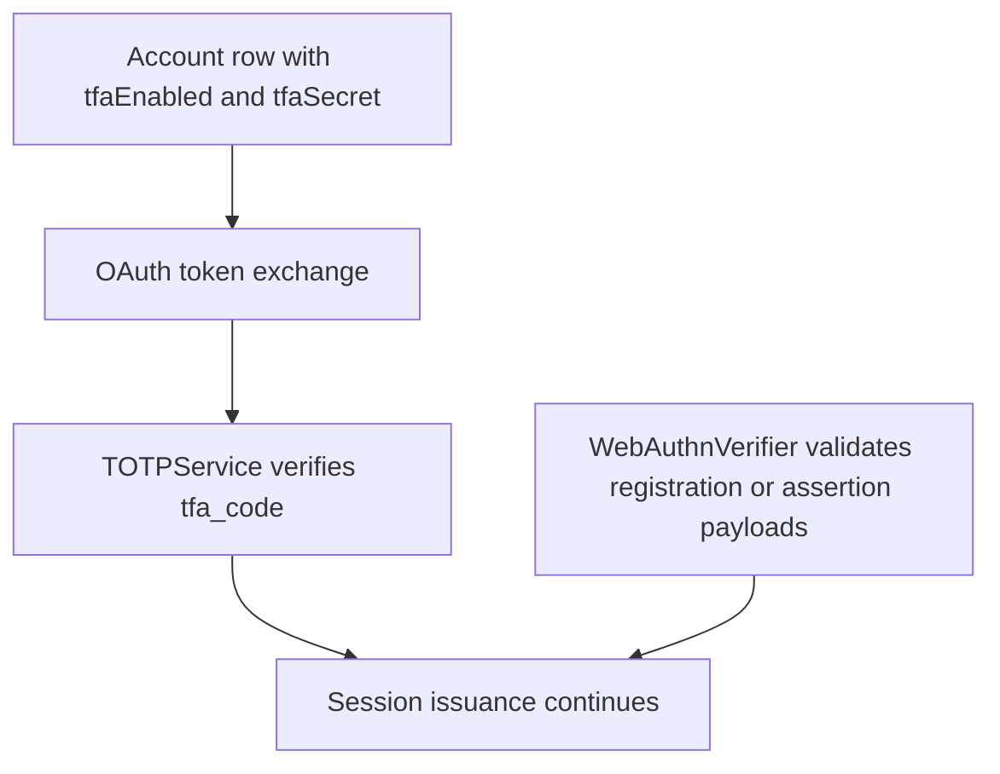

# TOTP and WebAuthn

## Overview

Garazyk contains both TOTP and WebAuthn support, but they are not at the same maturity level in the runtime. TOTP is part of a live authentication path. WebAuthn currently exists as verifier logic and tests that can support higher-level enrollment or assertion flows, but it is not the same thing as a fully surfaced account-management feature set.

## Full Flow

## What Is Live Today

The current repo-grounded picture is:

- account records in `PDSDatabase` include `tfaEnabled` and `tfaSecret`
- `OAuth2.m` requires `tfa_code` during token exchange when an account has two-factor auth enabled
- `TOTPService` generates secrets, can produce QR-code enrollment material, and verifies incoming codes
- `TOTPTests` cover secret generation, code verification windows, and QR output

That makes TOTP part of a real request path, not just a helper library.

## Where WebAuthn Fits

`WebAuthnVerifier` is also real code, and its tests verify registration and assertion validation rules such as:

- challenge matching
- expected origin checks
- signature validation
- sign-count progression

What it does not currently represent by itself is a complete user-facing enrollment and session flow on par with the TOTP path above. Treat it as a verified building block that higher-level request handling can call into.

## Why This Boundary Matters

Contributors often mix up three different layers:

- second-factor verification
- session creation and refresh
- request-time token and DPoP validation

TOTP and WebAuthn live at the first layer. They do not replace session storage, JWT validation, or DPoP proof checks. If an authenticated request fails after login succeeds, you are usually past this page already.

## Related Deep Dives

- [OAuth + DPoP Request Walkthrough](./oauth-dpop-request-walkthrough)
- [Session and JWT Lifecycle](./session-and-jwt-lifecycle)

## Related Reading

- [OAuth 2.0 with DPoP](./oauth2-dpop)
- [Security Best Practices](./security-best-practices)
- [Troubleshooting a Failing Endpoint](../11-reference/troubleshooting-a-failing-endpoint)\n\n## Related\n\n- [Documentation Map](../11-reference/documentation-map.md)\n- [Contributor Guide](../index.md)\n- [Repository Documentation Index](../repo-index/index.md)\n\n