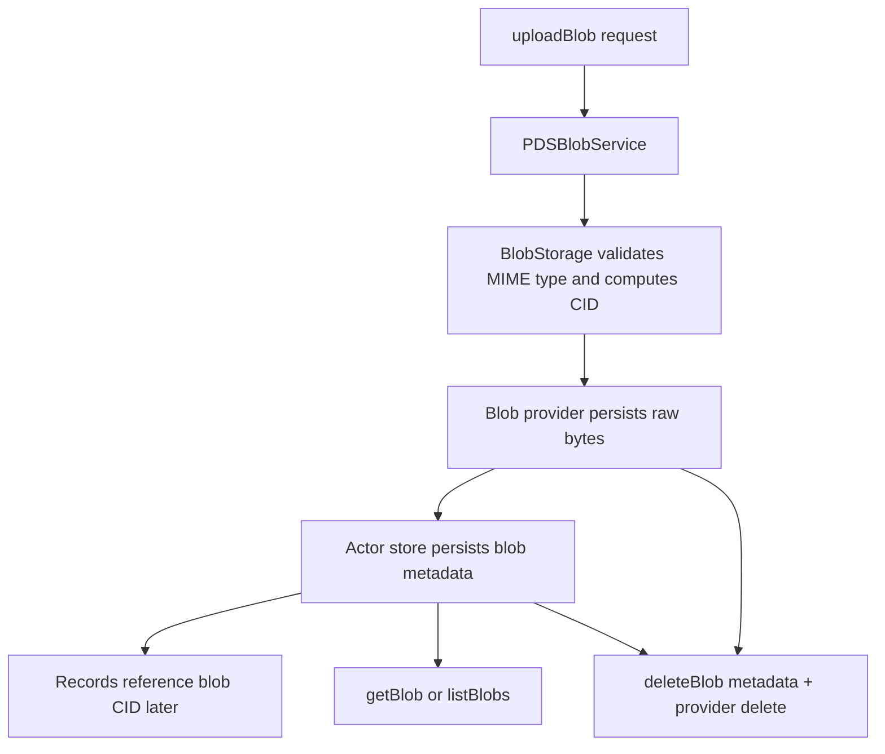

# Blob Flow Walkthrough

## Goal

Read this page when you need the concrete blob path from upload to read or delete. The goal is to separate what the current runtime really does from maintenance features it does not yet promise, especially around cleanup and quota accounting.

## Full Flow

## Why Blob Work Spans More Than One Layer

Blob behavior is split on purpose:

- `PDSBlobService` is the service-facing adapter,
- `BlobStorage` owns content addressing, metadata coordination, and provider calls,
- the blob provider owns raw byte persistence,
- repository records may later reference the blob CID but do not own the byte store.

That means "blob exists" can mean different things depending on whether you checked metadata, provider bytes, or a record reference.

## Walkthrough: Upload And Later Read

The normal upload path lives across `Garazyk/Sources/App/Services/PDSBlobService.m` and `Garazyk/Sources/Blob/BlobStorage.m`.

1. The request arrives with binary data and a MIME type.
2. `PDSBlobService` hands the bytes to `BlobStorage`.
3. `BlobStorage` validates the MIME type and computes a CID for the content.
4. If the blob already exists for that actor, the store can reuse metadata instead of duplicating work.
5. The provider persists the raw bytes.
6. The actor store persists the blob metadata row keyed by CID.
7. Later `getBlob` or `listBlobs` reads metadata first and then resolves raw bytes through the provider.

This split explains why provider failures and metadata failures look different in practice.

## Walkthrough: Delete

Delete is explicit and narrower than contributors often assume.

1. The delete call resolves the blob CID and actor.
2. Metadata is removed from the actor store.
3. The provider is asked to remove the raw bytes for that CID.

What does not happen automatically:

- cross-record reference counting,
- background garbage collection,
- automatic cleanup after a record stops referencing a blob.

If you expect those behaviors, you will debug the wrong subsystem.

## Where To Debug When This Breaks

- Start in `Garazyk/Sources/App/Services/PDSBlobService.m` when request inputs or response shaping look wrong.
- Start in `Garazyk/Sources/Blob/BlobStorage.m` when CID, metadata, or provider coordination is wrong.
- Start in the provider implementation when bytes disappear or cannot be loaded even though metadata exists.
- Start in repository record code when the issue is really a bad reference embedded in a record rather than a storage bug.

## Tests That Should Fail If This Changes

- `Garazyk/Tests/Blob/BlobStorageTests.m`
- `Garazyk/Tests/App/Services/PDSBlobServiceTests.m`
- `Garazyk/Tests/Integration/CommitChainTests.m`

## Appendix

### Practical debugging split

- metadata exists, bytes missing: provider path
- bytes exist, metadata missing: actor-store path
- upload succeeds, records still broken: record reference path
