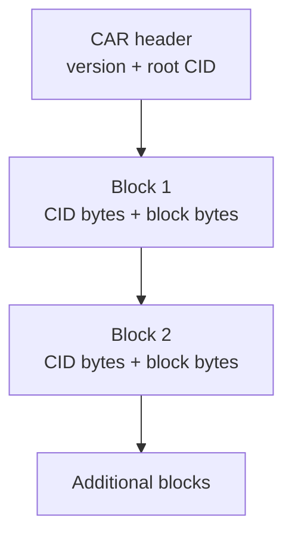

# CAR Format

## Overview

CAR (Content Addressable aRchive) v1 is a format for storing and transmitting IPLD blocks. It's used for repository export/import and sync operations.

## CAR Structure



## CAR Classes

The CAR format is implemented with three main classes:

```objc
// CARBlock - represents a single block in the archive
@interface CARBlock : NSObject
@property (nonatomic, strong, readonly) CID *cid;
@property (nonatomic, strong, readonly) NSData *data;
+ (instancetype)blockWithCID:(CID *)cid data:(NSData *)data;
@end

// CARReader - reads and parses CAR files
@interface CARReader : NSObject
@property (nonatomic, strong, readonly) CID *rootCID;
@property (nonatomic, strong, readonly) NSArray<CARBlock *> *blocks;
+ (nullable instancetype)readFromData:(NSData *)data error:(NSError **)error;
+ (nullable instancetype)readFromPath:(NSString *)path error:(NSError **)error;
- (nullable CARBlock *)blockWithCID:(CID *)cid;
@end

// CARWriter - creates and writes CAR files
@interface CARWriter : NSObject
@property (nonatomic, strong, readonly) CID *rootCID;
+ (instancetype)writerWithRootCID:(CID *)rootCID;
- (void)addBlock:(CARBlock *)block;
- (nullable NSData *)serialize;
- (BOOL)writeToPath:(NSString *)path error:(NSError **)error;
@end
```

**Source:** `ATProtoPDS/Sources/Repository/CAR.m` (lines 1-100, 200-250, 300-350)

## Creating CAR Files

```objc
// 1. Create writer with root CID
CID *rootCID = /* ... */;
CARWriter *writer = [CARWriter writerWithRootCID:rootCID];

// 2. Add MST root block
NSData *rootBlockData = /* ... */;
CARBlock *rootBlock = [CARBlock blockWithCID:rootCID data:rootBlockData];
[writer addBlock:rootBlock];

// 3. Add record blocks
for (CID *recordCid in recordCids) {
    NSData *recordBlockData = /* ... */;
    CARBlock *recordBlock = [CARBlock blockWithCID:recordCid data:recordBlockData];
    [writer addBlock:recordBlock];
}

// 4. Write to file
NSError *error = nil;
BOOL success = [writer writeToPath:@"/tmp/repo.car" error:&error];

if (success) {
    NSLog(@"CAR file created successfully");
} else {
    NSLog(@"Failed to write CAR: %@", error);
}
```

**Source:** `ATProtoPDS/Sources/Repository/CAR.m` (lines 300-350, 380-420)

## Reading CAR Files

```objc
// 1. Read CAR file
NSError *error = nil;
CARReader *reader = [CARReader readFromPath:@"/tmp/repo.car" error:&error];

if (!reader) {
    NSLog(@"Failed to read CAR: %@", error);
    return;
}

// 2. Get root CID
CID *rootCID = reader.rootCID;
NSLog(@"Root CID: %@", rootCID.stringValue);

// 3. Process blocks
for (CARBlock *block in reader.blocks) {
    CID *blockCID = block.cid;
    NSData *blockData = block.data;
    
    // Store block
    NSLog(@"Processing block: %@", blockCID.stringValue);
    [blobService storeBlock:blockData forCID:blockCID];
}
```

**Source:** `ATProtoPDS/Sources/Repository/CAR.m` (lines 150-200, 250-300)

## Streaming CAR

For large repositories, stream CAR data:

```objc
// 1. Read CAR file (streaming is automatic for large files)
NSError *error = nil;
CARReader *reader = [CARReader readFromPath:@"/tmp/repo.car" error:&error];

if (!reader) {
    NSLog(@"Failed to read CAR: %@", error);
    return;
}

// 2. Process blocks one at a time
for (CARBlock *block in reader.blocks) {
    CID *blockCID = block.cid;
    NSData *blockData = block.data;
    
    // Process block without loading entire CAR into memory
    [self processBlock:blockData forCID:blockCID];
}
```

**Source:** `ATProtoPDS/Sources/Repository/CAR.m` (lines 150-200)

## Repository Export

```objc
// 1. Get repository root CID
NSError *error = nil;
CID *rootCID = [repositoryService getRootCIDForDid:userDid error:&error];

if (!rootCID) {
    NSLog(@"Failed to get root CID: %@", error);
    return;
}

// 2. Create CAR writer
CARWriter *writer = [CARWriter writerWithRootCID:rootCID];

// 3. Add all repository blocks
NSArray *blocks = [repositoryService getAllBlocksForDid:userDid error:&error];
for (CARBlock *block in blocks) {
    [writer addBlock:block];
}

// 4. Serialize and send to client
NSData *carData = [writer serialize];
response.statusCode = 200;
response.body = carData;
[response setHeaderValue:@"application/vnd.ipld.car" forName:@"Content-Type"];
```

**Source:** `ATProtoPDS/Sources/Repository/CAR.m` (lines 300-350, 380-420)

## Repository Import

```objc
// 1. Receive CAR data
NSData *carData = request.body;

// 2. Parse CAR
NSError *error = nil;
CARReader *reader = [CARReader readFromData:carData error:&error];

if (!reader) {
    [XrpcErrorHelper setValidationError:response message:@"Invalid CAR"];
    return;
}

// 3. Validate root CID
CID *rootCID = reader.rootCID;
if (!rootCID) {
    [XrpcErrorHelper setValidationError:response message:@"CAR missing root CID"];
    return;
}

// 4. Apply blocks to repository
for (CARBlock *block in reader.blocks) {
    BOOL success = [repositoryService storeBlock:block.data 
                                         forCID:block.cid 
                                           did:userDid 
                                          error:&error];
    if (!success) {
        [XrpcErrorHelper setInternalServerError:response];
        return;
    }
}

// 5. Update repository root
BOOL success = [repositoryService setRootCID:rootCID 
                                       forDid:userDid 
                                       error:&error];

if (!success) {
    [XrpcErrorHelper setInternalServerError:response];
    return;
}
```

**Source:** `ATProtoPDS/Sources/Repository/CAR.m` (lines 150-200, 250-300)

## Best Practices

1. **CAR Creation**
   - Include all required blocks
   - Set correct root CID
   - Validate block data
   - Use streaming for large repos

2. **CAR Reading**
   - Validate CAR format
   - Verify root CID
   - Check block integrity
   - Handle missing blocks

3. **Performance**
   - Stream large CAR files
   - Batch block processing
   - Use compression if needed
   - Monitor memory usage

## See Also

- [CBOR Serialization](cbor-serialization)
- [CID and Hashing](cid-and-hashing)
- [Repository Basics](repository-basics)
