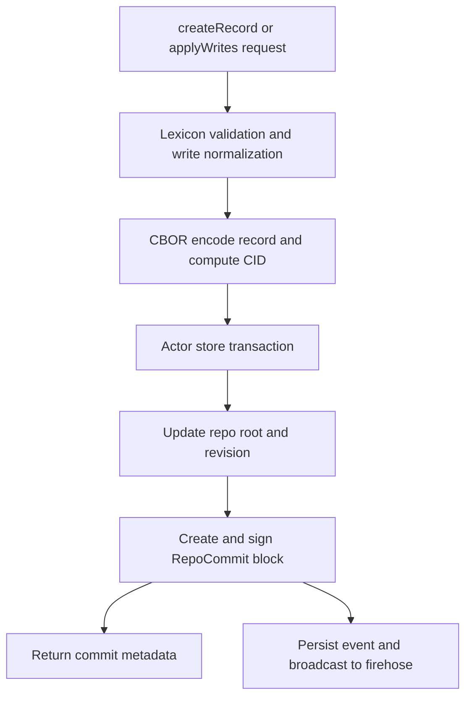

# Record Write to Commit Walkthrough

## Overview

This document details how a record mutation is processed, from the initial API request to the signed commit and firehose broadcast.

## Mutation Flow

## 1. Input and Validation

1. `PDSRecordService.m` receives the mutation request (`putRecord`, `createRecord`, or `applyWrites`).
2. The record is validated against its [Lexicon schema](./lexicon-validation).
3. The service checks write policy and account status.

## 2. Encoding and Persistence

1. The record is serialized using [DAG-CBOR](./cbor-serialization).
2. Its [CID](./cid-and-hashing) is computed from the encoded bytes.
3. The mutation is applied within an [Actor Store](../05-database-layer/actor-databases) transaction.
4. The Merkle Search Tree (MST) is updated to reflect the change.

## 3. Signing and Commit

1. A `RepoCommit` block is generated, containing the new MST root and repository revision.
2. The commit is signed using the actor's private key.
3. The signed commit block is stored in the actor database.
4. The repository root is updated.

## 4. Sync Side Effects

The write path and firehose are coupled by the stored commit block. `SubscribeReposHandler.m` later loads this block, packages it into [CAR bytes](./car-format), and broadcasts it to WebSocket consumers.

## Where to Debug
- **Validation/Normalization**: `Garazyk/Sources/App/Services/PDSRecordService.m`
- **Persistence/Transactions**: `Garazyk/Sources/Database/ActorStore/ActorStore.m`
- **Sync/Firehose Broadcast**: `Garazyk/Sources/Sync/SubscribeReposHandler.m`

## Related Deep Dives
- [Repository Basics](./repository-basics)
- [Lexicon Validation](./lexicon-validation)
- [CBOR Serialization](./cbor-serialization)
- [CID and Hashing](./cid-and-hashing)

## Related Reading
- [Actor Databases](../05-database-layer/actor-databases)
- [Firehose Overview](../08-sync-firehose/firehose-overview)
- [Glossary](../GLOSSARY)

