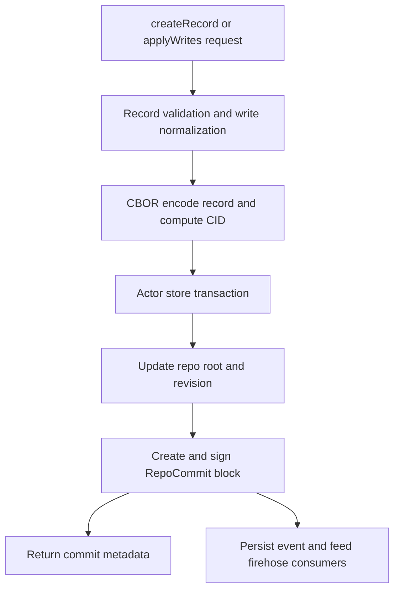

# Record Write to Commit Walkthrough

## Goal

Read this page when you want the concrete repository mutation path for a normal write: endpoint input, record validation, CBOR and CID generation, actor-store persistence, signed commit creation, and the sync side effects that follow. This is the most important data-path deep dive in the repo.

## Full Flow

## Why This Flow Is Easy To Misread

The repo has both `PDSRecordService` and `PDSRepositoryService`, so new contributors often assume record writes go through a single obvious repository entry point. In practice:

- `PDSRecordService` owns most endpoint-facing record mutation work,
- the actor store owns the low-level transaction boundary,
- commit objects are created and signed after the record mutation is staged,
- sync and firehose surfaces depend on that stored commit block existing later.

That means a record write bug can be correct at the endpoint level and still fail downstream in commit persistence or event publication.

## Walkthrough: A Normal Record Write

The clearest implementation path is the `putRecord` and `applyWrites` logic in `Garazyk/Sources/App/Services/PDSRecordService.m`.

1. The handler normalizes the write request and checks required fields such as repo, collection, and record value.
2. The service validates the record shape and writes policy before persistence.
3. The record is encoded to CBOR and assigned a CID.
4. The actor store transaction creates or replaces the record row and updates repository metadata.
5. The service refreshes repository root metadata so it can compute the new commit context.
6. A `RepoCommit` is created, signed through the actor store key path, and serialized as a signed block.
7. The commit block is stored and the repo root revision is updated.
8. The response returns URI, CID, and commit metadata.

If one of those stages is missing, the repo can look correct in a narrow read path but still fail export or firehose delivery later.

## Where Firehose Side Effects Enter

The write path and the firehose path are coupled by stored commit material, not by an in-memory callback chain.

`Garazyk/Sources/Sync/SubscribeReposHandler.m` later loads the signed commit block, builds CAR bytes, persists the event sequence, and broadcasts the result to WebSocket consumers. That means "record write succeeded but firehose looks wrong" often points to commit storage or event persistence rather than the request handler.

## Where To Debug When This Breaks

- Start in `Garazyk/Sources/App/Services/PDSRecordService.m` for input normalization, write validation, and commit metadata generation.
- Start in `Garazyk/Sources/Database/ActorStore/ActorStore.m` for transaction ordering, block persistence, and repo-root updates.
- Start in `Garazyk/Sources/App/Services/PDSRepositoryService.m` when the failure shows up in export, import, or repository-level read behavior.
- Start in `Garazyk/Sources/Sync/SubscribeReposHandler.m` when commit state looks correct locally but the sync surface is wrong.

## Tests That Should Fail If This Changes

- `Garazyk/Tests/App/Services/PDSRecordServiceTests.m`
- `Garazyk/Tests/App/Services/PDSRepositoryServiceTests.m`
- `Garazyk/Tests/Integration/CommitChainTests.m`
- `Garazyk/Tests/Sync/SubscribeReposHandlerTests.m`

## Appendix

### Artifacts worth inspecting

- record URI
- record CID
- commit CID
- repo revision
- stored commit block in the actor database
