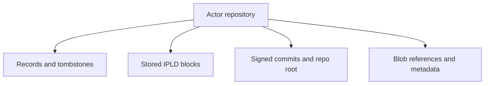

# Repository Basics

## Overview

An ATProto repository in September is the actor-owned bundle of records, stored blocks, commit state, and blob references that make one DID's data portable and syncable.

## Repository Shape

## The Important Mental Model

Keep these ideas separate:

- records are user-facing logical objects
- blocks and commits are repository-structure artifacts
- blobs are adjacent to the repository but have their own storage path
- the actor store is the persistence boundary underneath all of it

That separation explains why one request can succeed at the record layer while a later sync or export path still fails.

## What A Normal Write Means

A normal write is not just "insert a record row." It usually means:

1. validate and normalize the record input
2. encode and identify the record content
3. update actor-store state
4. create and sign the new commit material
5. expose the result to sync and firehose consumers

That is why the commit deep dive is the most important repository walkthrough in the guide.

## What This Summary Does Not Try To Do

This page is the conceptual map. It does not try to inline CBOR, CID, CAR, blob, and commit implementation details all at once. Those details are now split into focused deep dives and protocol articles so contributors can read the part they actually need.

## Related Deep Dives

- [Record Write to Commit Walkthrough](./record-write-to-commit-walkthrough)
- [Blob Flow Walkthrough](./blob-flow-walkthrough)

## Related Reading

- [Blob Storage](./blob-storage)
- [Blob Lifecycle](./blob-lifecycle)
- [Repository Data Structures](../02-core-concepts/repository-data-structures-walkthrough)
- [CID and Hashing](./cid-and-hashing)
