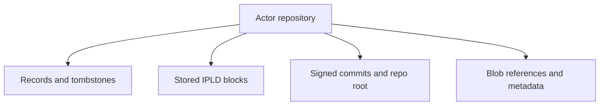

# Repository Basics

## Overview

An ATProto repository is a collection of records, stored blocks, and commit state that makes an actor's data portable and syncable.

## Repository Structure

## Key Concepts

- **Records**: User-facing logical objects (e.g., posts, follows).
- **Blocks**: IPLD blocks that store encoded record data.
- **Commits**: Signed snapshots of the repository state.
- **Blobs**: Large binary files (images, video) stored outside the repository but referenced by it.
- **Actor Store**: The isolated SQLite database that persists all repository state for a single DID.

## Write Workflow

A repository mutation involves:

1. Validating the record against its Lexicon schema.
2. Encoding the record to DAG-CBOR and computing its CID.
3. Updating the Merkle Search Tree (MST) in the actor store.
4. Signing a new commit that points to the updated MST root.
5. Broadcasting the commit to the sync firehose.

## Related Deep Dives
- [Record Write to Commit Walkthrough](./record-write-to-commit-walkthrough)
- [Blob Flow Walkthrough](./blob-flow-walkthrough)
- [CID and Hashing](./cid-and-hashing)
- [CAR Format](./car-format)

## Related Reading
- [Actor Databases](../05-database-layer/actor-databases)
- [Lexicon Validation](./lexicon-validation)
- [Firehose Overview](../08-sync-firehose/firehose-overview)
- [Glossary](../GLOSSARY)

