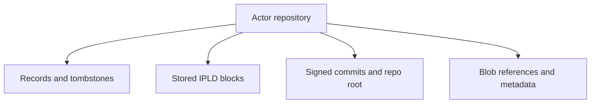

# Repository Basics

## Overview

An ATProto repository in Garazyk is the actor-owned bundle of records, stored blocks, commit state, and blob references that make one DID's data portable and syncable.

## Repository Shape

## The Important Mental Model

Separate these concepts:

- records are user-facing logical objects
- blocks and commits are repository-structure artifacts
- blobs are adjacent to the repository but have their own storage path
- the actor store is the persistence boundary underneath all of it

This separation explains why a request can succeed at the record layer but fail during sync or export.

## What A Normal Write Means

A normal write involves more than inserting a record row:

1. validate and normalize the record input
2. encode and identify the record content
3. update actor-store state
4. create and sign the new commit material
5. expose the result to sync and firehose consumers

The commit deep dive is the most critical repository walkthrough.

## What This Summary Does Not Try To Do

This conceptual map omits inline CBOR, CID, CAR, blob, and commit implementation details. Those details reside in focused deep dives and protocol articles.

## Related Deep Dives

- [Record Write to Commit Walkthrough](./record-write-to-commit-walkthrough)
- [Blob Flow Walkthrough](./blob-flow-walkthrough)

## Related Reading

- [Blob Storage](./blob-storage)
- [Blob Lifecycle](./blob-lifecycle)
- [Repository Data Structures](../02-core-concepts/repository-data-structures-walkthrough)
- [CID and Hashing](./cid-and-hashing)

## Related

- [Documentation Map](../11-reference/documentation-map.md)
- [Contributor Guide](../index.md)
- [Repository Documentation Index](../repo-index/index.md)

