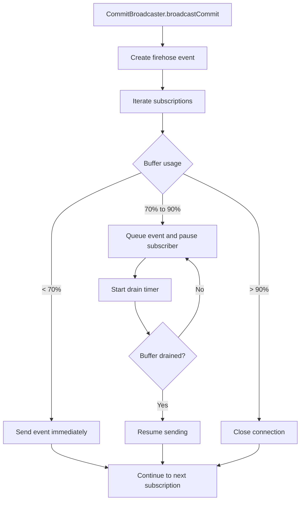

# Backpressure and Flow Control

## Overview

Backpressure is the mechanism that prevents overwhelming slow clients with events. It:
- Monitors send buffer levels
- Pauses event transmission when buffers fill
- Resumes transmission when buffers drain
- Implements adaptive rate limiting
- Handles client disconnections gracefully

## Problem: Buffer Overflow

### Without Backpressure

Without backpressure, a single slow subscriber can accumulate queued frames until the connection drops, which turns transient slowness into data loss.

### With Backpressure

With backpressure enabled, the broadcaster classifies each subscriber by buffer pressure and either sends immediately, pauses and drains, or disconnects the subscriber before it can destabilize the rest of the fan-out.



## Buffer Management

### Send Buffer Architecture

```objc
// In WebSocketConnection.m
@interface WebSocketConnection : NSObject

@property (nonatomic, assign) NSUInteger sendBufferSize;
@property (nonatomic, assign) NSUInteger maxSendBufferSize;
@property (nonatomic, assign) BOOL isPaused;
@property (nonatomic, strong) NSMutableData *sendBuffer;
@property (nonatomic, strong) dispatch_queue_t sendQueue;

@end
```

### Buffer Initialization

```objc
// In WebSocketConnection.m
- (instancetype)initWithSocket:(NSSocket *)socket {
    self = [super init];
    if (!self) return nil;
    
    self.socket = socket;
    self.sendBuffer = [NSMutableData data];
    self.maxSendBufferSize = 10 * 1024 * 1024;  // 10MB max
    self.sendQueue = dispatch_queue_create("com.atproto.websocket.send", 
                                           DISPATCH_QUEUE_SERIAL);
    self.isPaused = NO;
    
    return self;
}
```

## Backpressure Detection

### Monitoring Buffer Levels

The WebSocketConnection tracks send buffer levels and applies backpressure when needed:

```objc
// In WebSocketConnection.m - Send frame with backpressure handling
- (void)sendFrame:(NSData *)frame {
  dispatch_async(self.writeQueue, ^{
    if (self.state == WebSocketConnectionStateClosing ||
        self.state == WebSocketConnectionStateClosed) {
      return;
    }
    if (self.queuedSendBytes + frame.length > WS_MAX_PENDING_SEND_BYTES) {
      [self.messageQueue removeAllObjects];
      self.queuedSendBytes = 0;
      dispatch_async(dispatch_get_main_queue(), ^{
        [self closeWithCode:1009 reason:@"Outbound queue limit exceeded"];
      });
      return;
    }

    [self.messageQueue addObject:frame];
    self.queuedSendBytes += frame.length;
    if (self.messageQueue.count == 1) {
      [self flushWriteBuffer];
    }
  });
}

- (NSUInteger)pendingSendBytes {
  __block NSUInteger bytes = 0;
  if (!self.writeQueue) {
    return 0;
  }

  dispatch_sync(self.writeQueue, ^{
    bytes = self.queuedSendBytes;
  });
  return bytes;
}
```

**Source:** `ATProtoPDS/Sources/Sync/WebSocketConnection.m` (lines 280-310)

### Buffer Threshold Levels

```objc
// In WebSocketConnection.m
- (void)checkBufferThresholds {
    double fillPercentage = (double)self.sendBufferSize / self.maxSendBufferSize;
    
    if (fillPercentage > 0.9) {
        // Critical: 90% full
        [self applyBackpressure];
        NSLog(@"Critical backpressure: %.1f%% full", fillPercentage * 100);
    } else if (fillPercentage > 0.7) {
        // Warning: 70% full
        NSLog(@"Warning: buffer %.1f%% full", fillPercentage * 100);
    } else if (fillPercentage < 0.3) {
        // Recovery: 30% full
        [self releaseBackpressure];
    }
}
```

## Backpressure Application

### Pausing Event Transmission

```objc
// In WebSocketConnection.m
- (void)applyBackpressure {
    if (self.isPaused) {
        return;  // Already paused
    }
    
    self.isPaused = YES;
    
    // 1. Notify broadcaster to pause
    if (self.backpressureHandler) {
        self.backpressureHandler(YES);
    }
    
    // 2. Start drain timer
    [self startDrainTimer];
}

- (void)startDrainTimer {
    self.drainTimer = dispatch_source_create(DISPATCH_SOURCE_TYPE_TIMER, 0, 0, 
                                             self.sendQueue);
    
    dispatch_source_set_timer(self.drainTimer,
                             dispatch_time(DISPATCH_TIME_NOW, 100 * NSEC_PER_MSEC),
                             100 * NSEC_PER_MSEC,
                             10 * NSEC_PER_MSEC);
    
    dispatch_source_set_event_handler(self.drainTimer, ^{
        [self checkBufferDrain];
    });
    
    dispatch_resume(self.drainTimer);
}

- (void)checkBufferDrain {
    // 1. Try to send buffered data
    if (self.sendBuffer.length > 0) {
        NSError *error = nil;
        [self.socket sendData:self.sendBuffer];
        
        if (!error) {
            [self.sendBuffer setLength:0];
            self.sendBufferSize = 0;
        }
    }
    
    // 2. Check if buffer is drained
    if (self.sendBufferSize < (self.maxSendBufferSize * 0.3)) {
        [self releaseBackpressure];
    }
}
```

### Write Buffer Flushing

The connection flushes queued messages asynchronously:

```objc
// In WebSocketConnection.m - Flushing write buffer
- (void)flushWriteBuffer {
  if (self.messageQueue.count == 0)
    return;

  NSData *message = self.messageQueue.firstObject;
  [self writeData:message];
}

- (void)writeData:(NSData *)data {
  __weak typeof(self) weakSelf = self;
  [self.connection sendData:data
                 completion:^(NSError *_Nullable error) {
                   __strong typeof(weakSelf) strongSelf = weakSelf;
                   if (!strongSelf)
                     return;

                   dispatch_async(strongSelf.writeQueue, ^{
                     if (strongSelf.messageQueue.count > 0) {
                       NSData *sentFrame = strongSelf.messageQueue.firstObject;
                       [strongSelf.messageQueue removeObjectAtIndex:0];
                       if (sentFrame.length >= strongSelf.queuedSendBytes) {
                         strongSelf.queuedSendBytes = 0;
                       } else {
                         strongSelf.queuedSendBytes -= sentFrame.length;
                       }
                     }
                     [strongSelf flushWriteBuffer];
                   });

                   if (error) {
                     dispatch_async(dispatch_get_main_queue(), ^{
                       [strongSelf notifyError:error];
                     });
                   }
                 }];
}
```

**Source:** `ATProtoPDS/Sources/Sync/WebSocketConnection.m` (lines 310-340)

## Broadcaster-Level Backpressure

### Selective Broadcasting

```objc
// In CommitBroadcaster.m
- (void)broadcastCommit:(NSDictionary *)commit 
                   did:(NSString *)did
                   seq:(NSInteger)seq
                  rebase:(BOOL)rebase
                 tooBig:(BOOL)tooBig {
    
    dispatch_async(self.eventQueue, ^{
        // 1. Create event
        NSDictionary *event = @{
            @"t": @"#commit",
            @"commit": commit,
            @"seq": @(seq),
            @"time": [self formatTimestamp:[NSDate date]],
            @"rebase": @(rebase),
            @"tooBig": @(tooBig)
        };
        
        NSData *jsonData = [NSJSONSerialization dataWithJSONObject:event 
                                                           options:0 
                                                             error:nil];
        
        // 2. Send to subscribers
        [self sendEventToSubscribers:jsonData commit:commit];
    });
}

- (void)sendEventToSubscribers:(NSData *)eventData 
                       commit:(NSDictionary *)commit {
    
    [self.subscriptionLock lock];
    NSArray *subscriptions = [self.subscriptions copy];
    [self.subscriptionLock unlock];
    
    NSMutableArray *pausedSubscriptions = [NSMutableArray array];
    
    for (SubscriptionContext *context in subscriptions) {
        // 1. Check if subscription matches
        if (![self subscriptionMatches:context commit:commit]) {
            continue;
        }
        
        // 2. Check if connection is paused
        if (context.connection.isPaused) {
            [pausedSubscriptions addObject:context];
            continue;
        }
        
        // 3. Send event
        NSError *error = nil;
        [context.connection sendMessage:eventData opcode:0x1 fin:YES error:&error];
        
        if (error) {
            NSLog(@"Failed to send event: %@", error);
        }
    }
    
    // 4. Record paused subscriptions
    if (pausedSubscriptions.count > 0) {
        [self recordMetric:@"paused_subscriptions" value:@(pausedSubscriptions.count)];
    }
}
```

## Adaptive Rate Limiting

### Dynamic Rate Adjustment

```objc
// In WebSocketConnection.m
- (void)adjustSendRate {
    // 1. Calculate current buffer fill percentage
    double fillPercentage = (double)self.sendBufferSize / self.maxSendBufferSize;
    
    // 2. Adjust rate based on fill level
    if (fillPercentage > 0.8) {
        // Reduce rate to 25%
        self.sendRateLimit = self.maxSendRate * 0.25;
    } else if (fillPercentage > 0.6) {
        // Reduce rate to 50%
        self.sendRateLimit = self.maxSendRate * 0.5;
    } else if (fillPercentage > 0.4) {
        // Reduce rate to 75%
        self.sendRateLimit = self.maxSendRate * 0.75;
    } else {
        // Full rate
        self.sendRateLimit = self.maxSendRate;
    }
    
    NSLog(@"Rate limit adjusted to %.0f%% (buffer: %.1f%%)", 
          (self.sendRateLimit / self.maxSendRate) * 100,
          fillPercentage * 100);
}

- (void)enforceRateLimit {
    dispatch_async(self.sendQueue, ^{
        NSTimeInterval timeSinceLastSend = [[NSDate date] timeIntervalSinceDate:self.lastSendTime];
        NSTimeInterval minInterval = 1.0 / self.sendRateLimit;
        
        if (timeSinceLastSend < minInterval) {
            // Wait before sending
            dispatch_after(dispatch_time(DISPATCH_TIME_NOW, 
                                        (minInterval - timeSinceLastSend) * NSEC_PER_SEC),
                          self.sendQueue, ^{
                [self processPendingMessages];
            });
        } else {
            [self processPendingMessages];
        }
    });
}
```

## Client-Side Backpressure

### Slow Client Simulation

```objc
// In WebSocketConnection.m (for testing)
- (void)simulateSlowClient:(NSUInteger)delayMs {
    self.clientDelay = delayMs;
    
    // Simulate slow processing
    dispatch_after(dispatch_time(DISPATCH_TIME_NOW, delayMs * NSEC_PER_MSEC),
                  dispatch_get_main_queue(), ^{
        [self processNextMessage];
    });
}
```

### Handling Slow Clients

```objc
// In CommitBroadcaster.m
- (void)identifySlowClients {
    [self.subscriptionLock lock];
    NSArray *subscriptions = [self.subscriptions copy];
    [self.subscriptionLock unlock];
    
    NSMutableArray *slowClients = [NSMutableArray array];
    
    for (SubscriptionContext *context in subscriptions) {
        // 1. Calculate average latency
        NSTimeInterval avgLatency = context.totalLatency / context.eventsReceived;
        
        // 2. Identify slow clients (> 1 second latency)
        if (avgLatency > 1.0) {
            [slowClients addObject:context];
        }
    }
    
    if (slowClients.count > 0) {
        NSLog(@"Identified %lu slow clients", (unsigned long)slowClients.count);
        
        // 3. Apply selective backpressure
        for (SubscriptionContext *context in slowClients) {
            [context.connection applyBackpressure];
        }
    }
}
```

## Keep-Alive and Heartbeat

### Heartbeat Implementation

The WebSocketConnection implements a heartbeat mechanism to detect stalled connections:

```objc
// In WebSocketConnection.m - Heartbeat management
- (void)startHeartbeat {
  [self stopHeartbeat];
  self.heartbeatTimer = dispatch_source_create(DISPATCH_SOURCE_TYPE_TIMER, 0, 0,
                                               dispatch_get_main_queue());
  // Tick more frequently to check the policy (e.g., every 1 second)
  dispatch_source_set_timer(
      self.heartbeatTimer,
      dispatch_walltime(NULL, 1 * NSEC_PER_SEC),
      1 * NSEC_PER_SEC, 1 * NSEC_PER_SEC);

  __weak typeof(self) weakSelf = self;
  dispatch_source_set_event_handler(self.heartbeatTimer, ^{
    [weakSelf tickHeartbeat];
  });
  dispatch_resume(self.heartbeatTimer);
}

- (void)tickHeartbeat {
  NSTimeInterval now = [NSDate timeIntervalSinceReferenceDate];
  WSHeartbeatAction action = [self.heartbeatPolicy tick:now];
  
  if (action == WSHeartbeatActionSendPing) {
    [self sendPing:nil];
    [self.heartbeatPolicy pingSent:now];
  } else if (action == WSHeartbeatActionTimeout) {
    [self closeWithCode:1001 reason:@"Heartbeat timeout"];
  }
}

- (void)handlePongFrame:(NSData *)payload {
  NSTimeInterval now = [NSDate timeIntervalSinceReferenceDate];
  [self.heartbeatPolicy pongReceived:now];
}
```

**Source:** `ATProtoPDS/Sources/Sync/WebSocketConnection.m` (lines 340-380)

## Monitoring and Metrics

### Backpressure Metrics

```objc
// In CommitBroadcaster.m
- (void)recordBackpressureMetrics {
    @synchronized(self.metrics) {
        NSUInteger pausedCount = 0;
        NSUInteger totalBufferSize = 0;
        
        [self.subscriptionLock lock];
        for (SubscriptionContext *context in self.subscriptions) {
            if (context.connection.isPaused) {
                pausedCount++;
            }
            totalBufferSize += context.connection.sendBufferSize;
        }
        [self.subscriptionLock unlock];
        
        self.metrics[@"paused_subscriptions"] = @(pausedCount);
        self.metrics[@"total_buffer_size"] = @(totalBufferSize);
        self.metrics[@"avg_buffer_size"] = @(totalBufferSize / MAX(1, self.subscriptions.count));
    }
}

- (void)logMetrics {
    @synchronized(self.metrics) {
        NSLog(@"Backpressure metrics:");
        NSLog(@"  Paused subscriptions: %@", self.metrics[@"paused_subscriptions"]);
        NSLog(@"  Total buffer size: %@ bytes", self.metrics[@"total_buffer_size"]);
        NSLog(@"  Avg buffer size: %@ bytes", self.metrics[@"avg_buffer_size"]);
    }
}
```

### Performance Impact

```objc
// In WebSocketConnection.m
- (void)recordPerformanceMetrics {
    // 1. Calculate throughput
    NSTimeInterval elapsed = [[NSDate date] timeIntervalSinceDate:self.connectionStartTime];
    double throughput = self.bytesSent / elapsed;
    
    // 2. Calculate latency
    NSTimeInterval avgLatency = self.totalLatency / self.messagesReceived;
    
    // 3. Calculate backpressure impact
    double backpressureTime = self.totalBackpressureTime / elapsed;
    
    NSLog(@"Performance metrics:");
    NSLog(@"  Throughput: %.2f KB/s", throughput / 1024);
    NSLog(@"  Avg latency: %.2f ms", avgLatency * 1000);
    NSLog(@"  Backpressure time: %.1f%%", backpressureTime * 100);
}
```

## Best Practices

1. **Set appropriate buffer sizes** — Balance memory usage and responsiveness
2. **Monitor buffer levels** — Track fill percentage continuously
3. **Apply backpressure early** — Don't wait for buffer to overflow
4. **Release backpressure gradually** — Avoid oscillation
5. **Identify slow clients** — Monitor latency and throughput
6. **Implement timeouts** — Close stalled connections
7. **Log metrics** — Track backpressure events
8. **Test under load** — Verify behavior with many subscribers

## Configuration

### Recommended Settings

```objc
// In WebSocketConnection.m
static const NSUInteger MAX_SEND_BUFFER_SIZE = 10 * 1024 * 1024;  // 10MB
static const NSUInteger BACKPRESSURE_THRESHOLD = 7 * 1024 * 1024;  // 70%
static const NSUInteger RELEASE_THRESHOLD = 3 * 1024 * 1024;       // 30%
static const NSTimeInterval DRAIN_CHECK_INTERVAL = 0.1;             // 100ms
static const NSTimeInterval STALL_CHECK_INTERVAL = 5.0;             // 5 seconds
static const NSUInteger MAX_STALL_COUNT = 12;                       // 60 seconds
```

## Next Steps

- **[Commit Broadcasting](commit-broadcasting)** — Broadcasting events
- **[WebSocket Server](websocket-server)** — WebSocket implementation
- **[Firehose Overview](firehose-overview)** — Architecture overview
