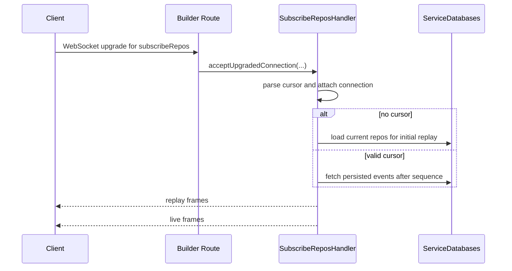

# Firehose Flow Walkthrough

## Overview

[Firehose Overview](./firehose-overview) explains the service boundary. This
page walks through the actual runtime path: route registration, subscriber
startup, replay, live delivery, and backpressure enforcement.

Garazyk's firehose is a sequence of transport, replay, persistence, and queueing steps.

## Route Registration Starts On The Main HTTP Server

The WebSocket route is registered by `PDSHttpServerBuilder`, not by a separate
network stack.

```objc
[server addWebSocketRoute:@"/xrpc/com.atproto.sync.subscribeRepos"
                  handler:^(HttpRequest *request, HttpResponse *response,
                            id<PDSNetworkConnection> connection) {
                    [strongSubscribeReposHandler acceptUpgradedConnection:connection
                                                                   request:request];
                  }];
```

The firehose inherits the deployment boundary, hostname, and HTTP runtime of the PDS.

## A New Subscriber Goes Through Replay Setup First

When a client connects, the handler does not immediately start pushing live
events. It first records the connection and evaluates the cursor.



The cursor handling code makes the server's intent explicit:

```objc
if (hasCursor && !cursorValid) {
  [self sendErrorFrameWithCode:kSubscribeReposErrorInvalidCursor
                       message:@"cursor must be a non-negative integer"
                  toConnection:connection];
  [connection closeWithCode:1008 reason:kSubscribeReposErrorInvalidCursor];
  return;
}
```

Replay behavior is part of connection setup.

## No Cursor Means "Replay Current State, Then Go Live"

Garazyk uses a no-cursor connection to seed the consumer with current repo
state before the client joins live delivery.

```objc
if (!hasCursor) {
  NSArray<PDSDatabaseRepo *> *repos = [self.userDatabasePool getAllReposWithError:&error];
  for (PDSDatabaseRepo *repo in repos) {
    CARWriter *writer = [CARWriter writerWithRootCID:commitCID];
    [self addMSTNodeBlocksForRootCID:commitCID did:repo.ownerDid toWriter:writer];
  }
}
```

This design ensures:

- the client does not begin with an empty view
- the server can bootstrap a subscriber without requiring a stored cursor
- the replay material is rooted in real repository data, not synthetic summary
  messages

## Live Commit Broadcasts Are Sequenced And Persisted

Live commit delivery happens on the handler's event queue. Each event gets a
new sequence number, is encoded, persisted, and only then broadcast.

```objc
[self ensureSequenceInitialized];
self.sequenceNumber++;
event.seq = self.sequenceNumber;
NSData *eventData = [self.eventFormatter encodeCommitEvent:event error:&error];
[self.serviceDatabases persistEvent:self.sequenceNumber
                               type:eventType
                               data:eventData
                              error:&persistError];
[self broadcastEventData:eventData];
```

This order is the core operational invariant of the firehose:

- assign sequence
- encode the frame
- persist replay material
- deliver to subscribers

## Replay And Live Delivery Share The Same Pressure Limits

The server does not keep replaying or broadcasting indefinitely if a consumer is
too slow.

```objc
if (connection.pendingSendCount >= self.maxPendingSendsPerConnection ||
    connection.pendingSendBytes >= self.maxPendingBytesPerConnection) {
  [self sendErrorFrameWithCode:kSubscribeReposErrorConsumerTooSlow
                       message:@"connection output queue exceeded server limit"
                  toConnection:connection];
  [connection closeWithCode:1008 reason:kSubscribeReposErrorConsumerTooSlow];
  return NO;
}
```

Replay, live broadcast, and connection health all meet at the connection queue.

## The Payload Format Is DAG-CBOR End To End

The server emits DAG-CBOR event frames, and the client-side `Firehose` object
decodes those frames into event objects.

```objc
id message = [ATProtoDagCBOR decodeData:data error:&error];
NSString *kind = message[@"kind"];
if ([kind isEqualToString:@"commit"]) {
  event.seq = [message[@"seq"] longLongValue];
  event.blocks = message[@"blocks"];
}
```

Firehose debugging can present as a transport issue or a data format issue.

## Practical Debugging Order

When a subscriber is missing data, check the flow in this order:

1. was the WebSocket route actually reached?
2. did the cursor parse and replay path behave as expected?
3. did the event get assigned and persisted with the expected sequence?
4. did backpressure close the connection?
5. did the client decode the DAG-CBOR frame correctly?

This sequence mirrors the implementation.

## Related Reading

- [Firehose Overview](./firehose-overview)
- [WebSocket Server](./websocket-server)
- [Backpressure](./backpressure)
- [Event Replay](./event-replay)
- [Runtime Flow Walkthrough](../03-application-layer/runtime-flow-walkthrough)

## Related

- [Documentation Map](../11-reference/documentation-map.md)
- [Contributor Guide](../index.md)
- [Repository Documentation Index](../repo-index/index.md)

