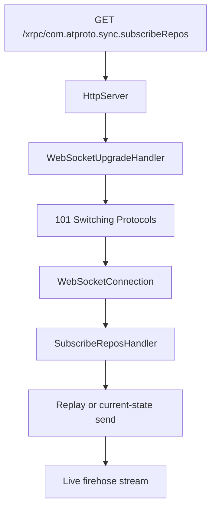

# WebSocket Server

## Overview

The firehose production path routes through the main server:

```text
HttpServer -> WebSocketUpgradeHandler -> WebSocketConnection -> SubscribeReposHandler
```

The firehose begins as an HTTP request on the main port and becomes a WebSocket after upgrade.

## Current production path

In the current runtime:

- `PDSHttpServerBuilder` registers `/xrpc/com.atproto.sync.subscribeRepos` as a WebSocket route.
- `HttpServer` detects the route and validates the upgrade request.
- `WebSocketUpgradeHandler` computes `Sec-WebSocket-Accept`.
- **`WebSocketProtocolSession`** (Sans-I/O) handles framing, masking, and heartbeats once switched.
- `SubscribeReposHandler` accepts the upgraded connection and manages event subscription.



If you are debugging today's implementation, start in this path first.

## Legacy standalone server

The repository still contains `Garazyk/Sources/Sync/WebSocketServer.{h,m}`.
That class owns a separate listener based on Network.framework and still exists
for compatibility and older test seams.

This legacy path is deprecated in favor of the current `SubscribeReposHandler`.

Use the legacy class only when:

- a compatibility test explicitly exercises it,
- you are auditing historical behavior,
- or you are comparing old and new connection-acceptance paths.

## What this layer owns

The WebSocket layer answers these questions:

- did the upgrade request satisfy RFC 6455 handshake requirements,
- how are frames encoded and decoded on the socket,
- how are ping/pong and close frames handled,
- when is a connection considered too slow or dead,
- and how does an upgraded socket become a firehose subscriber.

These are transport and framing concerns, distinct from event replay or commit sequencing.

## Main runtime seams

Start with these files:

- `Garazyk/Sources/Network/WebSocketUpgradeHandler.m`
- `Garazyk/Sources/Sync/WebSocketConnection.m`
- `Garazyk/Sources/Sync/WebSocketCodec.m`
- `Garazyk/Sources/Sync/WebSocketHeartbeatPolicy.m`
- `Garazyk/Sources/Sync/SubscribeReposHandler.m`

Read `WebSocketServer.m` only after that if you need the deprecated standalone
listener path.

## Advanced internals track

If you want the full implementation walkthrough, use the tutorial subguide:

- [Subguide: HTTP + WebSocket from Scratch](../10-tutorials/network-from-scratch/)
- [Part 3: WebSocket Upgrade, Codec, and Firehose](../10-tutorials/network-from-scratch/websocket-upgrade-codec-and-firehose)

For the HTTP setup that precedes the upgrade, read:

- [Part 1: HTTP Transport and Parser](../10-tutorials/network-from-scratch/http-transport-and-parser)
- [Part 2: Routing, Pipelining, and Responses](../10-tutorials/network-from-scratch/http-routing-pipelining-and-responses)

## Related reading

- [Firehose Overview](./firehose-overview)
- [Backpressure](./backpressure)
- [Event Replay](./event-replay)
- [HTTP Server](../04-network-layer/http-server)
- [HTTP Request and Route Pipeline](../04-network-layer/http-request-and-route-pipeline)

## Sources

- [RFC 6455: The WebSocket Protocol](https://datatracker.ietf.org/doc/html/rfc6455)
- [Network framework `nw_connection_receive`](https://developer.apple.com/documentation/network/nw_connection_receive)
- [Network framework `nw_listener_start`](https://developer.apple.com/documentation/network/nw_listener_start)

## Related

- [Documentation Map](../11-reference/documentation-map.md)
- [Contributor Guide](../index.md)
- [Repository Documentation Index](../repo-index/index.md)

