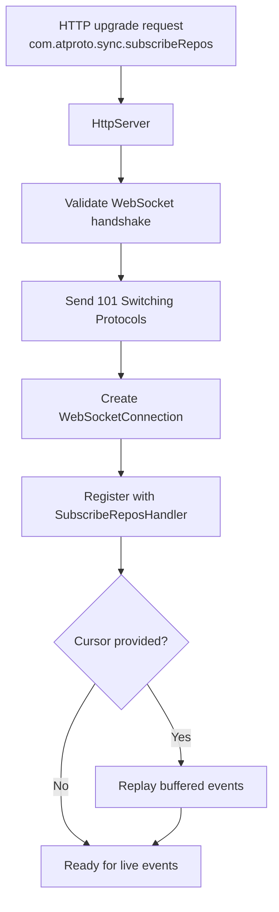
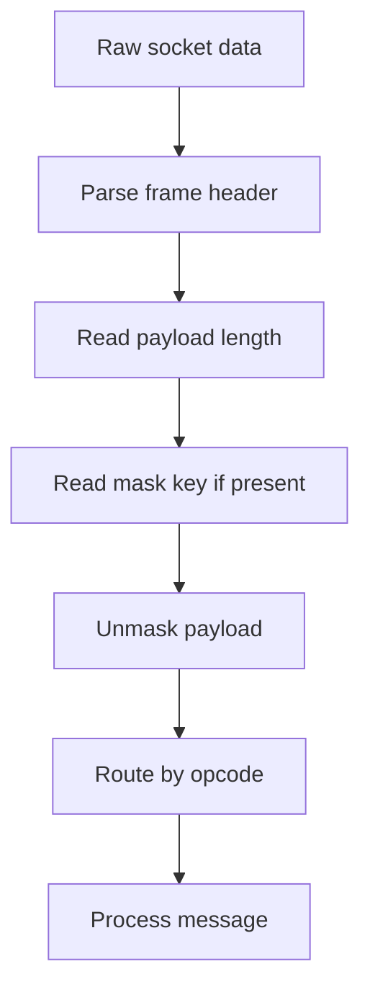

# WebSocket Server

## Overview

The WebSocket server handles real-time connections for the firehose (`subscribeRepos` endpoint). It:
- Upgrades HTTP connections to WebSocket protocol
- Manages persistent client connections
- Handles frame encoding/decoding
- Implements connection lifecycle management
- Supports both text and binary frames

## Architecture

### WebSocket Connection Lifecycle



### Frame Processing Pipeline



## WebSocket Handshake

### HTTP Upgrade Request

The client initiates a WebSocket connection with an HTTP upgrade request:

```

GET /xrpc/com.atproto.sync.subscribeRepos HTTP/1.1
Host: pds.example.com
Upgrade: websocket
Connection: Upgrade
Sec-WebSocket-Key: dGhlIHNhbXBsZSBub25jZQ==
Sec-WebSocket-Version: 13
```

### Server Response

The server responds with a 101 status code:

```

HTTP/1.1 101 Switching Protocols
Upgrade: websocket
Connection: Upgrade
Sec-WebSocket-Accept: s3pPLMBiTxaQ9kYGzzhZRbK+xOo=
```

### Handshake Implementation

The WebSocket server validates the upgrade request and calculates the accept key:

```objc
// In WebSocketServer.m - Server initialization and connection handling
- (BOOL)start:(NSError **)error {
  if (self.state != WebSocketServerStateIdle) {
    if (error) {
      *error = [NSError
          errorWithDomain:WebSocketServerErrorDomain
                     code:WebSocketServerErrorCodeListenerFailed
                 userInfo:@{NSLocalizedDescriptionKey : @"Server is not idle"}];
    }
    return NO;
  }

  self.state = WebSocketServerStateStarting;

  nw_parameters_t parameters = nw_parameters_create_secure_tcp(
      NW_PARAMETERS_DISABLE_PROTOCOL, NW_PARAMETERS_DEFAULT_CONFIGURATION);

  nw_listener_t listener;
  NSString *portString = [NSString stringWithFormat:@"%hu", self.port];
  listener = nw_listener_create_with_port(portString.UTF8String, parameters);
  if (!listener) {
    self.state = WebSocketServerStateFailed;
    if (error) {
      *error = [NSError
          errorWithDomain:WebSocketServerErrorDomain
                     code:WebSocketServerErrorCodeListenerFailed
                 userInfo:@{
                   NSLocalizedDescriptionKey : @"Failed to create listener"
                 }];
    }
    return NO;
  }

  nw_listener_set_queue(listener, self.listenerQueue);

  // Create a semaphore to wait for the listener to be ready
  dispatch_semaphore_t readySemaphore = dispatch_semaphore_create(0);
  __block BOOL startupSuccess = NO;
  __block NSError *startupError = nil;

  __weak typeof(self) weakSelf = self;
  nw_listener_set_state_changed_handler(
      listener, ^(nw_listener_state_t state, _Nullable nw_error_t error) {
        __strong typeof(weakSelf) strongSelf = weakSelf;
        if (!strongSelf)
          return;

        switch (state) {
        case nw_listener_state_ready:
          strongSelf.state = WebSocketServerStateRunning;
          strongSelf.port = nw_listener_get_port(listener);
          startupSuccess = YES;
          dispatch_semaphore_signal(readySemaphore);
          break;
        case nw_listener_state_failed:
          strongSelf.state = WebSocketServerStateFailed;
          if (error) {
            startupError =
                (__bridge_transfer NSError *)nw_error_copy_cf_error(error);
            if (strongSelf.delegate) {
              [strongSelf.delegate webSocketServer:strongSelf
                                  didFailWithError:startupError];
            }
          }
          dispatch_semaphore_signal(readySemaphore);
          break;
        case nw_listener_state_cancelled:
          strongSelf.state = WebSocketServerStateIdle;
          dispatch_semaphore_signal(strongSelf.stopSemaphore);
          break;
        default:
          break;
        }
      });

  nw_listener_set_new_connection_handler(
      listener, ^(nw_connection_t connection) {
        __strong typeof(weakSelf) strongSelf = weakSelf;
        if (!strongSelf)
          return;

        WebSocketConnection *webSocketConnection =
            [[WebSocketConnection alloc] initWithConnection:connection];
        [strongSelf addConnection:webSocketConnection];

        if ([strongSelf.delegate respondsToSelector:@selector
                                 (webSocketServer:didAcceptConnection:)]) {
          dispatch_async(dispatch_get_main_queue(), ^{
            [strongSelf.delegate webSocketServer:strongSelf
                             didAcceptConnection:webSocketConnection];
          });
        }

        [webSocketConnection start];
      });

  nw_listener_start(listener);

  // Wait for ready state (max 2 seconds)
  if (dispatch_semaphore_wait(
          readySemaphore, dispatch_time(DISPATCH_TIME_NOW, 2 * NSEC_PER_SEC)) !=
      0) {
    if (error) {
      *error = [NSError
          errorWithDomain:WebSocketServerErrorDomain
                     code:WebSocketServerErrorCodeListenerFailed
                 userInfo:@{
                   NSLocalizedDescriptionKey :
                       @"Timed out waiting for WebSocket server to start"
                 }];
    }
    nw_listener_cancel(listener);
    return NO;
  }

  if (!startupSuccess) {
    if (error) {
      *error =
          startupError
              ?: [NSError errorWithDomain:WebSocketServerErrorDomain
                                     code:WebSocketServerErrorCodeListenerFailed
                                 userInfo:@{
                                   NSLocalizedDescriptionKey :
                                       @"Failed to start WebSocket server"
                                 }];
    }
    return NO;
  }

  self.listener = listener;
  return YES;
}
```

**Source:** `ATProtoPDS/Sources/Sync/WebSocketServer.m` (lines 1-150)

## WebSocket Frames

### Frame Structure

Each WebSocket frame has the following structure:

```

 0 1 2 3 4 5 6 7 8 9 0 1 2 3 4 5 6 7 8 9 0 1 2 3 4 5 6 7 8 9 0 1
+-+-+-+-+-------+-+-------------+-------------------------------+
|F|R|R|R| opcode|M| Payload len |    Extended payload length    |
|I|S|S|S|(4)   |A|     (7)     |          (0/16/64)            |
|N|V|V|V|       |S|             |   (if payload len==126/127)   |
| |1|2|3|       |K|             |                               |
+-+-+-+-+-------+-+-------------+ - - - - - - - - - - - - - - - +
|     Extended payload length continued, if payload len == 127  |
+ - - - - - - - - - - - - - - - +-------------------------------+
|                                |Masking-key, if MASK set to 1  |
+-------------------------------+-------------------------------+
| Masking-key (continued)       |          Payload Data         |
+-------------------------------- - - - - - - - - - - - - - - - +
|                     Payload Data continued ...                |
+ - - - - - - - - - - - - - - - - - - - - - - - - - - - - - - - +
```

### Frame Opcodes

| Opcode | Meaning | Description |
|--------|---------|-------------|
| 0x0 | Continuation | Continuation of fragmented message |
| 0x1 | Text | Text frame |
| 0x2 | Binary | Binary frame |
| 0x8 | Close | Close connection |
| 0x9 | Ping | Ping (keep-alive) |
| 0xA | Pong | Pong (response to ping) |

### Frame Parsing

```objc
// In WebSocketConnection.m
- (void)parseFrame:(NSData *)frameData {
    uint8_t *bytes = (uint8_t *)frameData.bytes;
    NSUInteger length = frameData.length;
    
    if (length < 2) {
        return;  // Incomplete frame
    }
    
    // 1. Parse first byte
    BOOL fin = (bytes[0] & 0x80) != 0;
    uint8_t opcode = bytes[0] & 0x0F;
    
    // 2. Parse second byte
    BOOL masked = (bytes[1] & 0x80) != 0;
    uint64_t payloadLength = bytes[1] & 0x7F;
    
    NSUInteger offset = 2;
    
    // 3. Parse extended payload length
    if (payloadLength == 126) {
        if (length < 4) return;  // Incomplete
        payloadLength = ((uint16_t)bytes[2] << 8) | bytes[3];
        offset = 4;
    } else if (payloadLength == 127) {
        if (length < 10) return;  // Incomplete
        payloadLength = 0;
        for (int i = 0; i < 8; i++) {
            payloadLength = (payloadLength << 8) | bytes[offset + i];
        }
        offset = 10;
    }
    
    // 4. Extract mask key (if masked)
    uint8_t maskKey[4] = {0};
    if (masked) {
        if (length < offset + 4) return;  // Incomplete
        memcpy(maskKey, &bytes[offset], 4);
        offset += 4;
    }
    
    // 5. Verify complete frame
    if (length < offset + payloadLength) {
        return;  // Incomplete frame
    }
    
    // 6. Extract payload
    NSData *payload = [frameData subdataWithRange:NSMakeRange(offset, payloadLength)];
    
    // 7. Unmask payload (if masked)
    if (masked) {
        NSMutableData *unmasked = [payload mutableCopy];
        uint8_t *unmaskedBytes = (uint8_t *)unmasked.mutableBytes;
        for (NSUInteger i = 0; i < payloadLength; i++) {
            unmaskedBytes[i] ^= maskKey[i % 4];
        }
        payload = unmasked;
    }
    
    // 8. Handle frame
    [self handleFrame:opcode payload:payload fin:fin];
}
```

## Connection Management

### Managing Active Connections

The WebSocketServer manages active connections and broadcasts messages:

```objc
// In WebSocketServer.m - Connection management
- (void)addConnection:(WebSocketConnection *)connection {
  dispatch_barrier_async(self.connectionsQueue, ^{
    [self.mutableConnections addObject:connection];
  });
}

- (void)removeConnection:(WebSocketConnection *)connection {
  dispatch_barrier_async(self.connectionsQueue, ^{
    [self.mutableConnections removeObject:connection];
  });
}

- (NSSet<WebSocketConnection *> *)connections {
  __block NSSet<WebSocketConnection *> *snapshot;
  dispatch_sync(self.connectionsQueue, ^{
    snapshot = [self.mutableConnections copy];
  });
  return snapshot;
}

- (void)broadcastMessage:(NSData *)message
    toConnectionsMatching:(NSPredicate *)predicate {
  __block NSSet<WebSocketConnection *> *snapshot = nil;
  dispatch_sync(self.connectionsQueue, ^{
    snapshot = [self.mutableConnections copy];
  });

  NSSet<WebSocketConnection *> *targets =
      predicate ? [snapshot filteredSetUsingPredicate:predicate] : snapshot;

  for (WebSocketConnection *connection in targets) {
    dispatch_group_enter(self.taskGroup);
    [connection sendMessage:message];
    dispatch_group_leave(self.taskGroup);
  }
}
```

**Source:** `ATProtoPDS/Sources/Sync/WebSocketServer.m` (lines 150-200)

### Stopping the Server

```objc
// In WebSocketServer.m - Server shutdown
- (void)stop {
  if (self.state == WebSocketServerStateIdle ||
      self.state == WebSocketServerStateStopping) {
    return;
  }

  self.state = WebSocketServerStateStopping;

  __block NSSet<WebSocketConnection *> *connectionsSnapshot = nil;
  dispatch_barrier_sync(self.connectionsQueue, ^{
    connectionsSnapshot = [self.mutableConnections copy];
    [self.mutableConnections removeAllObjects];
  });

  for (WebSocketConnection *connection in connectionsSnapshot) {
    [connection close];
  }

  if (self.listener) {
    nw_listener_cancel(self.listener);

    // Wait for CANCELLED state with 2s timeout
    dispatch_time_t timeout =
        dispatch_time(DISPATCH_TIME_NOW, (int64_t)(2.0 * NSEC_PER_SEC));
    dispatch_semaphore_wait(self.stopSemaphore, timeout);

    self.listener = nil;
  }

  // Wait for all active tasks (broadcasting) to complete
  dispatch_group_wait(self.taskGroup, DISPATCH_TIME_FOREVER);

  self.state = WebSocketServerStateIdle;
}
```

**Source:** `ATProtoPDS/Sources/Sync/WebSocketServer.m` (lines 200-240)

## Connection Lifecycle

### Creating and Starting Connections

The WebSocketConnection handles the full lifecycle of a WebSocket connection:

```objc
// In WebSocketConnection.m - Connection initialization and startup
- (instancetype)initWithConnection:(id<PDSNetworkConnection>)connection {
  self = [super init];
  if (self) {
    [self commonInit];
    _connection = connection;
    _state = WebSocketConnectionStateConnected;
    _remoteAddress = [[connection remoteAddress] copy] ?: @"unknown";
    _host = _remoteAddress;
    _path = @"/";
    _queryString = @"";
  }
  return self;
}

- (void)startOnExistingTransport {
  if (!self.connection) {
    return;
  }
  __weak typeof(self) weakSelf = self;
  void (^originalHandler)(PDSNetworkConnectionState, NSError *) =
      self.connection.stateChangedHandler;
  self.connection.stateChangedHandler =
      ^(PDSNetworkConnectionState state, NSError *_Nullable error) {
        if (originalHandler) {
          originalHandler(state, error);
        }
        [weakSelf handlePDSStateChange:state error:error];
      };
  [self startReading];
  [self startHeartbeat];
}

- (void)startReading {
  __weak typeof(self) weakSelf = self;
  [self.connection
      receiveWithMinimumLength:1
                 maximumLength:UINT32_MAX
                    completion:^(NSData *_Nullable data, BOOL isComplete,
                                 NSError *_Nullable error) {
                      __strong typeof(weakSelf) strongSelf = weakSelf;
                      if (!strongSelf)
                        return;

                      if (data) {
                        dispatch_async(dispatch_get_main_queue(), ^{
                          [strongSelf handleReceivedData:data];
                        });
                      }

                      if (error) {
                        return;
                      }

                      if (isComplete) {
                        dispatch_async(dispatch_get_main_queue(), ^{
                          if (strongSelf.state !=
                              WebSocketConnectionStateClosed) {
                            strongSelf.state = WebSocketConnectionStateClosed;
                            [strongSelf
                                notifyCloseWithCode:1000
                                             reason:@"Connection closed"];
                          }
                        });
                        return;
                      }

                      [strongSelf startReading];
                    }];
}
```

**Source:** `ATProtoPDS/Sources/Sync/WebSocketConnection.m` (lines 50-150)

## Keep-Alive

### Ping/Pong Mechanism

```objc
// In WebSocketConnection.m - Keep-alive with ping/pong
- (void)startHeartbeat {
  [self stopHeartbeat];
  self.heartbeatTimer = dispatch_source_create(DISPATCH_SOURCE_TYPE_TIMER, 0, 0,
                                               dispatch_get_main_queue());
  // Tick more frequently to check the policy (e.g., every 1 second)
  dispatch_source_set_timer(
      self.heartbeatTimer,
      dispatch_walltime(NULL, 1 * NSEC_PER_SEC),
      1 * NSEC_PER_SEC, 1 * NSEC_PER_SEC);

  __weak typeof(self) weakSelf = self;
  dispatch_source_set_event_handler(self.heartbeatTimer, ^{
    [weakSelf tickHeartbeat];
  });
  dispatch_resume(self.heartbeatTimer);
}

- (void)tickHeartbeat {
  NSTimeInterval now = [NSDate timeIntervalSinceReferenceDate];
  WSHeartbeatAction action = [self.heartbeatPolicy tick:now];
  
  if (action == WSHeartbeatActionSendPing) {
    [self sendPing:nil];
    [self.heartbeatPolicy pingSent:now];
  } else if (action == WSHeartbeatActionTimeout) {
    [self closeWithCode:1001 reason:@"Heartbeat timeout"];
  }
}

- (void)handlePongFrame:(NSData *)payload {
  NSTimeInterval now = [NSDate timeIntervalSinceReferenceDate];
  [self.heartbeatPolicy pongReceived:now];
}
```

**Source:** `ATProtoPDS/Sources/Sync/WebSocketConnection.m` (lines 340-380)

### Sending Messages

```objc
// In WebSocketConnection.m
- (void)sendMessage:(NSData *)payload 
            opcode:(uint8_t)opcode
               fin:(BOOL)fin
              error:(NSError **)error {
    
    NSMutableData *frame = [NSMutableData data];
    
    // 1. First byte: FIN + opcode
    uint8_t byte1 = (fin ? 0x80 : 0x00) | opcode;
    [frame appendBytes:&byte1 length:1];
    
    // 2. Payload length and mask bit
    uint64_t payloadLength = payload.length;
    uint8_t byte2;
    
    if (payloadLength < 126) {
        byte2 = (uint8_t)payloadLength;  // No mask for server-to-client
        [frame appendBytes:&byte2 length:1];
    } else if (payloadLength < 65536) {
        byte2 = 126;
        [frame appendBytes:&byte2 length:1];
        uint16_t length16 = (uint16_t)payloadLength;
        [frame appendBytes:&length16 length:2];
    } else {
        byte2 = 127;
        [frame appendBytes:&byte2 length:1];
        [frame appendBytes:&payloadLength length:8];
    }
    
    // 3. Append payload
    [frame appendData:payload];
    
    // 4. Send frame
    [self.socket sendData:frame];
}

// Convenience method for JSON messages
- (void)sendJSON:(NSDictionary *)json error:(NSError **)error {
    NSData *jsonData = [NSJSONSerialization dataWithJSONObject:json options:0 error:error];
    if (!jsonData) return;
    
    [self sendMessage:jsonData opcode:0x1 fin:YES error:error];
}
```

### Closing Connections

```objc
// In WebSocketConnection.m
- (void)closeWithCode:(uint16_t)code reason:(NSString *)reason {
    NSMutableData *payload = [NSMutableData data];
    
    // 1. Add close code (big-endian)
    uint16_t codeNetworkOrder = htons(code);
    [payload appendBytes:&codeNetworkOrder length:2];
    
    // 2. Add reason (if provided)
    if (reason) {
        [payload appendData:[reason dataUsingEncoding:NSUTF8StringEncoding]];
    }
    
    // 3. Send close frame
    [self sendMessage:payload opcode:0x8 fin:YES error:nil];
    
    // 4. Close socket
    [self.socket close];
    self.isOpen = NO;
}
```

### Close Codes

| Code | Meaning | Description |
|------|---------|-------------|
| 1000 | Normal Closure | Normal close |
| 1001 | Going Away | Endpoint going away |
| 1002 | Protocol Error | Protocol error |
| 1003 | Unsupported Data | Unsupported data type |
| 1006 | Abnormal Closure | Abnormal close |
| 1008 | Policy Violation | Policy violation |
| 1009 | Message Too Big | Message too large |
| 1011 | Server Error | Server error |

## Keep-Alive

### Ping/Pong Mechanism

```objc
// In WebSocketConnection.m
- (void)startKeepAlive {
    // Send ping every 30 seconds
    self.keepAliveTimer = dispatch_source_create(DISPATCH_SOURCE_TYPE_TIMER, 0, 0, 
                                                  dispatch_get_main_queue());
    
    dispatch_source_set_timer(self.keepAliveTimer,
                             dispatch_time(DISPATCH_TIME_NOW, 30 * NSEC_PER_SEC),
                             30 * NSEC_PER_SEC,
                             1 * NSEC_PER_SEC);
    
    dispatch_source_set_event_handler(self.keepAliveTimer, ^{
        [self sendPing];
    });
    
    dispatch_resume(self.keepAliveTimer);
}

- (void)sendPing {
    NSData *payload = [@"ping" dataUsingEncoding:NSUTF8StringEncoding];
    [self sendMessage:payload opcode:0x9 fin:YES error:nil];
}

- (void)handlePongFrame:(NSData *)payload {
    // Update last activity time
    self.lastActivityTime = [NSDate date];
}
```

### Timeout Detection

```objc
// In WebSocketConnection.m
- (void)startTimeoutDetection {
    self.timeoutTimer = dispatch_source_create(DISPATCH_SOURCE_TYPE_TIMER, 0, 0, 
                                               dispatch_get_main_queue());
    
    dispatch_source_set_timer(self.timeoutTimer,
                             dispatch_time(DISPATCH_TIME_NOW, 60 * NSEC_PER_SEC),
                             60 * NSEC_PER_SEC,
                             1 * NSEC_PER_SEC);
    
    dispatch_source_set_event_handler(self.timeoutTimer, ^{
        NSTimeInterval elapsed = [[NSDate date] timeIntervalSinceDate:self.lastActivityTime];
        if (elapsed > 120) {  // 2 minutes
            [self closeWithCode:1000 reason:@"Timeout"];
        }
    });
    
    dispatch_resume(self.timeoutTimer);
}
```

## Error Handling

### Connection Errors

```objc
// In WebSocketConnection.m
- (void)handleError:(NSError *)error {
    NSLog(@"WebSocket error: %@", error);
    
    // Determine error code
    uint16_t closeCode = 1011;  // Server error
    
    if ([error.domain isEqualToString:@"WebSocket"]) {
        if (error.code == 1) {
            closeCode = 1002;  // Protocol error
        } else if (error.code == 2) {
            closeCode = 1009;  // Message too big
        }
    }
    
    // Close connection
    [self closeWithCode:closeCode reason:error.localizedDescription];
    
    // Notify handler
    if (self.errorHandler) {
        self.errorHandler(error);
    }
}
```

### Frame Validation

```objc
// In WebSocketConnection.m
- (BOOL)validateFrame:(NSData *)frameData error:(NSError **)error {
    uint8_t *bytes = (uint8_t *)frameData.bytes;
    
    // 1. Check minimum length
    if (frameData.length < 2) {
        *error = [NSError errorWithDomain:@"WebSocket" code:1 
            userInfo:@{NSLocalizedDescriptionKey: @"Frame too short"}];
        return NO;
    }
    
    // 2. Check reserved bits
    if ((bytes[0] & 0x70) != 0) {
        *error = [NSError errorWithDomain:@"WebSocket" code:1 
            userInfo:@{NSLocalizedDescriptionKey: @"Reserved bits set"}];
        return NO;
    }
    
    // 3. Check opcode
    uint8_t opcode = bytes[0] & 0x0F;
    if (opcode > 0xA) {
        *error = [NSError errorWithDomain:@"WebSocket" code:1 
            userInfo:@{NSLocalizedDescriptionKey: @"Invalid opcode"}];
        return NO;
    }
    
    // 4. Check mask bit (client frames must be masked)
    BOOL masked = (bytes[1] & 0x80) != 0;
    if (!self.isServer && !masked) {
        *error = [NSError errorWithDomain:@"WebSocket" code:1 
            userInfo:@{NSLocalizedDescriptionKey: @"Client frame not masked"}];
        return NO;
    }
    
    return YES;
}
```

## Performance Optimization

### Connection Pooling

```objc
// In SubscribeReposHandler.m
- (void)registerSubscription:(SubscriptionContext *)context {
    @synchronized(self.subscriptions) {
        [self.subscriptions addObject:context];
    }
    
    // Log metrics
    NSLog(@"Active subscriptions: %lu", self.subscriptions.count);
}

- (void)unregisterSubscription:(SubscriptionContext *)context {
    @synchronized(self.subscriptions) {
        [self.subscriptions removeObject:context];
    }
}
```

### Message Batching

```objc
// In CommitBroadcaster.m
- (void)broadcastCommitsBatch:(NSArray *)commits {
    NSMutableArray *events = [NSMutableArray array];
    
    for (NSDictionary *commit in commits) {
        [events addObject:@{
            @"t": @"#commit",
            @"commit": commit
        }];
    }
    
    NSData *jsonData = [NSJSONSerialization dataWithJSONObject:events options:0 error:nil];
    
    @synchronized(self.subscriptions) {
        for (SubscriptionContext *context in self.subscriptions) {
            [context.connection sendMessage:jsonData opcode:0x1 fin:YES error:nil];
        }
    }
}
```

## Monitoring

### Connection Metrics

```objc
// In WebSocketConnection.m
- (void)recordMetric:(NSString *)name value:(NSNumber *)value {
    @synchronized(self.metrics) {
        NSMutableArray *values = self.metrics[name];
        if (!values) {
            values = [NSMutableArray array];
            self.metrics[name] = values;
        }
        [values addObject:value];
    }
}

// Usage
[self recordMetric:@"frames_sent" value:@(frameCount)];
[self recordMetric:@"bytes_sent" value:@(byteCount)];
[self recordMetric:@"connection_duration_seconds" value:@(duration)];
```

### Health Checks

```objc
// In SubscribeReposHandler.m
- (void)performHealthCheck {
    @synchronized(self.subscriptions) {
        NSMutableArray *deadSubscriptions = [NSMutableArray array];
        
        for (SubscriptionContext *context in self.subscriptions) {
            if (!context.connection.isOpen) {
                [deadSubscriptions addObject:context];
            }
        }
        
        [self.subscriptions removeObjectsInArray:deadSubscriptions];
    }
}
```

## Best Practices

1. **Always mask client frames** — Required by WebSocket spec
2. **Implement keep-alive** — Detect stale connections
3. **Handle fragmentation** — Support multi-frame messages
4. **Validate frames** — Check reserved bits and opcodes
5. **Implement backpressure** — Don't overwhelm clients
6. **Monitor connections** — Track health and metrics
7. **Graceful shutdown** — Close connections cleanly
8. **Error recovery** — Handle network failures

## Next Steps

- **[Commit Broadcasting](commit-broadcasting)** — Broadcasting events
- **[Backpressure](backpressure)** — Flow control
- **[Firehose Overview](firehose-overview)** — Architecture overview
