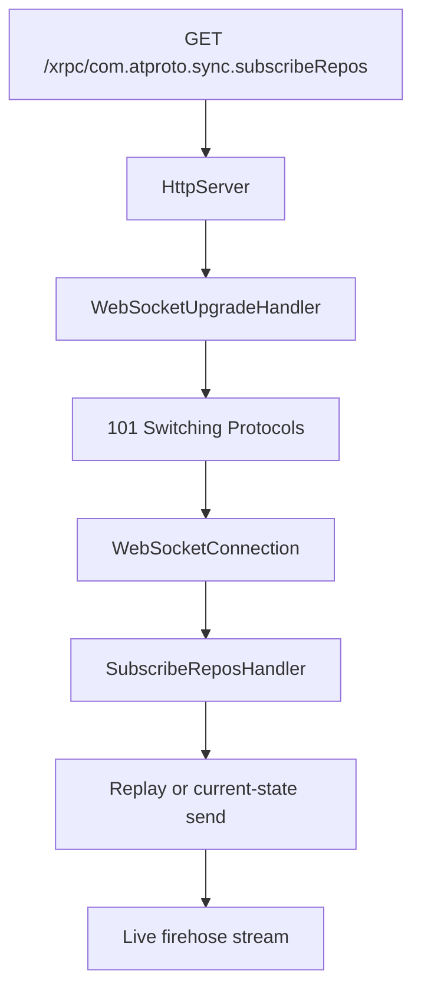

# WebSocket Server

The firehose production path routes through the main server:

```text
HttpServer -> WebSocketUpgradeHandler -> WebSocketConnection -> SubscribeReposHandler
```

Requests start as standard HTTP on the main port and upgrade to WebSocket connections.

## Production Path

The runtime handles the upgrade through these stages:

1. `ATProtoHttpServerBuilder` registers `/xrpc/com.atproto.sync.subscribeRepos` as a WebSocket route.
2. `HttpServer` detects the route and validates the upgrade request.
3. `WebSocketUpgradeHandler` computes the `Sec-WebSocket-Accept` header.
4. `WebSocketProtocolSession` (Sans-I/O) handles framing, masking, and heartbeats once switched.
5. `SubscribeReposHandler` accepts the connection and manages event subscription.



## Legacy Standalone Server

`Garazyk/Sources/Sync/WebSocketServer.{h,m}` contains a legacy listener based on Network.framework. This class remains for compatibility and specific test seams but is deprecated in favor of `SubscribeReposHandler`.

Only use the legacy class when:
- Explicitly required by compatibility tests.
- Auditing historical behavior.
- Comparing connection-acceptance paths.

## Responsibilities

The WebSocket layer manages:
- RFC 6455 handshake validation.
- Frame encoding and decoding.
- Ping/pong and close frame handling.
- Connection health and timeout detection.
- Handoff of upgraded sockets to firehose subscribers.

Transport and framing are separate from event replay and commit sequencing.

## Main runtime seams

Start with these files:

- `Garazyk/Sources/Network/WebSocketUpgradeHandler.m`
- `Garazyk/Sources/Sync/WebSocketConnection.m`
- `Garazyk/Sources/Sync/WebSocketCodec.m`
- `Garazyk/Sources/Sync/WebSocketHeartbeatPolicy.m`
- `Garazyk/Sources/Sync/SubscribeReposHandler.m`

Read `WebSocketServer.m` only after that if you need the deprecated standalone
listener path.

## Advanced internals track

If you want the full implementation walkthrough, use the tutorial subguide:

- [Subguide: HTTP + WebSocket from Scratch](../10-tutorials/network-from-scratch/)
- [Part 3: WebSocket Upgrade, Codec, and Firehose](../10-tutorials/network-from-scratch/websocket-upgrade-codec-and-firehose)

For the HTTP setup that precedes the upgrade, read:

- [Part 1: HTTP Transport and Parser](../10-tutorials/network-from-scratch/http-transport-and-parser)
- [Part 2: Routing, Pipelining, and Responses](../10-tutorials/network-from-scratch/http-routing-pipelining-and-responses)

## Related reading

- [Firehose Overview](./firehose-overview)
- [Backpressure](./backpressure)
- [Event Replay](./event-replay)
- [HTTP Server](../04-network-layer/http-server)
- [HTTP Request and Route Pipeline](../04-network-layer/http-request-and-route-pipeline)

## Sources

- [RFC 6455: The WebSocket Protocol](https://datatracker.ietf.org/doc/html/rfc6455)
- [Network framework `nw_connection_receive`](https://developer.apple.com/documentation/network/nw_connection_receive)
- [Network framework `nw_listener_start`](https://developer.apple.com/documentation/network/nw_listener_start)

## Related

- [Documentation Map](../11-reference/documentation-map.md)
- [Contributor Guide](../index.md)

