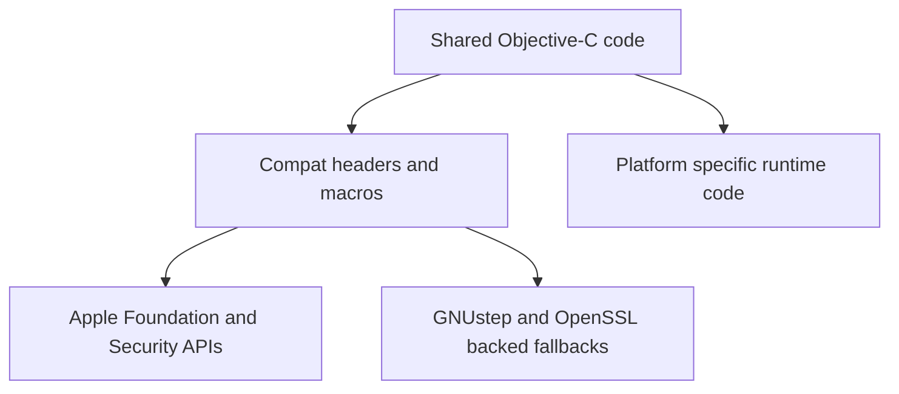

# Compatibility Layer

## Overview

September's compatibility layer is intentionally small. It is not a second SDK that hides every Apple or GNUstep difference. It is a narrow set of headers, macros, and test shims that keep shared Objective-C code buildable while still allowing the repo to use true platform-specific implementations where that is the right tradeoff.

## Full Flow

## What Lives Here Today

The current `Compat/` tree does a few concrete jobs:

- `Compat/Foundation/Foundation.h` selects Apple Foundation or GNUstep Foundation
- `Compat/Foundation/NSDataCompat.*` and `NSErrorCompat.h` paper over GNUstep gaps that shared code depends on
- `Compat/LinuxXCTestCompat.h` keeps the test surface usable on GNUstep
- `Compat/PDSTypes.h` defines CF bridging fallbacks and dispatch-queue storage macros such as `PDS_GCD_OBJC_SUPPORT` and `PDS_DISPATCH_QUEUE_STRONG`

That is the real scope. If you need a compatibility story, start by checking whether one of those files already owns it.

## What It Deliberately Does Not Hide

The compatibility layer does not erase:

- the macOS versus GNUstep networking split
- Keychain versus OpenSSL-backed key-management differences
- runtime differences in dispatch object ownership
- behavior gaps in Foundation implementations

Those seams still matter, which is why the repo also contains real platform-specific code rather than only macros.

## Contributor Rule Of Thumb

If you add a new cross-platform dependency, prefer one of these approaches:

1. put the smallest possible compatibility shim in `Compat/` when the API gap is narrow and mechanical
2. keep the platform split explicit when the behavior difference is substantial

The bad middle ground is sprinkling raw `#if` branches across unrelated business logic.

## Related Deep Dives

- [macOS vs GNUstep Boundary](./macos-vs-gnustep-boundary)

## Related Reading

- [macOS and Linux Compatibility](./macos-linux)
- [Platform-Specific Network Transport](./network-transport)
- [Setup](../01-getting-started/setup)
