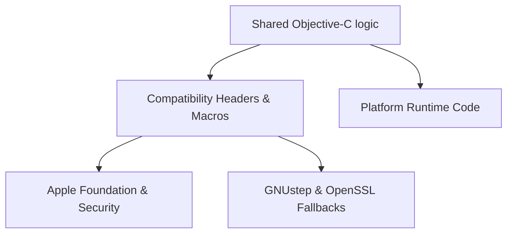

# Compatibility Layer

Garazyk uses a narrow compatibility layer to keep shared Objective-C code buildable across macOS and Linux without hiding the underlying platform differences. This layer consists of headers, macros, and shims that bridge gaps in Foundation and system APIs.

## Architecture

The compatibility layer acts as a shim between shared logic and platform-specific implementations.

## Core Components

The `Compat/` directory manages several critical tasks:

- **Foundation Selection**: `Compat/Foundation/Foundation.h` automatically selects between Apple's Foundation and GNUstep's implementation.
- **API Gaps**: `NSDataCompat` and `NSErrorCompat` provide missing functionality in older GNUstep versions that our shared code expects.
- **Test Compatibility**: `LinuxXCTestCompat.h` enables our XCTest-based suite to run under the GNUstep test runner.
- **GCD & Types**: `PDSTypes.h` defines macros like `PDS_GCD_OBJC_SUPPORT` to handle differences in how Dispatch objects are treated by the runtime.

## Limitations by Design

We do not use the compatibility layer to pretend the platforms are identical. It specifically avoids hiding:

- The split between Apple's Network framework and BSD sockets on Linux.
- Differences between Keychain and OpenSSL-based key management.
- Significant behavioral gaps in Foundation implementations.

These require explicit platform-specific implementations rather than simple macros.

## Contributor Guidelines

When adding cross-platform code:

1. Use `Compat/` for narrow, mechanical API gaps (e.g., a missing constant or a simple method shim).
2. Keep the platform split explicit in the source file (e.g., using `PDSNetworkTransportMac.m` vs `PDSNetworkTransportLinux.m`) for substantial behavior differences.
3. Avoid deep `#if` branching within business logic.

## Related

- [macOS vs GNUstep Boundary](./macos-vs-gnustep-boundary)
- [macOS and Linux Compatibility](./macos-linux)
- [Network Transport](./network-transport)
- [ARC Runtime](./arc-runtime)
- [Documentation Map](../11-reference/documentation-map.md)

