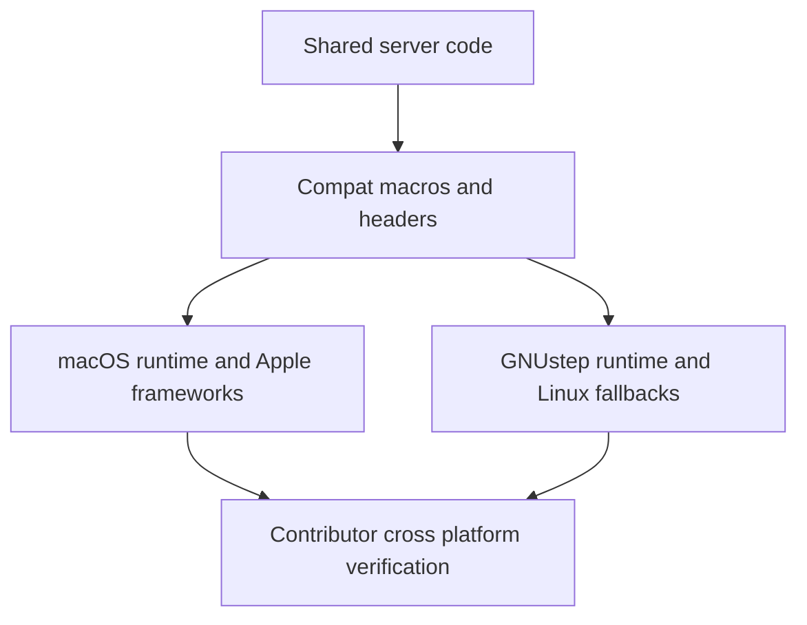

# macOS and Linux Compatibility

## Overview

Garazyk targets both macOS and Linux/GNUstep, but it does not get there by pretending both environments behave the same. Shared code sits on top of compat headers and platform abstractions, while crypto, key storage, networking, and some Foundation behavior still diverge in meaningful ways.

## Full Flow

## Where The Platforms Differ In Practice

In this repo, the high-value differences are:

- networking: macOS uses the Network framework transport, while Linux uses non-blocking BSD sockets with dispatch sources
- key storage and crypto: Apple code can use Security-framework and Keychain-backed paths, while GNUstep paths fall back to OpenSSL-backed managers
- Foundation and tests: GNUstep needs targeted compatibility helpers where Apple Foundation or XCTest behavior is assumed
- dispatch ownership: queue storage and ARC interaction are not identical across platforms

Those are the seams most likely to turn a "works on my machine" patch into a Linux regression.

## What Contributors Should Verify

Before you ship a cross-platform change, check:

- did you introduce a framework call that exists only on Apple platforms?
- did you assume Keychain behavior where the GNUstep path uses OpenSSL or memory fallback?
- did you rely on dispatch object ownership that only works when Objective-C integration is available?
- did you change network behavior without checking both transport implementations?

If the answer to any of those is yes, the change needs deliberate platform review.

## Where Build Guidance Lives

This page is about runtime boundaries, not build commands. Use the getting-started docs for the supported build flow, especially the macOS `xcodegen` workflow and the current out-of-source build rules.

## Related Deep Dives

- [macOS vs GNUstep Boundary](./macos-vs-gnustep-boundary)

## Related Reading

- [Compatibility Layer](./compatibility-layer)
- [Platform-Specific Network Transport](./network-transport)
- [Setup](../01-getting-started/setup)

## Related

- [Documentation Map](../11-reference/documentation-map.md)
- [Contributor Guide](../index.md)
- [Repository Documentation Index](../repo-index/index.md)

