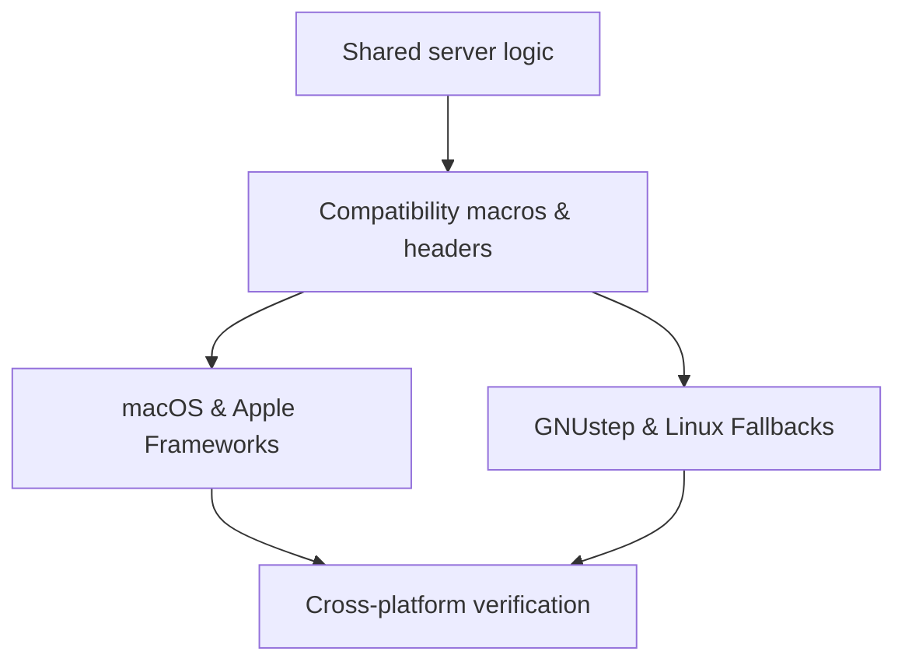

# macOS and Linux Compatibility

Garazyk targets both macOS and Linux (via GNUstep) without abstracting away the unique characteristics of each environment. Shared logic sits on top of platform-specific drivers for networking, cryptography, and key storage.

## Development Workflow

While most business logic is shared, the runtime environments diverge in several key areas.

## Primary Divergence Points

We maintain explicit implementations where behavior or performance requirements differ significantly between platforms:

- **Networking**: macOS uses the `Network.framework` for transport, while Linux uses non-blocking BSD sockets driven by `dispatch` sources.
- **Security**: Apple platforms use `Security.framework` and the system Keychain. Linux fallbacks utilize OpenSSL-backed managers for key operations.
- **Foundation**: We use targeted compatibility helpers where GNUstep's Foundation behavior differs from Apple's implementation, particularly in URL handling and data encoding.
- **GCD Integration**: The interaction between Grand Central Dispatch (GCD) and the Objective-C runtime varies; we use macros in `PDSTypes.h` to ensure safe object ownership across both.

## Contributor Checklist

Before submitting changes, verify that your updates do not introduce platform-specific regressions:

1. Did you add a dependency on an Apple-only framework (like `Combine` or `CryptoKit`)?
2. Does your code assume Keychain persistence that might not be available on Linux?
3. Did you rely on `dispatch` object ownership patterns that only work on the Apple runtime?
4. If you modified network logic, did you test against both the macOS and Linux transport drivers?

## Build Systems

This guide focuses on runtime boundaries. For build instructions, see the [Setup](../01-getting-started/setup) guide for macOS (`xcodegen`) and the CMake workflow for Linux.

## Related

- [Compatibility Layer](./compatibility-layer)
- [macOS vs GNUstep Boundary](./macos-vs-gnustep-boundary)
- [Network Transport](./network-transport)
- [ARC Runtime](./arc-runtime)
- [Documentation Map](../11-reference/documentation-map.md)

