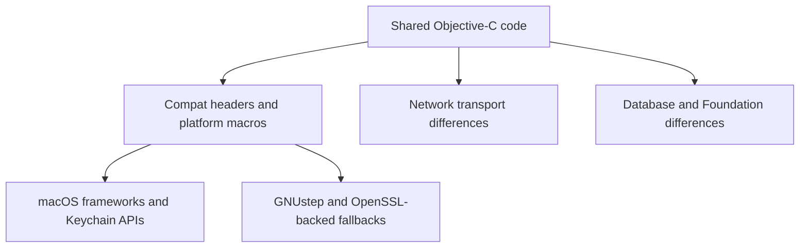

# macOS vs GNUstep Boundary

Garazyk maintains a strict boundary between shared Objective-C logic and platform-specific implementations for macOS and GNUstep. This split manages divergence in security frameworks, networking stacks, and Foundation behavior.

## Architecture

## Platform Divergence

### Security and Cryptography
- **macOS**: Utilizes `Security.framework` and Keychain APIs directly for key management and signing.
- **GNUstep**: Falls back to OpenSSL-backed implementations (`PDSOpenSSLActorKeyManager`) when Apple-specific security APIs are unavailable.

### Networking
- **macOS**: Leverages modern networking frameworks and system transport optimizations.
- **GNUstep**: Utilizes `NSURLConnection` on background queues or BSD sockets directly to ensure compatibility across Linux distributions.

### Foundation and Runtime
- **Memory Management**: ARC behavior and CoreFoundation bridging often require explicit macros in `PDSTypes.h` to maintain cross-platform stability.
- **API Availability**: Some Foundation APIs declared in GNUstep may lack the implementation depth or performance characteristics of their macOS counterparts.

## Implementation Seams
- **`AuthCryptoJWK.m`**: Manages cryptographic primitive abstraction.
- **`HandleResolver.m`**: Implements platform-specific DNS and HTTP resolution paths.
- **`PDSTypes.h`**: Defines compatibility macros and type aliases for cross-platform builds.

## Verification Requirements
Review changes for:
- Reliance on macOS-only frameworks or `SecKey` behavior.
- CoreFoundation ownership patterns that assume Apple-specific runtime details.
- Networking assumptions that bypass the compatibility layer.
- Threading or synchronization primitives that diverge in behavior between Apple and GNUstep runtimes.

## Related
- [Compatibility Layer](./compatibility-layer)
- [ARC Runtime](./arc-runtime)
- [Network Transport](./network-transport)
- [Documentation Map](../11-reference/documentation-map.md)

