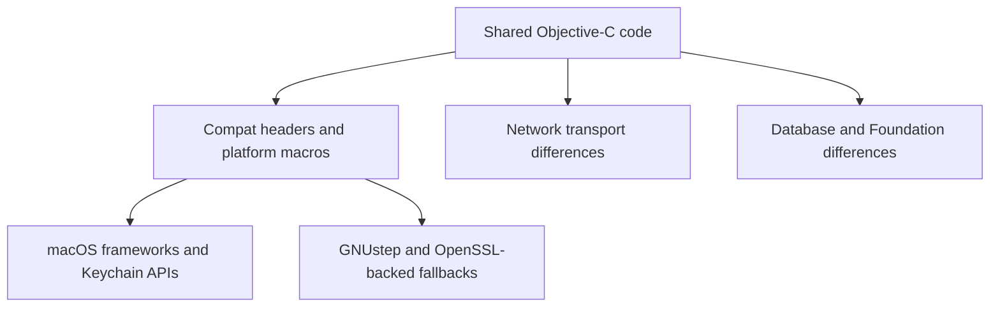

# macOS vs GNUstep Boundary

## Goal

This page explains where Garazyk uses compatibility shims versus true platform-specific implementations, and highlights runtime differences.

## Full Flow

## Why This Boundary Is Not Just `#if`

The platform split affects what the runtime guarantees:

- macOS can use Keychain and Security-framework APIs directly,
- GNUstep must fall back to compatibility layers and OpenSSL-backed code,
- networking and Foundation behavior are not identical across both runtimes,
- some APIs exist as declarations on GNUstep but are not reliable enough to trust in the same way.

Therefore, a change can compile on both platforms but fail on one.

## Walkthrough: Two Real Seams

Two concrete examples illustrate the boundary:

1. `Garazyk/Sources/Auth/PDSAppleActorKeyManager.m` can use Keychain-backed storage on macOS, but it must fall back when Keychain APIs are unavailable on GNUstep.
2. `Garazyk/Sources/Identity/HandleResolver.m` documents a GNUstep path that uses `NSURLConnection` on a background queue instead of assuming the macOS networking stack.

`AuthCryptoJWK.m` and `PDSTypes.h` further demonstrate why compatibility work needs deliberate review.

## What Contributors Should Verify

- Did you introduce a framework call that only exists on macOS?
- Did you assume Keychain or `SecKey` behavior that GNUstep does not provide?
- Did you add a CoreFoundation ownership pattern that depends on Apple runtime details?
- Did you assume one networking path exists everywhere?

Answering these questions catches most accidental regressions.

## Where To Debug When This Breaks

- Start in `Garazyk/Sources/Compat/PDSTypes.h` and the compat headers for macro and type issues.
- Start in the Apple and OpenSSL key-manager implementations when signing or key loading diverges by platform.
- Start in `Garazyk/Sources/Identity/HandleResolver.m` when network behavior differs between macOS and GNUstep.
- Start in `Garazyk/Sources/Database/PDSDatabase.m` when SQLite or Foundation interaction changes by platform.

## Tests That Should Fail If This Changes

- `Garazyk/Tests/App/PDSApplicationTests.m`
- `Garazyk/Tests/Auth/OAuth2HandlerTests.m`
- `Garazyk/Tests/Database/Integration/DatabaseMigrationTests.m`
- the Linux/GNUstep CI build and test jobs

## Appendix

### Practical rule

Changes touching crypto, networking, CoreFoundation bridging, or compatibility macros require explicit cross-platform review.

## Related

- [Documentation Map](../11-reference/documentation-map.md)
- [Contributor Guide](../index.md)
- [Repository Documentation Index](../repo-index/index.md)

