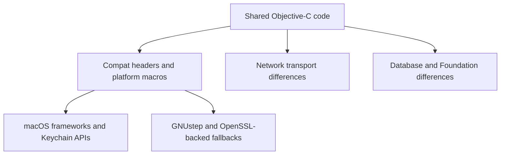

# macOS vs GNUstep Boundary

## Goal

Read this page when you are touching code that crosses the platform boundary. The objective is to show where September uses compatibility shims, where it uses true platform-specific implementations, and which runtime differences contributors must keep in mind before they ship a change that works only on one side.

## Full Flow

## Why This Boundary Is Not Just `#if`

The platform split is not only about conditional compilation. It also affects what the runtime can promise:

- macOS can use Keychain and Security-framework APIs directly,
- GNUstep must fall back to compatibility layers and OpenSSL-backed code,
- networking and Foundation behavior are not identical across both runtimes,
- some APIs exist as declarations on GNUstep but are not reliable enough to trust in the same way.

That is why a change can compile on both platforms and still be functionally wrong on one of them.

## Walkthrough: Two Real Seams

Two concrete examples define most of the boundary:

1. `ATProtoPDS/Sources/Auth/PDSAppleActorKeyManager.m` can use Keychain-backed storage on macOS, but it must fall back when Keychain APIs are unavailable on GNUstep.
2. `ATProtoPDS/Sources/Identity/HandleResolver.m` documents a GNUstep path that uses `NSURLConnection` on a background queue instead of assuming the macOS networking stack.

Add `ATProtoPDS/Sources/AuthCrypto/AuthCryptoJWK.m` and `ATProtoPDS/Sources/Compat/PDSTypes.h` to that picture, and you have the main reason compatibility work needs deliberate review.

## What Contributors Should Verify

- Did you introduce a framework call that only exists on macOS?
- Did you assume Keychain or `SecKey` behavior that GNUstep does not provide?
- Did you add a CoreFoundation ownership pattern that depends on Apple runtime details?
- Did you assume one networking path exists everywhere?

Those questions catch most accidental regressions.

## Where To Debug When This Breaks

- Start in `ATProtoPDS/Sources/Compat/PDSTypes.h` and the compat headers for macro and type issues.
- Start in the Apple and OpenSSL key-manager implementations when signing or key loading diverges by platform.
- Start in `ATProtoPDS/Sources/Identity/HandleResolver.m` when network behavior differs between macOS and GNUstep.
- Start in `ATProtoPDS/Sources/Database/PDSDatabase.m` when SQLite or Foundation interaction changes by platform.

## Tests That Should Fail If This Changes

- `ATProtoPDS/Tests/App/PDSApplicationTests.m`
- `ATProtoPDS/Tests/Auth/OAuth2HandlerTests.m`
- `ATProtoPDS/Tests/Database/Integration/DatabaseMigrationTests.m`
- the Linux/GNUstep CI build and test jobs

## Appendix

### Practical rule

If a change touches crypto, networking, CoreFoundation bridging, or compatibility macros, assume it needs explicit cross-platform review even if it passes on macOS first.
