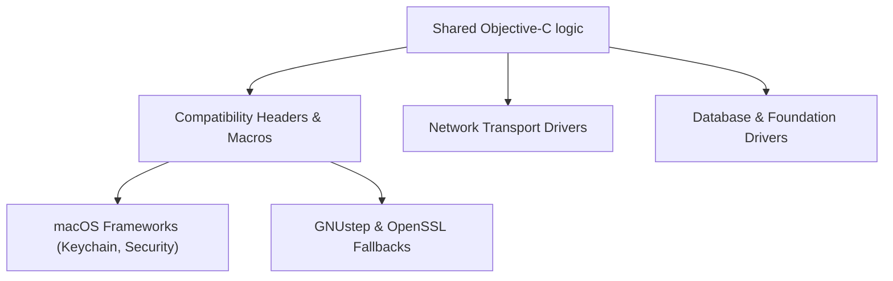

# macOS vs GNUstep Boundary

Garazyk maintains a strict boundary between shared Objective-C logic and platform-specific implementations. This split manages divergence in security frameworks, networking stacks, and Foundation behavior between macOS and Linux.

## Architecture

We use a modular approach where shared logic depends on abstract interfaces, which are satisfied by platform-specific drivers.

## Implementation Strategy

### Security and Cryptography
On macOS, we utilize `Security.framework` and Keychain APIs for hardware-backed key management and signing. On Linux, we use the `PDSOpenSSLActorKeyManager` fallback, which provides the same interface but uses OpenSSL for the underlying operations.

### Networking
The networking stack is split at the transport level. macOS leverages the `Network.framework` for optimal performance and system integration. Linux uses a custom BSD socket implementation integrated with `libdispatch` to ensure compatibility across distributions without depending on Apple-specific frameworks.

### Foundation and Runtime
We handle runtime differences through the `PDSTypes.h` header. This includes macros for CoreFoundation bridging and dispatch object ownership, ensuring that ARC behavior remains stable even when the underlying runtime implementation differs.

## Core Implementation Files
- **`AuthCryptoJWK.m`**: Abstracts cryptographic primitives.
- **`HandleResolver.m`**: Manages platform-specific DNS and HTTP resolution.
- **`PDSTypes.h`**: Centralizes compatibility macros and type aliases.

## Review Guidelines
When reviewing platform-specific changes, ensure they do not:
- Introduce hard dependencies on macOS-only symbols in shared files.
- Assume `SecKeyRef` behavior where the GNUstep path uses a raw key buffer.
- Bypass the `ATProtoNetworkTransport` abstraction for raw socket access.
- Depend on threading behaviors that are unique to the Apple Mach kernel.

## Related
- [Compatibility Layer](./compatibility-layer)
- [ARC Runtime](./arc-runtime)
- [Network Transport](./network-transport)
- [macOS and Linux Compatibility](./macos-linux)
- [Documentation Map](../11-reference/documentation-map.md)

