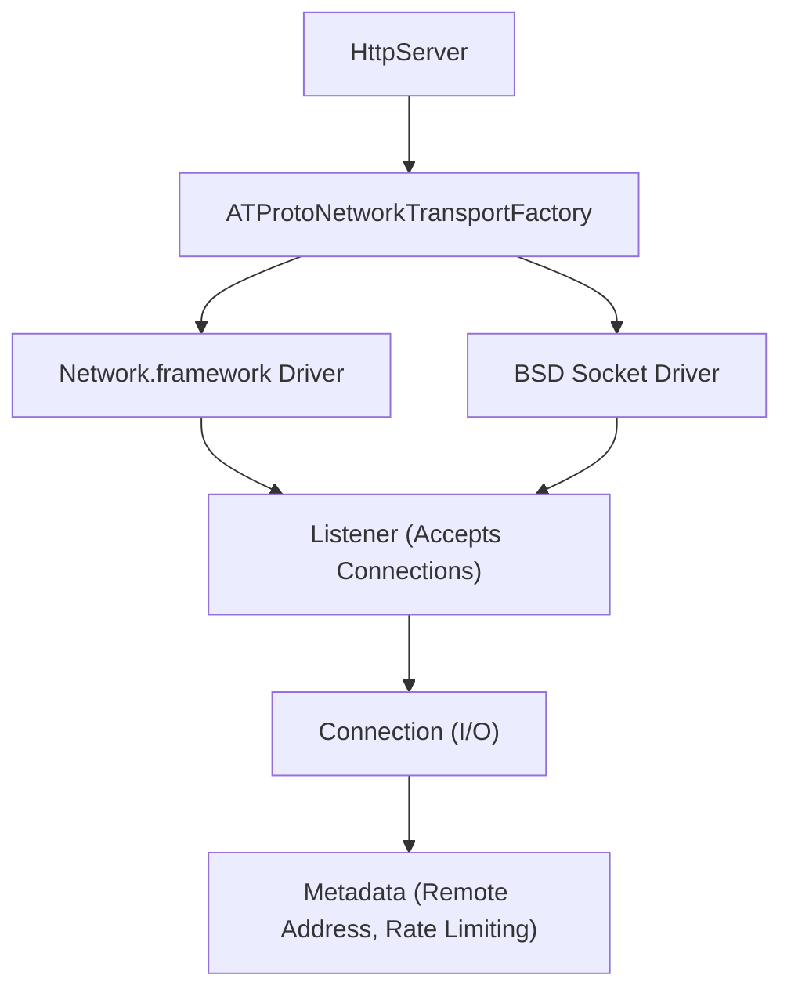

# Platform-Specific Network Transport

`ATProtoNetworkTransport` is the server-side abstraction that allows the `HttpServer` to accept and manage connections without depending on a specific platform's network stack. We avoid using heavy wrappers like `libcurl` or `CFNetwork` in favor of native drivers: `Network.framework` on macOS and BSD sockets on Linux.

## Architecture

The transport layer sits at the bottom of the network stack, providing raw byte streams to the higher-level HTTP and WebSocket parsers.

## Transport Responsibilities

The transport layer manages the following:

- **Listener Lifecycle**: Binding to interfaces and ports, and handling the accept loop.
- **Connection Callbacks**: Notifying the server when a new client connects.
- **Byte Stream I/O**: Performing non-blocking send and receive operations.
- **State Management**: Tracking whether a connection is active, closing, or failed.
- **Peer Identification**: Reporting the remote IP address for logging and rate limiting.

## High-Level Pipeline

By abstracting the transport, the `HttpServer` remains focused on protocol logic. It doesn't need to know if it's talking to a macOS kernel object or a Linux file descriptor.

- **HTTP Parsing**: Handled in `HttpServer` via `HttpParser`.
- **Routing**: Managed by the `HttpRouter`.
- **Event Streaming**: Handled by the WebSocket and Firehose components.

## Implementation Details

- **macOS (`ATProtoNetworkTransportMac`)**: Wraps `nw_listener_t` and `nw_connection_t`. It benefits from system-level optimizations for power and throughput.
- **Linux (`ATProtoNetworkTransportLinux`)**: Uses non-blocking BSD sockets integrated with `libdispatch` sources. This ensures the server remains performant on Linux without requiring Apple-specific frameworks.
- **Factory (`ATProtoNetworkTransportFactory`)**: Automatically selects the correct implementation at compile time based on the target platform.

## Related

- [HTTP Request and Route Pipeline](../04-network-layer/http-request-and-route-pipeline)
- [macOS vs GNUstep Boundary](./macos-vs-gnustep-boundary)
- [HTTP Server](../04-network-layer/http-server)
- [WebSocket Server](../08-sync-firehose/websocket-server)
- [macOS and Linux Compatibility](./macos-linux)
- [Documentation Map](../11-reference/documentation-map.md)

