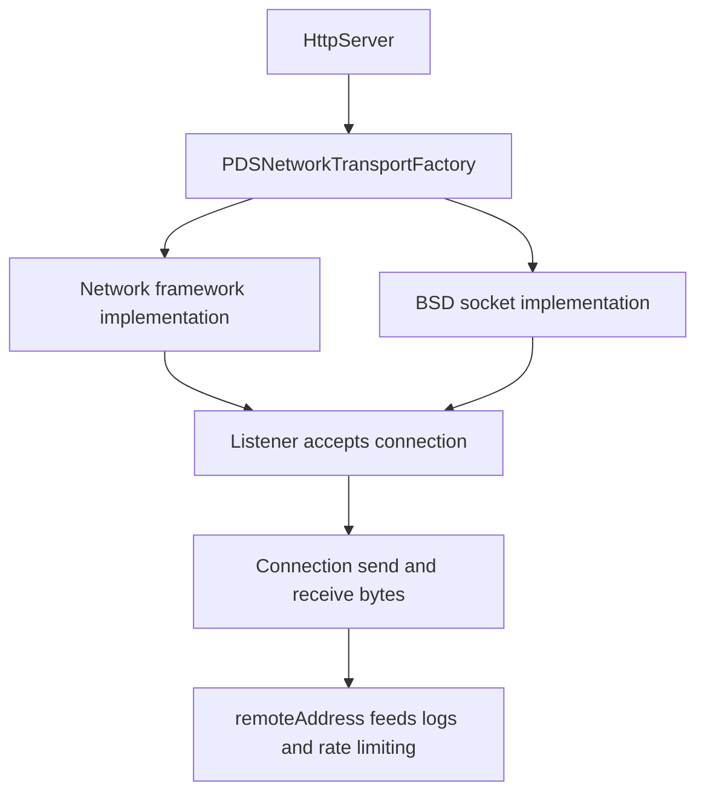

# Platform-Specific Network Transport

## Overview

`PDSNetworkTransport` is the server-side transport abstraction that lets `HttpServer` accept and use connections without hard-coding one platform's network stack. The current implementations do not use CFNetwork or libcurl. macOS uses the Network framework, and Linux/GNUstep uses non-blocking BSD sockets with dispatch-driven I/O.

## Full Flow

## What This Abstraction Owns

The transport layer owns:

- listener lifecycle
- accepted-connection callbacks
- byte-oriented send and receive operations
- connection state changes
- peer-address reporting for logging and rate limiting

This allows `HttpServer` to parse requests and manage connection lifecycles independent of the platform.

## What It Does Not Own

The transport layer does not decide:

- HTTP parsing rules
- route registration or dispatch
- XRPC semantics
- WebSocket protocol behavior above the raw connection

Those concerns sit above it in `HttpServer`, dispatch code, and the firehose stack.

## The Real Platform Split

Today the split is explicit:

- `PDSNetworkTransportMac` wraps `nw_listener_t` and `nw_connection_t` from the Network framework
- `PDSNetworkTransportLinux` wraps non-blocking BSD sockets and dispatch sources
- `PDSNetworkTransportFactory` chooses the right implementation for the current build target
- `HttpServer` attaches `newConnectionHandler` and copies `remoteAddress` into request state for logging and IP-based rate limiting

If networking behaves differently between platforms, inspect these implementations first.

## Related Deep Dives

- [HTTP Request and Route Pipeline](../04-network-layer/http-request-and-route-pipeline)
- [macOS vs GNUstep Boundary](./macos-vs-gnustep-boundary)

## Related Reading

- [HTTP Server](../04-network-layer/http-server)
- [WebSocket Server](../08-sync-firehose/websocket-server)
- [macOS and Linux Compatibility](./macos-linux)

## Related

- [Documentation Map](../11-reference/documentation-map.md)
- [Contributor Guide](../index.md)
- [Repository Documentation Index](../repo-index/index.md)

