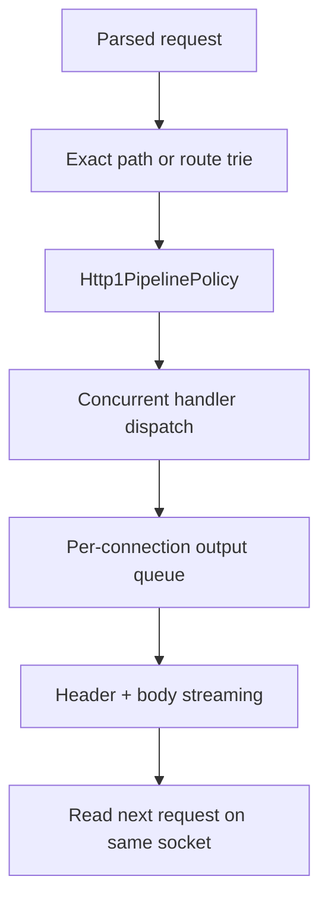

# Part 2: routing, pipelining, and responses

**Learning Objectives:**
- Master the two routing mechanisms: `pathHandlers` and `HttpRouteTrie`.
- Understand the role of `Http1PipelinePolicy` in managing concurrent requests.
- Identify how `HttpServer` enforces global dispatch limits.
- Analyze the `outputQueue` mechanism for ordered, streamed responses.

**Estimated Time:** 30-40 minutes

## Why this exists

Once `Http1Parser` has produced a `HttpRequest`, the transport problem changes.
The server no longer asks "do I have a valid request?" It asks:

- which handler owns this path,
- how many requests can I dispatch at once,
- what happens if multiple requests arrive on one connection,
- and how do I send the right response without reordering pipelined traffic.

Those are separate concerns, and Garazyk keeps them separate on purpose.

## Minimal mental model

The core routing and response loop looks like this:

```objc
RequestHandler handler = [self handlerForRoute:request.path
                                        method:request.methodString
                                    parameters:&params];
HttpResponse *response =
    handler ? [self dispatchRequest:request]
            : [HttpResponse responseWithStatusCode:HttpStatusNotFound];
[self enqueueResponse:response forConnection:connection];
```

The interesting detail is what surrounds that simple line:

- path matching is not just a single dictionary lookup,
- requests can queue on the same connection,
- and responses must leave the socket in request order even when dispatch work
  happens concurrently.



## How Garazyk implements it

### 1. Garazyk uses two routing mechanisms on purpose

`HttpServer` resolves handlers in this order:

1. exact `pathHandlers` lookup,
2. prefix-style path handler scan,
3. route-trie lookup for method-aware patterns.

This split exists because the repository has two different route families:

- exact or prefix handlers for coarse entrypoints such as `/xrpc`,
- and structured route patterns such as `/xrpc/:method` or `/*`.

`ATProtoHttpServerBuilder` installs those routes in startup order. That order
matters because specific surfaces, such as OAuth routes or
`/xrpc/com.atproto.sync.subscribeRepos`, must win before the catch-all UI
handler.

### 2. `HttpRouteTrie` optimizes structured path matching

`HttpRouteTrie` stores routes in a tree of path segments rather than scanning a
flat list every time. Each node can hold:

- literal child segments,
- one parameter child such as `:method`,
- and an optional wildcard route.

That lets the server match routes in path-segment order while extracting path
parameters into `request.pathParameters`.

The result is not just faster lookup. It also makes routing behavior explicit:

- literal segment wins first,
- then parameter segment,
- then wildcard.

### 3. `Http1PipelinePolicy` separates parse order from dispatch order

`Http1PipelinePolicy` tracks how many requests are currently pending on the
connection. When a request finishes parsing, the policy answers one question:

- dispatch now,
- queue for later,
- read more data,
- or close.

By default, the policy caps pipelined requests at a small number instead of
letting one client queue an arbitrary number of in-flight operations on a single
socket.

That is why `HttpServer` can parse request B while request A is still being
processed, but still keep a bounded per-connection request backlog.

### 4. Garazyk dispatches requests concurrently, but bounds that concurrency

Route handlers do not run on the connection's serial transport queue. Instead,
`HttpServer` dispatches request work onto a global concurrent queue and protects
overall server capacity with a `dispatch_semaphore_t`.

The default cap in `HttpServer.m` is `64` concurrent requests. This is the
important effect:

- many connections can make progress at once,
- but the runtime never spawns unbounded concurrent handler work.

`dispatch_group_t taskGroup` then tracks outstanding dispatch work so shutdown
can wait for active tasks to finish cleanly.

### 5. Response ordering stays connection-local

Even though handler execution is concurrent, response sending is still
connection-local. Each `HttpConnectionState` owns an `outputQueue` of
`HttpQueuedResponse` objects.

That queue ensures:

- response bytes for one connection leave in the same order as the requests,
- only one send loop is active at a time for that connection,
- and large or generated bodies can stream without blocking unrelated
  connections.

This is the key HTTP/1.1 tradeoff in Garazyk:

- cross-connection concurrency is allowed,
- in-connection byte ordering is preserved.

### 6. `HttpQueuedResponse` abstracts the body source

The server does not treat every response as one fully materialized `NSData`.
`HttpQueuedResponse` can represent three different body modes:

- inline serialized response data,
- a file path to stream in chunks,
- or a producer block that yields generated chunks on demand.

That abstraction matters because some endpoints send:

- regular JSON responses,
- large file-backed bodies,
- or chunked streaming bodies where the final size is not known upfront.

### 7. High-water trimming prevents one connection from hoarding memory

The per-connection output queue has a byte budget. In `HttpServer.m`, the queue
high-water mark is `10 MB`.

If the queue grows past that limit, Garazyk drops older queued responses for
that connection and cleans up any temporary files that those responses owned.

This is a transport-level safety valve. It keeps one slow client from turning a
burst of responses into unbounded retained memory.

### 8. Streaming logic is explicit for file-backed and generated bodies

Once a response reaches the front of the queue, `HttpServer` sends headers
first, then chooses the body path:

- file-backed body: read from `NSFileHandle` in fixed-size chunks
- generated body: repeatedly call the producer block and optionally wrap each
  payload chunk with HTTP chunked-transfer framing
- inline body: send the serialized bytes directly

The chunked-transfer mode follows [RFC 9112](https://datatracker.ietf.org/doc/html/rfc9112)
rules by prefixing each emitted chunk with a hex size and terminating with
`0\r\n\r\n`.

## Relevant data structures

| Structure | Location | What it holds |
| --- | --- | --- |
| `HttpRouteNode` | `HttpRouteTrie.m` | Segment children, per-method routes, optional wildcard route, and parameter name |
| `NSMutableDictionary<NSString *, HttpRouteTrie *> *routeTries` | `HttpServer.m` | One trie per HTTP method plus a catch-all trie |
| `NSMutableDictionary<NSString *, RequestHandler> *pathHandlers` | `HttpServer.m` | Exact and prefix-oriented route-family entrypoints |
| `Http1PipelinePolicy` | `Http1PipelinePolicy.h` | Pending dispatch count and the rules for dispatching or queueing pipelined requests |
| `NSMutableArray<HttpRequest *> *pendingRequests` | `HttpConnectionState` in `HttpServer.m` | Parsed requests waiting to dispatch on this connection |
| `HttpQueuedResponse` | `HttpServer.m` | Serialized header data plus inline body data, file path, or chunk producer |
| `NSMutableArray<HttpQueuedResponse *> *outputQueue` | `HttpConnectionState` in `HttpServer.m` | Responses waiting to flush on this connection |
| `NSUInteger outputQueueSize` | `HttpConnectionState` in `HttpServer.m` | Approximate queued byte total used for backpressure trimming |

## Concurrency and failure modes

### Route registration is concurrent-read, barrier-write

`HttpRouteTrie` uses a concurrent dispatch queue with barrier writes. This means:

- startup or test setup can insert routes safely,
- many request lookups can happen concurrently,
- and a route lookup never races partially constructed trie state.

### Dispatch concurrency is global, not per route

The `dispatch_semaphore_t` cap applies to all requests, not to one route family.
If the server is saturated, new dispatch work waits before handler code runs.
That protects the runtime as a whole, but it also means latency under load is a
shared resource.

### Pipelined requests stay ordered even when handlers finish out of order

One handler can finish earlier than another on a different connection, but
responses on the same socket still flush through the connection's `outputQueue`.
Without that queue, HTTP/1.1 pipelining would corrupt response order.

### Chunk producers and file streams can fail after headers are sent

This is an important operational edge case. Once headers are already on the
wire, later file-read or producer failures cannot be converted into a clean
"normal" HTTP error body. Garazyk handles those cases by logging the failure
and cancelling the connection.

### Queue trimming is a deliberate tradeoff

Dropping older queued responses above the high-water mark is not "nice," but it
is bounded. The alternative would be letting a slow client hold arbitrary data
in memory. In this repository, protecting process stability wins.

## Tests that prove it

Start with:

- `HttpRouteTrieTests`
- `HttpServerTests`

These tests cover the exact mechanics discussed here:

- literal, parameter, and wildcard matching,
- concurrent trie access,
- request start-up behavior,
- chunked response streaming,
- chunk producer failures,
- and oversized generated-body chunk splitting.

## Sources and further reading

### Specs and APIs

- [RFC 9112: HTTP/1.1](https://datatracker.ietf.org/doc/html/rfc9112)
- [DispatchSource](https://developer.apple.com/documentation/dispatch/dispatchsource)
- [dispatch_semaphore_create](https://developer.apple.com/documentation/dispatch/dispatch_semaphore_create)

### Garazyk reference pages

- [HTTP Server](../../04-network-layer/http-server)
- [HTTP Request and Route Pipeline](../../04-network-layer/http-request-and-route-pipeline)
- [Deep Dive: From NSID to Service Call](../../04-network-layer/from-nsid-to-service-call)

## Next step

Continue to [Part 3: WebSocket upgrade, codec, and firehose](./websocket-upgrade-codec-and-firehose).

## Related

- [Documentation Map](../../11-reference/documentation-map.md)
- [Contributor Guide](../../index.md)
- [Repository Documentation Index](../../repo-index/index.md)

