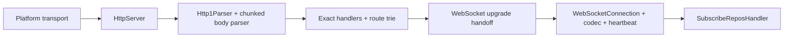

# Subguide: HTTP + WebSocket from Scratch

## Overview

This subguide is the advanced internals track for Garazyk's network stack. It
starts from first principles, but it stays grounded in the real code under
`Garazyk/Sources/`.

The goal is not to build a toy server next to the repository. The goal is to
understand how Garazyk actually:

- accepts connections on macOS and Linux,
- parses and frames HTTP/1.1 requests,
- routes and pipelines responses,
- upgrades `subscribeRepos` to WebSocket,
- and hands the live socket to the firehose layer.

## Why this exists

[Tutorial 5: Firehose](../tutorial-5-firehose) gives you the contributor mental
model for sync work. This subguide takes the next step: it explains the
transport and protocol machinery that makes the firehose possible.

The existing reference pages stay useful, but they are intentionally shorter.
This track is where you read the implementation from the bottom up.

## Reader contract

This subguide follows four rules:

- It is **hybrid**. Each part starts with a small first-principles snippet or
  diagram, then maps that idea to Garazyk's actual classes.
- It is **repo-grounded**. Runtime files and tests are the source of truth for
  Garazyk behavior.
- It is **illustrative, not copy-paste**. Small snippets explain ideas. They do
  not claim to be a standalone buildable mini-project.
- It is **citation-heavy where it matters**. Normative claims cite standards or
  platform APIs. Repository behavior cites source files and test classes.

::: info
If you want a concise system summary instead of the implementation walk, start
with [HTTP Server](../../04-network-layer/http-server),
[WebSocket Server](../../08-sync-firehose/websocket-server), and
[Platform-Specific Network Transport](../../09-platform-compatibility/network-transport).
:::

## Reading order

Read the parts in order:

1. [Part 1: HTTP transport and parser](./http-transport-and-parser)
2. [Part 2: Routing, pipelining, and responses](./http-routing-pipelining-and-responses)
3. [Part 3: WebSocket upgrade, codec, and firehose](./websocket-upgrade-codec-and-firehose)

Each part assumes the previous one already established the lower layer.

## Code map

| Area | Primary files | Why they matter |
| --- | --- | --- |
| Platform transport | `Garazyk/Sources/Network/PDSNetworkTransport.h`, `PDSNetworkTransportMac.m`, `PDSNetworkTransportLinux.m` | Own the listener and byte-stream abstraction used by `HttpServer` |
| HTTP server | `Garazyk/Sources/Network/HttpServer.m` | Owns accepted connections, per-connection state, dispatch limits, and response sending |
| HTTP parsing | `Garazyk/Sources/Network/Http1Parser.m`, `HttpChunkedBodyParser.m` | Turn raw bytes into a structured `HttpRequest` |
| Routing | `Garazyk/Sources/Network/HttpRouteTrie.m`, `PDSHttpServerBuilder.m` | Map parsed requests to the correct handler family |
| HTTP response flow | `Garazyk/Sources/Network/HttpResponse.m`, `Http1PipelinePolicy.m` | Serialize responses, stream files or producer chunks, and keep pipelined requests ordered |
| WebSocket upgrade | `Garazyk/Sources/Network/WebSocketUpgradeHandler.m` | Validates RFC 6455 upgrade headers and emits the `101 Switching Protocols` response |
| WebSocket runtime | `Garazyk/Sources/Sync/WebSocketConnection.m`, `WebSocketCodec.m`, `WebSocketHeartbeatPolicy.m` | Own state, framing, ping/pong, and outbound backpressure |
| Firehose handoff | `Garazyk/Sources/Sync/SubscribeReposHandler.m` | Attaches upgraded sockets and turns them into `subscribeRepos` subscribers |

## Test map

| Behavior | Test classes |
| --- | --- |
| Platform listener/connection behavior | `PDSNetworkTransportTests`, `PDSNetworkTransportLinuxTests` |
| HTTP request framing | `Http1ParserTests`, `HttpChunkedBodyParserTests` |
| Route matching | `HttpRouteTrieTests` |
| Response queueing and chunk streaming | `HttpServerTests` |
| Upgrade validation | `WebSocketUpgradeHandlerTests` |
| Connection/query parsing | `WebSocketConnectionTests` |
| Frame parsing and serialization | `WebSocketCodecTests`, `WebSocketFrameCharacterizationTests` |
| Heartbeat and backpressure behavior | `WebSocketHeartbeatPolicyTests`, `WebSocketStateCharacterizationTests` |
| Firehose handoff and subscriber behavior | `SubscribeReposHandlerTests` |

## Citation legend

Use these evidence categories throughout the subguide:

- **Spec**: wire-level rules from [RFC 9112](https://datatracker.ietf.org/doc/html/rfc9112)
  and [RFC 6455](https://datatracker.ietf.org/doc/html/rfc6455)
- **API**: platform behavior from Apple API docs such as
  [`CFHTTPMessage`](https://developer.apple.com/documentation/cfnetwork/cfhttpmessage-rg0),
  [`nw_connection_receive`](https://developer.apple.com/documentation/network/nw_connection_receive),
  [`nw_listener_start`](https://developer.apple.com/documentation/network/nw_listener_start),
  [`nw_parameters_create_secure_tcp`](https://developer.apple.com/documentation/network/nw_parameters_create_secure_tcp),
  [`DispatchSource`](https://developer.apple.com/documentation/dispatch/dispatchsource),
  [`dispatch_semaphore_create`](https://developer.apple.com/documentation/dispatch/dispatch_semaphore_create),
  and Linux man pages such as
  [`getaddrinfo(3)`](https://man7.org/linux/man-pages/man3/getaddrinfo.3.html),
  [`socket(2)`](https://man7.org/linux/man-pages/man2/socket.2.html), and
  [`fcntl(2)`](https://man7.org/linux/man-pages/man2/fcntl.2.html)
- **Repo**: current Garazyk implementation under `Garazyk/Sources/`
- **Tests**: executable proof under `Garazyk/Tests/`

## What this guide is not

This guide does **not** do the following:

- It does not present a second, independent sample server next to Garazyk.
- It does not duplicate every source file inline.
- It does not treat the deprecated standalone `WebSocketServer` as the primary
  production path.
- It does not replace the reference pages for XRPC dispatch, firehose replay,
  or platform compatibility.

If you need the high-level route from socket to handler before you start, read
[HTTP Request and Route Pipeline](../../04-network-layer/http-request-and-route-pipeline)
first. If you need the firehose semantics after the upgrade succeeds, read
[Firehose Overview](../../08-sync-firehose/firehose-overview) and
[Event Replay](../../08-sync-firehose/event-replay) after Part 3.

## Next step

Continue to [Part 1: HTTP transport and parser](./http-transport-and-parser).

## Related

- [Documentation Map](../../11-reference/documentation-map.md)
- [Contributor Guide](../../index.md)
- [Repository Documentation Index](../../repo-index/index.md)

