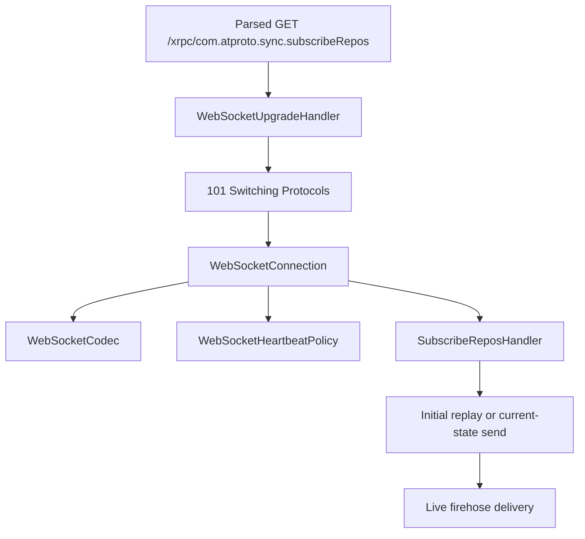

# Part 3: WebSocket upgrade, codec, and firehose

## Why this exists

The firehose is not a separate daemon in the normal runtime. It is a protocol
transition inside the main HTTP server:

1. parse an ordinary HTTP request,
2. validate the WebSocket upgrade,
3. switch the socket into frame-oriented mode,
4. and hand the live connection to `SubscribeReposHandler`.

That boundary matters because many sync bugs are not "firehose logic" bugs at
all. They are upgrade, framing, heartbeat, or outbound-backpressure bugs.

## Minimal mental model

At the handshake boundary, the server conceptually does this:

```objc
if ([upgradeHandler handleUpgradeRequest:request response:response]) {
  [connection sendData:[response serialize] completion:^(NSError *error) {
    [subscribeReposHandler acceptUpgradedConnection:connection request:request];
  }];
}
```

After the `101 Switching Protocols` response leaves the socket, the transport is
no longer speaking HTTP bodies. It is speaking WebSocket frames defined by
[RFC 6455](https://datatracker.ietf.org/doc/html/rfc6455).



## How Garazyk implements it

### 1. The production path is the main HTTP port, not the legacy standalone listener

This is the most important architectural fact in the current repository:

- `PDSHttpServerBuilder` registers an exact WebSocket route for
  `/xrpc/com.atproto.sync.subscribeRepos`
- `HttpServer` detects that route and performs the upgrade handshake
- `SubscribeReposHandler` receives the already upgraded
  `id<PDSNetworkConnection>`
- `WebSocketConnection` then starts on the existing transport

The older `WebSocketServer` class still exists, but `SubscribeReposHandler.h`
marks it as deprecated compatibility/test infrastructure. Do not treat it as
the main production entrypoint when reading the current code.

### 2. `WebSocketUpgradeHandler` owns the RFC 6455 handshake checks

The upgrade handler validates:

- `GET` method,
- `Upgrade: websocket`,
- `Connection: Upgrade`,
- `Sec-WebSocket-Version: 13`,
- and a plausibly valid `Sec-WebSocket-Key`.

It then computes `Sec-WebSocket-Accept` by concatenating the client key with the
WebSocket GUID and hashing with SHA-1, as required by
[RFC 6455 Section 1.3](https://datatracker.ietf.org/doc/html/rfc6455#section-1.3).

That logic lives in `WebSocketUpgradeHandler.m`, not in `SubscribeReposHandler`.
This separation is deliberate. The firehose handler should not need to know how
to emit a `101 Switching Protocols` response.

### 3. `HttpServer` is the handoff point

Inside `HttpServer`, the upgrade path is still anchored in request parsing and
route ownership:

- it looks up the exact WebSocket route by path,
- uses `WebSocketUpgradeHandler` to validate the request,
- sends the serialized `101` response,
- marks the connection state as upgraded,
- clears pending HTTP request/output state,
- and only then invokes the route's WebSocket handler block.

That cleanup is important. A socket cannot meaningfully stay in both HTTP
response mode and WebSocket mode at the same time.

### 4. `WebSocketConnection` adapts the raw transport to frame events

`WebSocketConnection` wraps `id<PDSNetworkConnection>` and owns:

- socket lifecycle state,
- query parsing for the upgraded request path,
- a send queue,
- byte-count accounting for outbound backpressure,
- a `WebSocketCodec`,
- and a `WebSocketHeartbeatPolicy`.

For the main-port upgrade path, `SubscribeReposHandler` calls
`startOnExistingTransport` rather than opening a new outbound connection. That
method preserves the existing socket and starts the read loop plus heartbeat
logic on top of it.

### 5. `WebSocketCodec` is a Sans-IO frame parser and serializer

`WebSocketCodec` takes raw `NSData` chunks from the transport and emits higher
level events:

- text message,
- binary message,
- ping,
- pong,
- close,
- protocol error.

The codec is responsible for frame mechanics from
[RFC 6455 Section 5](https://datatracker.ietf.org/doc/html/rfc6455#section-5):

- FIN bit,
- opcode,
- payload length,
- extended lengths,
- optional masking key,
- and payload extraction.

When the incoming frame is masked, the codec applies the XOR unmasking loop.
When the frame is fragmented, it appends payload pieces into a fragment array
until the final continuation frame arrives, then reassembles the message.

### 6. Heartbeats are a policy object, not ad hoc timer math

`WebSocketHeartbeatPolicy` owns the timing rules for ping/pong liveness:

- default interval: `30 seconds`
- default timeout: `10 seconds`

`WebSocketConnection` owns the `dispatch_source_t` timer, but it delegates the
decision to the policy object:

- `tick:` says whether to send a ping, do nothing, or time out
- `pingSent:` records that a pong is now expected
- `pongReceived:` clears the waiting state

That split keeps frame I/O separate from liveness policy.

### 7. Backpressure exists at two layers

The connection layer and the firehose layer both enforce limits.

At the connection layer:

- `WebSocketConnection` tracks queued outbound bytes,
- the hard cap is `16 MB`,
- and exceeding that cap clears the queue and closes with code `1009`.

At the firehose layer:

- `SubscribeReposHandler` checks connection pending counts and byte totals,
- emits a consumer-too-slow error frame when needed,
- and detaches the subscriber rather than buffering forever.

These are different protections:

- `WebSocketConnection` protects one socket's send queue,
- `SubscribeReposHandler` protects the streaming system from slow subscribers.

### 8. The firehose handoff starts with cursor-aware replay

Once `SubscribeReposHandler` accepts the upgraded socket, it:

- wraps the transport in `WebSocketConnection`,
- stores it in `attachedConnections`,
- starts the read loop and heartbeat,
- and calls `sendInitialRepositoryStateToConnection:cursor:`.

The cursor comes from the upgraded request's query string. That is why
`WebSocketConnection` and the original `HttpRequest` both matter at handoff
time. The socket carries the live channel, but the parsed HTTP request still
supplies the initial subscription parameters.

## Relevant data structures

| Structure | Location | What it holds |
| --- | --- | --- |
| `NSMutableData *readBuffer` | `WebSocketCodec.m` | Raw bytes waiting to be interpreted as one or more frames |
| `NSMutableArray<NSData *> *fragments` | `WebSocketCodec.m` | Fragment payloads for a message split across continuation frames |
| `uint8_t fragmentOpcode` | `WebSocketCodec.m` | The original opcode associated with the current fragment series |
| `NSMutableArray<NSData *> *messageQueue` | `WebSocketConnection.m` | Outbound frames waiting to flush on the socket |
| `NSUInteger queuedSendBytes` | `WebSocketConnection.m` | Approximate byte count used for connection-level backpressure |
| `dispatch_source_t heartbeatTimer` | `WebSocketConnection.m` | Periodic timer driving ping/pong liveness checks |
| `WebSocketHeartbeatPolicy` timestamps | `WebSocketHeartbeatPolicy.m` | Last ping time, last pong time, and whether the connection is waiting for a pong |
| `NSMutableSet<WebSocketConnection *> *attachedConnections` | `SubscribeReposHandler.m` | Live subscribers currently attached to the firehose |
| `dispatch_queue_t eventQueue` | `SubscribeReposHandler.m` | Serialized queue for event sequencing and replay-related work |

## Concurrency and failure modes

### Upgrade failures stop before the socket changes mode

If the handshake is invalid, `WebSocketUpgradeHandler` produces a normal HTTP
error response such as:

- `400 Bad Request`
- `405 Method Not Allowed`
- `426 Upgrade Required`
- `501 Not Implemented`

The socket only switches mode after a successful `101` response.

### Control frames can arrive in the middle of message traffic

`WebSocketCodec` handles ping, pong, and close frames as separate events. This
matters because control frames can interleave with data frames. The codec cannot
assume "all data first, then control."

### Fragmentation requires state across reads

A single logical message can span multiple transport reads and multiple
WebSocket frames. That is why the codec owns both a read buffer and a fragment
array. Without both, partial frames and fragmented messages would collapse into
the same state problem.

### Heartbeat timeouts are connection failures, not firehose semantic failures

If a pong never arrives in time, `WebSocketConnection` closes the socket. That
is transport liveness logic. It is separate from replay or sequencing logic in
`SubscribeReposHandler`.

### Production debugging starts at the main-port handoff

If `subscribeRepos` fails in the current server, start in this order:

1. `PDSHttpServerBuilder` route registration
2. `HttpServer` WebSocket handoff path
3. `WebSocketUpgradeHandler`
4. `WebSocketConnection` and `WebSocketCodec`
5. `SubscribeReposHandler`

Only drop into the deprecated standalone `WebSocketServer` path if the failure
is explicitly inside old compatibility tests or legacy helper code.

## Tests that prove it

Start with:

- `WebSocketUpgradeHandlerTests`
- `WebSocketConnectionTests`
- `WebSocketCodecTests`
- `WebSocketHeartbeatPolicyTests`
- `WebSocketFrameCharacterizationTests`
- `WebSocketStateCharacterizationTests`
- `SubscribeReposHandlerTests`

Together they cover:

- handshake validation and `Sec-WebSocket-Accept`,
- path/query parsing for upgraded connections,
- opcode parsing and frame serialization,
- heartbeat timing behavior,
- backpressure thresholds,
- and cursor-aware subscriber initialization.

## Sources and further reading

### Specs and APIs

- [RFC 6455: The WebSocket Protocol](https://datatracker.ietf.org/doc/html/rfc6455)
- [Network framework `nw_connection_receive`](https://developer.apple.com/documentation/network/nw_connection_receive)
- [Network framework `nw_listener_start`](https://developer.apple.com/documentation/network/nw_listener_start)
- [DispatchSource](https://developer.apple.com/documentation/dispatch/dispatchsource)

### Garazyk reference pages

- [WebSocket Server](../../08-sync-firehose/websocket-server)
- [Firehose Overview](../../08-sync-firehose/firehose-overview)
- [Backpressure](../../08-sync-firehose/backpressure)
- [Event Replay](../../08-sync-firehose/event-replay)

## Next step

Return to [Tutorial 6: Deployment](../tutorial-6-deployment) or revisit the
[Subguide overview](./).\n\n## Related\n\n- [Documentation Map](../../11-reference/documentation-map.md)\n- [Contributor Guide](../../index.md)\n- [Repository Documentation Index](../../repo-index/index.md)\n\n