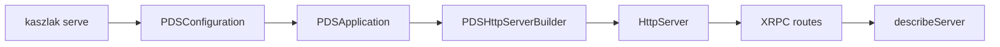

# Tutorial 1: Hello PDS

## Overview

This tutorial is the shortest path to understanding how Garazyk boots and exposes its first useful protocol surface. It does not try to turn the whole server into a toy standalone lab. Instead, it walks the real repository path from CLI startup to the `describeServer` response.

That makes it a better first tutorial for contributors because the important question is not "how do I rewrite a tiny HTTP server?" It is "how does this codebase actually start, register routes, and answer discovery?"

## What You'll Build

You will build a working mental model of the startup path that powers the first discovery endpoint:

- CLI entrypoint
- configuration loading
- controller and server initialization
- route registration
- discovery verification through `com.atproto.server.describeServer`

**Learning Objectives:**
- Understand how `serve` bootstraps the runtime
- Identify the files that own configuration, controller setup, and route registration
- Verify the discovery path with a minimal runtime check
- Recognize the difference between code truth and older standalone-example framing

**Estimated Time:** 25-35 minutes

## Prerequisites

- Complete [Setup](../01-getting-started/setup)
- Read [Codebase Map](../01-getting-started/codebase-map)
- Read [Request Lifecycle](../01-getting-started/request-lifecycle)
- Be able to build `kaszlak`

## Architecture Overview



## Step 1: Trace the Entry Point

The startup path begins in the CLI, not in a custom `main.m` tutorial scaffold.

Start with these files:

| File | Why it matters |
| --- | --- |
| `Garazyk/Sources/CLI/main.m` | parses global CLI flags and dispatches commands |
| `Garazyk/Sources/CLI/PDSCLIServeCommand.m` | turns `serve` into a running server |
| `Garazyk/Sources/App/PDSConfiguration.m` | loads config and environment overrides |

Read them in that order. The point is to see which values come from CLI flags, which come from config, and which are fallback defaults.

## Step 2: Follow Bootstrapping into the Runtime

After CLI parsing, the important handoff is:

1. configuration is loaded,
2. `PDSApplication` (the composition root) is initialized,
3. `PDSHttpServerBuilder` registers the server routes,
4. `HttpServer` starts listening.

For this tutorial, the most useful files are:

- `Garazyk/Sources/App/PDSApplication.m`
- `Garazyk/Sources/Network/PDSHttpServerBuilder.m`
- `Garazyk/Sources/Network/HttpServer.m`

The design reason is straightforward: Garazyk wants server boot to be centrally composed rather than scattered across unrelated handlers.

## Step 3: Identify Where `describeServer` Comes From

The first protocol response most clients care about is `com.atproto.server.describeServer`.

The contributor question is not just "what does it return?" It is:

> Which layer owns the response shape and what config values influence it?

Trace it through:

- route registration,
- XRPC dispatch,
- method registration,
- configuration-derived values such as issuer, available domains, and invite policy.

That flow is the pattern you will reuse for almost every other endpoint in the repo.

## Step 4: Verify the Path, Not Just the Process

Once the server is running, verify the discovery route directly. A healthy process without a valid discovery response is not good enough for a PDS.

What to look for:

- the route responds,
- the issuer-derived identity makes sense,
- the registration policy flags match the config you intended to load.

## Step 5: Read the Matching Tests

After you understand the runtime path, jump to tests instead of rereading the implementation:

- `Garazyk/Tests/Network/XrpcMethodRegistryTests.m`
- `Garazyk/Tests/XRPC/XrpcHandlerTests.m`
- `Garazyk/Tests/App/PDSConfigurationTests.m`

Those tests tell you which invariants the project already considers worth protecting.

## Troubleshooting

| Symptom | Likely cause | Where to look |
| --- | --- | --- |
| server starts but discovery looks wrong | wrong config, issuer, or CLI override | `PDSCLIServeCommand`, `PDSConfiguration` |
| route 404s | registration or dispatch issue | `PDSHttpServerBuilder`, XRPC registration |
| response exists but policy flags are wrong | config drift | `config.json`, env overrides, loaded config shape |

## Next Steps

1. Move to [Tutorial 2: Accounts](./tutorial-2-accounts).
2. Compare this boot path with [Explorer, OpenAPI & UI](../11-reference/explorer-openapi-ui).
3. Keep [Request Lifecycle](../01-getting-started/request-lifecycle) open as a companion reference.

## Summary

The "hello world" of Garazyk is not a toy socket server. It is the real boot path:

- CLI command,
- configuration load,
- application facade creation,
- route registration,
- and discovery output.

Once you understand that path, the rest of the server stops feeling opaque.

## Appendix

### Minimal verification loop

```bash
xcodegen generate
xcodebuild -scheme kaszlak build
./build/bin/kaszlak serve --config ./config.json --data-dir ./pds-data --foreground
curl -sS http://127.0.0.1:2583/xrpc/com.atproto.server.describeServer | jq .
```\n\n## Related\n\n- [Documentation Map](../11-reference/documentation-map.md)\n- [Contributor Guide](../index.md)\n- [Repository Documentation Index](../repo-index/index.md)\n\n