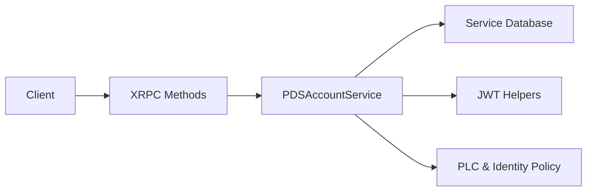

# Tutorial 2: Account Management

This tutorial explains how Garazyk manages identities and sessions. Account creation is more than just a single endpoint; it involves handles, invite policies, PLC resolution, and token issuance.

## Learning Objectives
- Identify where account and session logic lives in the repository.
- Understand how configuration values shape registration behavior.
- Trace `createAccount` and `createSession` from the XRPC entry point into the service logic.
- Verify account flows using existing tests.

## Architecture Overview



## Step 1: The Service Layer

The core of account management lives in the `PDSAccountService`. This layer reconciles configuration policy with user requests.

- **`Garazyk/Sources/Services/PDS/PDSAccountService.m`**: Owns the business rules for registration, handle validation, and password hashing.
- **`Garazyk/Sources/Services/PDS/PDSAccountService.h`**: Defines the interface for account lookups and state transitions.

As you read the service code, observe how it handles invite codes and domain validation.

## Step 2: XRPC Entry Points

The network layer exposes the service logic through protocol methods. The typical flow involves:

1. **XRPC Registration**: Methods are registered in `PDSHttpServerBuilder.m`.
2. **Input Validation**: Request bodies are parsed and validated against lexicon schemas.
3. **Service Invocation**: The handler calls the relevant `PDSAccountService` method.
4. **Response Shaping**: Success results are converted into the format expected by the client (e.g., returning a DID and session tokens).

## Step 3: Policy Configuration

Account behavior is strictly governed by the server configuration. A registration failure is often a policy mismatch rather than a bug.

- **`session.invite_code_required`**: Determines if an invite is mandatory for new accounts.
- **`availableUserDomains`**: Restricts the handles that can be registered on this PDS.
- **`identity.plc_url`**: Configures where the PDS sends DID documents for new users.

## Step 4: Session vs. Account Creation

While related, these are distinct paths in the codebase:

- **Account Creation**: Validates identity availability, applies invite policies, and creates the initial repository state.
- **Session Creation**: Authenticates an existing account and issues a JWT token set. See [Tutorial 4: Authentication](./tutorial-4-auth) for details on the token lifecycle.

## Step 5: Verification and Testing

Use the existing test suite to verify the account lifecycle without running the full server.

- **`Garazyk/Tests/App/Services/PDSAccountServiceTests.m`**: Validates registration rules and state changes.
- **`Garazyk/Tests/Auth/JWTTests.m`**: Tests the correctness of issued session tokens.
- **`Garazyk/Tests/CLI/PDSCLIAccountCommandTests.m`**: Ensures the CLI can manage accounts directly.

## Troubleshooting

- **Registration rejected**: Check if `invite_code_required` is enabled and verify the `availableUserDomains` list.
- **Session fails for existing account**: Ensure the password hasher configuration matches the one used during registration.
- **Handle validation failure**: Validator rules in `PDSAccountService` may be stricter than those of other PDS implementations.

## Next Steps

1. Move to [Tutorial 3: Records](./tutorial-3-records) to see how data is added to an account.
2. Keep the [Config Reference](../11-reference/config-reference) open to understand the policy settings.

## Appendix: Manual Verification

```bash
# Start the server
./build/bin/kaszlak serve --config ./config/examples/local.json --foreground &
PID=$!
sleep 2

# List existing accounts
./build/bin/kaszlak account list

# Create a session via curl
curl -sS -X POST http://127.0.0.1:2583/xrpc/com.atproto.server.createSession \
  -H 'Content-Type: application/json' \
  -d '{"identifier":"alice.test","password":"password"}' | jq .

kill $PID
```

## Related

- [Documentation Map](../11-reference/documentation-map.md)
- [Contributor Guide](../index.md)
- [Repository Documentation Index](../repo-index/index.md)

